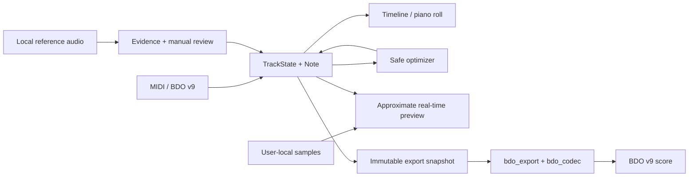

# BDO Music Composer

[简体中文](README.zh-CN.md) · [English](README.en.md) · [日本語](README.ja.md) · [한국어](README.ko.md) · [Language hub](README.md)

> AI agents and new maintainers: read [`AGENTS.md`](AGENTS.md) and the [Agent handoff and collaboration guide](docs/AGENT_HANDOFF.md) before changing code. Planned boundaries and measured-performance rules are in the [decoupling, performance, and extension roadmap](docs/OPTIMIZATION_EXTENSION_ROADMAP.md).

BDO Music Composer is an unofficial PySide6 MIDI editor, local audio-transcription workbench, deterministic optimizer, game-sample previewer, and Black Desert v9 music-score exporter. It is a small score laboratory for the maintainer and friends, not a general DAW, and is not affiliated with Pearl Abyss.

<!-- section:screenshots -->
## Interface preview


| Multitrack timeline | Piano-roll note editor |
|---|---|
|  |  |

<!-- section:status -->
## Status and disclaimer

v1.0.0 is the first public stable major release. Automated regression covers the main editor, autosave, optimization, preview, transcription-assist, and BDO v9 export flows, but audio hardware, Windows environments, and game versions can still differ.

- Export and in-game editing require a valid Owner ID copied from a score saved by your own account.
- BDO v9 represents `/4` meters; other denominators are rejected explicitly instead of being exported incorrectly.
- Game-sample preview and some DSP-heavy articulations are approximate until supported by in-game A/B evidence.
- Basic Pitch notes, harmony, voice groups, and BDO Top-3 matches are editable aids, not a verified score or reliable mixed-instrument identification.
- The application contains no account login, telemetry, file upload, OpenAI API client, or cloud-model runtime.

<!-- section:features -->
## Features

### MIDI, projects, and editing

- Import MIDI with velocities, durations, controllers, lyrics, sustain, and tempo changes.
- Create tracks from a blank project; create, delete, move, resize, select, and batch-edit notes.
- Multitrack timeline, per-track piano roll, velocity lane, quantized grid, articulations, and lossless `ntype=0` editing.
- Open BDO v9 scores while preserving dual velocities, track volume/settings, articulations, and physical chunks; unchanged documents round-trip byte for byte.
- Project undo/redo, background autosave, version discovery, and a privacy-safe home index.

### Practical transcription

- Load a local WAV or standard MP3 and click Analyze to run local Basic Pitch ONNX/CPU analysis.
- The production UI uses protected standard/balanced/preserve settings and does not expose experimental parameters, phrases, harmony, voice grouping, or orchestration diagnostics.
- Analyzed Notes use lightweight outlines with a lower recognition-confidence rail and can be selected, filtered, or added to the draft. A read-only continuity preview connects evidence-backed weak same-pitch splits while retaining every onset and candidate identity. Pitch Line is a separate continuous-pitch view with hysteresis continuation, a constrained two-pass Bézier stroke, independent opacity, and low/standard/high display-only denoise levels. Automatic timbre classification builds reliable prototypes first, absorbs short fragments, and reports coverage and confidence; uniquely owned pitch-line segments inherit the group colour, while conflicts and insufficient evidence stay neutral. Optional Melody Guidance adds a deduplicated, bounded weight to timbre groups matched by manually edited notes in repeated time windows. Once stable, it labels that group's analyzed notes and pitch lines as the current track instrument at highest display priority without rewriting acoustic recognition or export.
- Run the read-only game-fit check on the draft, then hide transcription guides and continue ordinary editing; the check never deletes, repitches, or quantizes notes.
- Results enter the editor draft first and reach the formal track only after Apply/OK. Existing notes are never overwritten automatically, and percussion is never mapped automatically.

### Optimization, preview, and export

- One MIDI Optimization workbench provides conservative/balanced/deep intensity, a first-level entire-project or single-track scope, and preview-before-apply analysis.
- Trusted local algorithms can be installed as `.bdoopt` packages through a registry/plugin boundary.
- Real-time preview from user-local Wwise WAVs or verified `.bdosamples` packages; the audio callback performs no disk I/O.
- BDO instruments and articulations, global/per-track octave projection, and Marnian `basic/stereo/super/superoct` modes.
- Export the current editor model as BDO v9, splitting physical tracks at 730 notes and adding each instrument's required empty trailing track.
- Freeze an immutable export snapshot, then publish atomically to the output and configured game directories.

### Interface and languages

- Dark Windows Fluent-inspired interface, responsive toolbar, project home, performance metrics, and non-blocking guidance.
- UI catalogs for Simplified Chinese, Traditional Chinese, English, Japanese, and Korean. Fixed UI text is translated; track names, filenames, and other music data are not.
- Packaged original icons plus an optional private cache generated from a game installation the user is entitled to read.

<!-- section:requirements -->
## Requirements and source setup

Reproducible release environment: Windows, Python 3.12.10, and a working audio device. MIDI import and editing do not require game audio.

```powershell
git clone https://github.com/CocoaMist/3007-BDO_Music_Composer.git
cd 3007-BDO_Music_Composer
python -m venv .venv
.\.venv\Scripts\python.exe -m pip install --constraint constraints-windows-py312.txt -r requirements-pyside.txt
powershell -ExecutionPolicy Bypass -File scripts\install_transcription.ps1
.\.venv\Scripts\python.exe main.py
```

`install_transcription.ps1` installs the same Basic Pitch ONNX CPU runtime bundled in the Windows executable. It prepares a source environment; it is not an extension mechanism for an existing EXE. The product has one UI, project schema, cache format, and executable.

<!-- section:workflow -->
## Typical workflow

1. Create a project, import MIDI, or open a BDO v9 score.
2. Configure character name, Owner ID, output directory, and optional local samples.
3. Choose BDO instruments and edit notes, velocities, articulations, FX, and pitch transforms.
4. Optionally load reference audio, start transcription, use reference notes or the pitch guide to locate the melody, and add selected notes to the draft.
5. Optionally analyze optimization, preview it, and apply it to the song or target track.
6. Run Conversion Check and resolve range, invalid-FX, percussion, and instrument-merge issues.
7. Preview the current editor state and export; the output is structurally read back for validation.

Export always uses the current `TrackState` / `Note` model. It never silently re-reads the original MIDI.

<!-- section:local-assets -->
## Local samples and game artwork

Settings accept one user-created `.bdosamples` package. It is a ZIP-compatible local container with a versioned manifest and SHA-256 verification, extracted before playback:

```powershell
.\.venv\Scripts\python.exe -m bdo_sample_pack "D:\your-audio-root" "D:\private\my-samples.bdosamples"
```

Use only audio you are legally entitled to use. Packages, extracted caches, WEM/WAV files, and reference audio must never be uploaded to the repository or a Release.

The packaged default uses original AI-assisted instrument-family icons. Users entitled to read their installed game files can create a private timeline-art cache:

```powershell
.\.venv\Scripts\python.exe tools\import_bdo_game_art.py "<BlackDesert-Paz>" --cache-root "<private-local-cache>"
```

The importer reads only allow-listed composition CSS and the instrument sprite, performs bounded decoding, and validates versions, sizes, crop coordinates, and hashes. It is not a general PAZ extractor. Generated assets must not enter a project, build, ZIP, or release.

<!-- section:architecture -->
## Architecture



Primary boundaries:

- `bdo_music_composer/ui/main_window.py`: main-window orchestration, Qt lifecycle, and compatibility exports.
- `bdo_music_composer/editor/model_revision.py`,
  `bdo_music_composer/app/conversion_validation_controller.py`,
  `bdo_music_composer/transcription/transcription_workspace_controller.py`,
  `bdo_music_composer/project/project_lifecycle_controller.py`, and
  `bdo_music_composer/audio/preview_transport_controller.py`: Qt-free state
  for validation, transcription workers/review history, project loading, and
  preview transport commands.
- `bdo_music_composer/editor/editor_models.py`,
  `bdo_music_composer/editor/editor_import.py`,
  `bdo_music_composer/editor/editor_commands.py`,
  `bdo_music_composer/editor/interval_index.py`,
  `bdo_music_composer/editor/velocity_curve.py`, and
  `bdo_music_composer/editor/preview_midi_writer.py`: Qt-free shared editor
  state, transactional imports, commands, visible-range queries, velocity
  curves, and deterministic standard-MIDI projection.
- `bdo_music_composer/ui/editor/`: visible-range-indexed timeline, piano-roll, and note-editor surfaces.
- `bdo_music_composer/app/application_metadata.py`: canonical
  version/repository identity.
- Focused dialogs live under `bdo_music_composer/ui/dialogs/`; the semantic
  application theme lives under the inert
  `bdo_music_composer/ui/theme/` subpackage.
- `optimization/`: production pipeline, registry, and trusted local algorithm boundary.
- `bdo_music_composer/audio/bdo_realtime_audio.py`, `bdo_music_composer/audio/bdo_sample_renderer.py`: real-time and offline sample preview.
- `bdo_music_composer/export/export_workflow.py`, `bdo_export/`, `bdo_codec/`: immutable requests, adaptation, binary I/O, and atomic publication.
- `bdo_music_composer/project/project_persistence.py`,
  `bdo_music_composer/project/project_schema.py`, and `bdo_music_composer/app/home_catalog.py`:
  autosave, migrations, and bounded home discovery.
- `bdo_transcription*.py`, `bdo_music_composer/ui/transcription/transcription_workers.py`: Qt-free analysis, stable candidate-range indexes, and background workers.
- `bdo_music_composer/ui/i18n.py`, `bdo_music_composer/core/project_paths.py`: runtime catalogs and source/frozen path boundaries.

See [Architecture](docs/ARCHITECTURE.md), [AI Context](docs/AI_CONTEXT.md), [Project Structure](docs/PROJECT_STRUCTURE.md), [Conversion Settings](docs/CONVERSION_SETTINGS.md), and [BDO v9 codec](docs/BDO_V9_CODEC.md).

The no-shim package migration reduced root Python files from 69 to 56 after
the earlier 89-to-69 slice. Colocating five Qt editor owners under
`bdo_music_composer/ui/editor/` and centralizing version/repository identity in
`bdo_music_composer/app/application_metadata.py` lowered the current ratchet to
52. A 7-to-10-file root is a long-term direction, not the current repository
state.

<!-- section:invariants -->
## Correctness and performance invariants

- `Note` remains `Note(pitch, vel, start, dur, ntype)`.
- Game-safe optimization does not unexpectedly change note count, pitch multiset, instrument mapping, or unrelated tracks.
- BDO v9 fields are little-endian; notes are 20-byte `<BBBBdd>` records; plaintext is 8-byte aligned before encryption.
- Autosave and export workers receive immutable data frozen on the GUI thread.
- The audio callback performs no file reads, JSON/WAV decoding, or unbounded allocation.
- Timeline, piano roll, and evidence painting use visible-range indexes, batching, and bounded caches.
- Deterministic inputs produce deterministic optimization and export results.

Use `tools/benchmark_dense_ui.py` for UI baselines. See the [roadmap](docs/OPTIMIZATION_EXTENSION_ROADMAP.md) for audited candidates and risks.

<!-- section:testing -->
## Tests and validation

```powershell
.\.venv\Scripts\python.exe -m unittest discover -s tests -t . -q
.\.venv\Scripts\python.exe -m py_compile main.py bdo_music_composer/core/project_paths.py bdo_music_composer/ui/main_window.py bdo_music_composer/ui/i18n.py
git diff --check
```

The suite covers optimizer safety, real-time audio, transcription cache/session/evidence, project migration, export round trips, BDO v9 structure, Marnian IDs, localization, and README consistency. UI changes also require an offscreen widget smoke test; packaging changes require a clean build and startup self-test.

<!-- section:packaging -->
## Build the Windows executable

```powershell
.\.venv\Scripts\python.exe -m pip install --constraint constraints-windows-py312.txt -r requirements-build.txt
powershell -ExecutionPolicy Bypass -File scripts\install_transcription.ps1
powershell -ExecutionPolicy Bypass -File packaging\windows\build.ps1
```

The sole output is `dist\BDO-Music-Composer.exe`. The build runs synthetic Basic Pitch ONNX/CPU inference and a 10+ second GUI startup test against that exact EXE, and embeds an exact dependency/license inventory. `-PublicRelease` fails closed against the approved inventory digest; dependency or artifact changes require a new human review. See [Windows packaging](docs/WINDOWS_PACKAGING.md).

The executable contains no extracted game audio/art, Owner IDs, personal settings, autosaves, reference audio, or exported scores. Writable runtime data lives under `%LOCALAPPDATA%\BDO Music Composer`, overridable with `BDO_USER_DATA_DIR`.

<!-- section:privacy -->
## Privacy and repository hygiene

Never commit `.pyside_bdo_gui.json`, `auto_save/`, `out/`, `build/`, `dist/`, scores containing real Owner IDs or character names, PAZ/BNK/WEM/WAV assets, reference audio, caches, crash logs, secrets, machine-local absolute paths, or release archives.

Before publishing:

```powershell
git status --short
git ls-files out auto_save dist build
git grep -n -I -E "(C:\\Users\\|OPENAI_API_KEY|api[_-]?key|password)"
.\.venv\Scripts\python.exe -m unittest discover -s tests -t . -q
```

<!-- section:docs -->
## Documentation and collaboration

- [Agent handoff and collaboration guide](docs/AGENT_HANDOFF.md)
- [Architecture](docs/ARCHITECTURE.md) / [AI change routing](docs/AI_CONTEXT.md)
- [Decoupling, performance, and extension roadmap](docs/OPTIMIZATION_EXTENSION_ROADMAP.md)
- [Localization policy](docs/LOCALIZATION.md)
- [Windows packaging](docs/WINDOWS_PACKAGING.md) / [BDO v9 codec](docs/BDO_V9_CODEC.md)
- [Contributing](CONTRIBUTING.md) / [Third-party notices](THIRD_PARTY_NOTICES.md)

AI agents must read `AGENTS.md`, preserve the user's existing worktree changes, and deliver with the validation matrix and handoff packet from the Agent guide.

<!-- section:license -->
## Credits and license

Basic Pitch, ONNX Runtime, PySide6/Qt, Mido, NumPy, SciPy, librosa, SoundFile, soxr, PyInstaller, and other dependencies retain their upstream terms. Basic Pitch 0.4.0 code and `nmp.onnx` are in its official Apache-2.0 release tree with LICENSE/NOTICE preserved. See [THIRD_PARTY_NOTICES.md](THIRD_PARTY_NOTICES.md) and the in-app Credits dialog for the full inventory, citations, and historical references.

Original project code owned by CocoaMist is licensed under the [MIT License](LICENSE). The root license does not claim ownership of or relicense third-party code, models, or assets.
