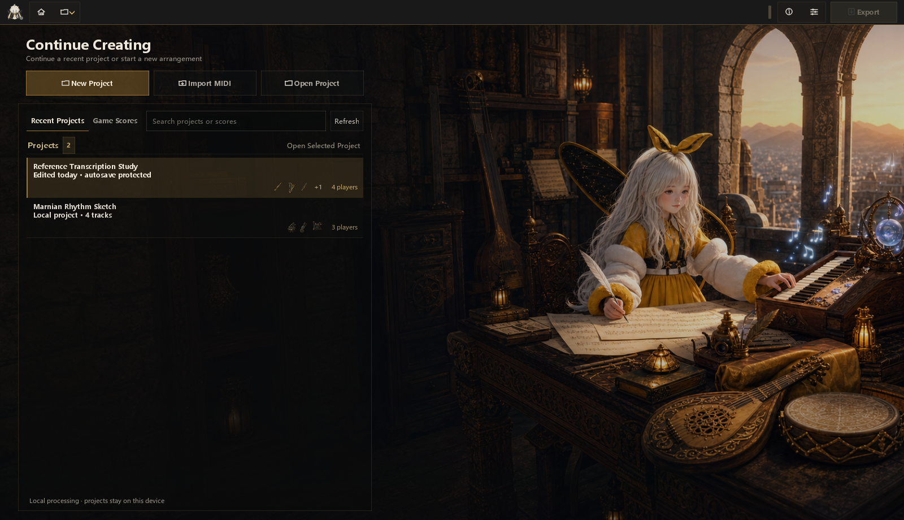
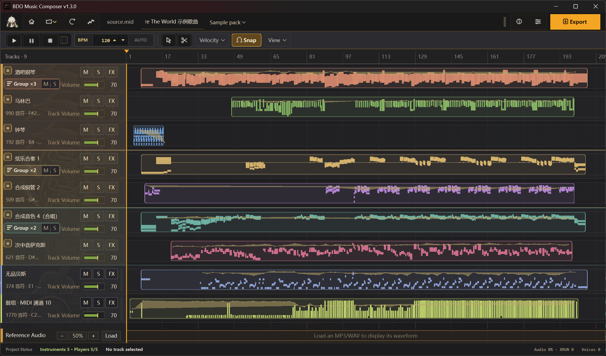
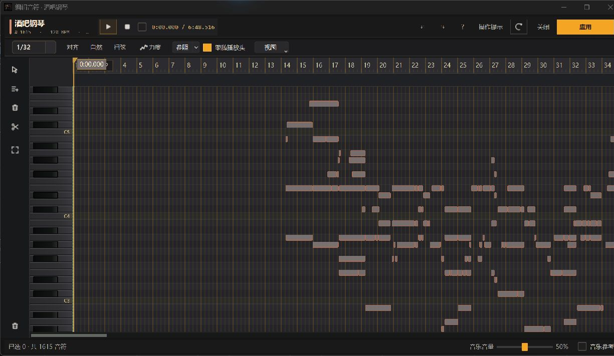
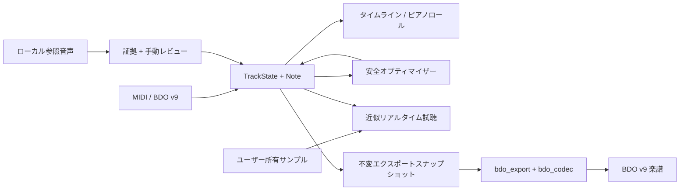

# BDO Music Composer

[简体中文](README.zh-CN.md) · [English](README.en.md) · [日本語](README.ja.md) · [한국어](README.ko.md) · [言語ハブ](README.md)

> AI Agent と新しいメンテナーは、コードを変更する前に [`AGENTS.md`](AGENTS.md) と [Agent 引き継ぎ・連携ガイド](docs/AGENT_HANDOFF.md) を読んでください。今後の境界設計と性能計測ルールは [分離・性能・拡張ロードマップ](docs/OPTIMIZATION_EXTENSION_ROADMAP.md) にあります。

BDO Music Composer は、非公式の PySide6 MIDI エディター、ローカル音声採譜ワークベンチ、決定論的オプティマイザー、ゲームサンプル試聴、Black Desert v9 楽譜エクスポーターです。メンテナーと友人向けの小規模な楽譜ラボであり、汎用 DAW ではありません。Pearl Abyss とは関係ありません。

<!-- section:screenshots -->
## インターフェースプレビュー



| マルチトラックタイムライン | ピアノロール音符エディター |
|---|---|
|  |  |

<!-- section:status -->
## 状態と免責事項

v1.0.0 は最初の公開安定メジャー版です。編集、オートセーブ、最適化、試聴、採譜支援、BDO v9 書き出しの主要フローには自動回帰テストがありますが、音声機器、Windows 環境、ゲームバージョンによる差は残ります。

- 書き出しとゲーム内での再編集には、自分のアカウントで保存した楽譜から取得した有効な Owner ID が必要です。
- BDO v9 は `/4` 拍子のみを表現します。他の分母は誤変換せず、明示的に拒否します。
- ゲームサンプル試聴と一部 DSP/奏法は、ゲーム内 A/B 証拠がない限り近似です。
- Basic Pitch の音符、和声、ボイスグループ、BDO Top-3 は編集可能な補助情報であり、検証済みの楽譜や混音中の楽器を確実に識別するものではありません。
- アカウントログイン、テレメトリー、ファイルアップロード、OpenAI API、クラウドモデル実行環境は含みません。

<!-- section:features -->
## 主な機能

### MIDI・プロジェクト・編集

- ベロシティ、長さ、コントローラー、歌詞、サステイン、テンポ変化を含む MIDI 読み込み。
- 空のプロジェクトからトラックを作成し、音符の作成・削除・移動・リサイズ・選択・一括編集。
- マルチトラックタイムライン、トラック別ピアノロール、ベロシティレーン、量子化グリッド、奏法、`ntype=0` の可逆編集。
- BDO v9 の二つのベロシティ、トラック音量/設定、奏法、物理チャンクを保持して開き、未変更文書はバイト単位で往復。
- Undo/Redo、バックグラウンドオートセーブ、版の検出、プライバシーに配慮したホーム索引。

### 実用的な採譜

- ローカル WAV または標準 MP3 を読み込み、［解析］で Basic Pitch ONNX/CPU をローカル実行します。
- 製品 UI は保護された standard/balanced/preserve 設定に固定し、実験的パラメーター、フレーズ、和声、ボイスグループ、編成診断を表示しません。
- 「解析ノート」は軽い枠線と下部の認識信頼度バーで表示し、範囲選択、絞り込み、下書きへの追加ができます。読み取り専用の連続性判定は、根拠のある同音高の弱い分割だけを接続し、各アタックと候補 ID は保持します。「ピッチライン」は独立した連続ピッチ表示で、ヒステリシス追跡、制約付き二重ベジェ描画、個別の不透明度、低・標準・高の表示専用ノイズ除去を使います。自動音色分類は信頼できるプロトタイプを先に作り、短い断片を吸収して分類数と信頼度を表示します。帰属が一意な線だけにグループ色を使い、競合や証拠不足は中立色に保ちます。任意のメロディガイドは、複数の時間区間で手動編集ノートが命中した音色グループに重複排除・上限制御された重みを加えます。安定後は、そのグループの解析ノートとピッチラインを現在のトラック楽器として最優先表示しますが、音響認識や書き出しは変更しません。
- 下書きには読み取り専用のゲーム適合チェックを実行でき、その後に採譜ガイドを閉じて通常編集を続けられます。チェックはノートを削除、移調、クオンタイズしません。
- 結果はまず編集ドラフトに入り、Apply/OK 後にのみ正式トラックへ反映されます。既存ノートの自動上書きや打楽器の自動マッピングは行いません。

### 最適化・試聴・書き出し

- 統一された「MIDI 最適化」ワークベンチで conservative/balanced/deep、プロジェクト全体/単一トラックを最初に選択し、解析プレビュー後に適用。
- 信頼するローカルアルゴリズムを `.bdoopt` として registry/plugin 境界から追加可能。
- ユーザー所有の Wwise WAV または検証済み `.bdosamples` によるリアルタイム試聴。音声 callback はディスク I/O を行いません。
- BDO 楽器/奏法、全体・トラック別オクターブ投影、Marnian `basic/stereo/super/superoct`。
- 現在の編集モデルから BDO v9 を生成し、物理トラックを 730 音符で分割し、楽器ごとの空の終端トラックを付加。
- GUI スレッドで不変スナップショットを作り、出力先とゲームフォルダーへアトミックに公開。

### UI と言語

- Windows 向けダーク Fluent 風 UI、レスポンシブツールバー、プロジェクトホーム、性能表示、非ブロッキングガイド。
- 簡体字中国語、繁体字中国語、英語、日本語、韓国語の UI。固定 UI 文だけを翻訳し、曲名・トラック名・ファイル名は翻訳しません。
- オリジナル同梱アイコンと、ユーザーが正当に読み取れるゲーム環境から作る任意の私有画像キャッシュ。

<!-- section:requirements -->
## 必要環境とソース起動

再現可能なリリース環境は Windows、Python 3.12.10、利用可能な音声デバイスです。MIDI の読み込みと編集だけならゲーム音声は不要です。

```powershell
git clone https://github.com/CocoaMist/3007-BDO_Music_Composer.git
cd 3007-BDO_Music_Composer
python -m venv .venv
.\.venv\Scripts\python.exe -m pip install --constraint constraints-windows-py312.txt -r requirements-pyside.txt
powershell -ExecutionPolicy Bypass -File scripts\install_transcription.ps1
.\.venv\Scripts\python.exe main.py
```

`install_transcription.ps1` は Windows EXE と同じ Basic Pitch ONNX CPU 環境をソース用に導入します。既存 EXE の拡張機構ではありません。製品は一つの UI、project schema、cache 形式、実行ファイルを持ちます。

<!-- section:workflow -->
## 基本ワークフロー

1. 新規プロジェクト、MIDI 読み込み、または BDO v9 楽譜を開きます。
2. キャラクター名、Owner ID、出力先、任意のローカルサンプルを設定します。
3. BDO 楽器を選び、音符、ベロシティ、奏法、FX、ピッチ変換を編集します。
4. 必要なら参照音声を読み込んで解析し、参照ノートまたはピッチガイドで旋律を確認して、選択ノートを下書きへ追加します。
5. 必要なら最適化を分析・試聴し、全曲または対象トラックへ適用します。
6. 「変換チェック」で音域、無効 FX、打楽器、楽器統合の問題を解消します。
7. 現在の編集状態を試聴して書き出します。出力は構造的に再読込して検証されます。

書き出しの事実源は常に現在の `TrackState` / `Note` です。元 MIDI を密かに読み直すことはありません。

<!-- section:local-assets -->
## ローカルサンプルとゲーム画像

設定ではユーザー作成の `.bdosamples` を一つ選択できます。これは versioned manifest と SHA-256 検証を持つ ZIP 互換ローカル容器で、再生前に展開されます。

```powershell
.\.venv\Scripts\python.exe -m bdo_sample_pack "D:\your-audio-root" "D:\private\my-samples.bdosamples"
```

利用権のある音声だけを使ってください。パッケージ、展開 cache、WEM/WAV、参照音声をリポジトリや Release にアップロードしてはいけません。

既定の同梱画像はオリジナルの AI 支援楽器ファミリーアイコンです。自分のゲームファイルを正当に読めるユーザーは私有タイムライン画像 cache を作れます。

```powershell
.\.venv\Scripts\python.exe tools\import_bdo_game_art.py "<BlackDesert-Paz>" --cache-root "<private-local-cache>"
```

importer は許可リストの CSS と楽器 sprite だけを有界にデコードし、version、size、crop、hash を検証します。汎用 PAZ 展開器ではありません。生成物を project、build、ZIP、release に含めないでください。

<!-- section:architecture -->
## アーキテクチャ



主要境界：

- `bdo_music_composer/ui/main_window.py`：メインウィンドウ編成、Qt lifecycle、互換 export。
- `bdo_music_composer/editor/model_revision.py`、
  `bdo_music_composer/app/conversion_validation_controller.py`、
  `bdo_music_composer/transcription/transcription_workspace_controller.py`、
  `bdo_music_composer/project/project_lifecycle_controller.py`、
  `bdo_music_composer/audio/preview_transport_controller.py`：検証、採譜
  worker／レビュー履歴、project loading、preview transport command の Qt-free 状態。
- `bdo_music_composer/editor/editor_models.py`、
  `bdo_music_composer/editor/editor_import.py`、
  `bdo_music_composer/editor/editor_commands.py`、
  `bdo_music_composer/editor/interval_index.py`、
  `bdo_music_composer/editor/velocity_curve.py`、
  `bdo_music_composer/editor/preview_midi_writer.py`：Qt-free の共有状態、
  transaction import、command、可視範囲 query、velocity curve、標準 MIDI 投影。
- `bdo_music_composer/ui/editor/`：可視範囲索引付き timeline、piano-roll、note-editor 画面。
- `bdo_music_composer/app/application_metadata.py`：version/repository identity。
- focused dialog は `bdo_music_composer/ui/dialogs/`、semantic application
  theme は inert な `bdo_music_composer/ui/theme/` subpackage にあります。
- `optimization/`：本番 pipeline、registry、信頼ローカルアルゴリズム境界。
- `bdo_music_composer/audio/bdo_realtime_audio.py`、`bdo_music_composer/audio/bdo_sample_renderer.py`：リアルタイム/オフライン試聴。
- `bdo_music_composer/export/export_workflow.py`、`bdo_export/`、`bdo_codec/`：不変 request、変換、binary I/O、atomic publish。
- `bdo_music_composer/project/project_persistence.py`、
  `bdo_music_composer/project/project_schema.py`、`bdo_music_composer/app/home_catalog.py`：autosave、
  migration、有界 home discovery。
- `bdo_transcription*.py`、`bdo_music_composer/ui/transcription/transcription_workers.py`：Qt-free 分析、安定候補範囲 index、background worker。
- `bdo_music_composer/ui/i18n.py`、`bdo_music_composer/core/project_paths.py`：翻訳 catalog と source/frozen path 境界。

詳細：[Architecture](docs/ARCHITECTURE.md)、[AI Context](docs/AI_CONTEXT.md)、[Project Structure](docs/PROJECT_STRUCTURE.md)、[Conversion Settings](docs/CONVERSION_SETTINGS.md)、[BDO v9 codec](docs/BDO_V9_CODEC.md)。

no-shim package migration は以前の 89→69 に続いて root Python file を
69→56 に削減しました。さらに 5 個の Qt editor owner を
`bdo_music_composer/ui/editor/` に集約し、version/repository identity を
`bdo_music_composer/app/application_metadata.py` に一元化して、現在の上限を
52 にしました。7～10 file の root は将来の方向で、現在完了した状態では
ありません。

<!-- section:invariants -->
## 正確性と性能の不変条件

- `Note` は `Note(pitch, vel, start, dur, ntype)` のままです。
- game-safe 最適化は音符数、pitch multiset、楽器 mapping、無関係なトラックを予期せず変えません。
- BDO v9 は little-endian、音符は 20-byte `<BBBBdd>`、暗号化前 plaintext は 8-byte alignment。
- autosave/export worker は GUI スレッドで固定した不変データだけを受け取ります。
- audio callback は file read、JSON/WAV decode、無界 allocation を行いません。
- timeline、piano roll、evidence paint は可視範囲 index、batch、有界 cache を使います。
- 決定論的入力は同じ最適化・書き出し結果を生成します。

UI 基準は `tools/benchmark_dense_ui.py`、候補とリスクは [ロードマップ](docs/OPTIMIZATION_EXTENSION_ROADMAP.md) を参照してください。

<!-- section:testing -->
## テストと検証

```powershell
.\.venv\Scripts\python.exe -m unittest discover -s tests -t . -q
.\.venv\Scripts\python.exe -m py_compile main.py bdo_music_composer/core/project_paths.py bdo_music_composer/ui/main_window.py bdo_music_composer/ui/i18n.py
git diff --check
```

最適化安全性、リアルタイム音声、採譜 cache/session/evidence、project migration、export round trip、BDO v9 構造、Marnian ID、localization、README 整合性を検証します。UI 変更には offscreen widget smoke、packaging 変更には clean build と startup self-test も必要です。

<!-- section:packaging -->
## Windows 実行ファイルの構築

```powershell
.\.venv\Scripts\python.exe -m pip install --constraint constraints-windows-py312.txt -r requirements-build.txt
powershell -ExecutionPolicy Bypass -File scripts\install_transcription.ps1
powershell -ExecutionPolicy Bypass -File packaging\windows\build.ps1
```

唯一の出力は `dist\BDO-Music-Composer.exe` です。ビルドはその EXE に対し Basic Pitch ONNX/CPU 合成推論と 10 秒以上の GUI 起動試験を行い、正確な dependency/license inventory を埋め込みます。`-PublicRelease` は承認済み digest と一致しなければ停止し、依存関係や artifact の変更には再審査が必要です。[Windows packaging](docs/WINDOWS_PACKAGING.md) を参照してください。

EXE にゲーム音声/画像、Owner ID、個人設定、autosave、参照音声、出力楽譜は入りません。書き込み先は `%LOCALAPPDATA%\BDO Music Composer` で、`BDO_USER_DATA_DIR` で変更できます。

<!-- section:privacy -->
## プライバシーとリポジトリ管理

`.pyside_bdo_gui.json`、`auto_save/`、`out/`、`build/`、`dist/`、実 Owner ID/キャラクター名入り楽譜、PAZ/BNK/WEM/WAV、参照音声、cache、crash log、secret、ローカル絶対 path、release archive を commit しないでください。

公開前：

```powershell
git status --short
git ls-files out auto_save dist build
git grep -n -I -E "(C:\\Users\\|OPENAI_API_KEY|api[_-]?key|password)"
.\.venv\Scripts\python.exe -m unittest discover -s tests -t . -q
```

<!-- section:docs -->
## ドキュメントと協力

- [Agent 引き継ぎ・連携ガイド](docs/AGENT_HANDOFF.md)
- [開発 SDK と再利用可能な UI](docs/DEVELOPER_SDK.md)
- [Architecture](docs/ARCHITECTURE.md) / [AI change routing](docs/AI_CONTEXT.md)
- [分離・性能・拡張ロードマップ](docs/OPTIMIZATION_EXTENSION_ROADMAP.md)
- [Localization policy](docs/LOCALIZATION.md)
- [Windows packaging](docs/WINDOWS_PACKAGING.md) / [BDO v9 codec](docs/BDO_V9_CODEC.md)
- [Contributing](CONTRIBUTING.md) / [Third-party notices](THIRD_PARTY_NOTICES.md)

AI Agent は `AGENTS.md` を読み、ユーザーの既存 worktree 変更を保持し、Agent ガイドの検証 matrix と handoff packet に従って引き渡してください。

<!-- section:license -->
## クレジットとライセンス

Basic Pitch、ONNX Runtime、PySide6/Qt、Mido、NumPy、SciPy、librosa、SoundFile、soxr、PyInstaller などは上流の条件を保持します。Basic Pitch 0.4.0 のコードと `nmp.onnx` は公式 Apache-2.0 release tree にあり、LICENSE/NOTICE を保持しています。完全な一覧、引用、歴史的参考は [THIRD_PARTY_NOTICES.md](THIRD_PARTY_NOTICES.md) とアプリ内 Credits を参照してください。

CocoaMist が所有するオリジナルコードは [MIT License](LICENSE) です。ルート LICENSE は第三者のコード、モデル、asset の所有や再ライセンスを主張しません。
