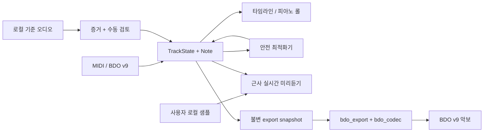

# BDO Music Composer

[简体中文](README.zh-CN.md) · [English](README.en.md) · [日本語](README.ja.md) · [한국어](README.ko.md) · [언어 허브](README.md)

> AI Agent와 새 유지보수자는 코드를 변경하기 전에 [`AGENTS.md`](AGENTS.md)와 [Agent 인수인계·협업 안내서](docs/AGENT_HANDOFF.md)를 읽어야 합니다. 다음 분리 경계와 성능 측정 규칙은 [분리·성능·확장 로드맵](docs/OPTIMIZATION_EXTENSION_ROADMAP.md)에 있습니다.

BDO Music Composer는 비공식 PySide6 MIDI 편집기, 로컬 오디오 채보 워크벤치, 결정론적 최적화기, 게임 샘플 미리듣기 및 Black Desert v9 악보 내보내기 도구입니다. 유지보수자와 지인을 위한 작은 악보 실험실이며 범용 DAW가 아닙니다. Pearl Abyss와 관련이 없습니다.

<!-- section:status -->
## 상태 및 고지

v1.0.0은 첫 공개 안정 메이저 버전입니다. 편집, 자동 저장, 최적화, 미리듣기, 채보 보조, BDO v9 내보내기의 주요 흐름은 자동 회귀 테스트로 보호되지만 오디오 장치, Windows 환경, 게임 버전에 따른 차이는 남아 있습니다.

- 내보내기와 게임 내 재편집에는 본인 계정으로 저장한 악보에서 얻은 유효한 Owner ID가 필요합니다.
- BDO v9은 `/4` 박자만 표현합니다. 다른 분모는 잘못 변환하지 않고 명확히 거부합니다.
- 게임 샘플 미리듣기와 일부 DSP/주법은 게임 내 A/B 증거가 없으면 근사치입니다.
- Basic Pitch 음표, 화성, 보이스 그룹, BDO Top-3는 편집 가능한 보조 정보이며 검증된 악보나 믹스 속 악기의 확정 식별이 아닙니다.
- 계정 로그인, 원격 측정, 파일 업로드, OpenAI API, 클라우드 모델 런타임을 포함하지 않습니다.

<!-- section:features -->
## 주요 기능

### MIDI, 프로젝트 및 편집

- velocity, 길이, controller, 가사, sustain, tempo 변화를 포함한 MIDI 가져오기.
- 빈 프로젝트에서 트랙을 만들고 음표 생성·삭제·이동·크기 변경·선택·일괄 편집.
- 멀티트랙 타임라인, 트랙별 피아노 롤, velocity lane, 양자화 grid, 주법, `ntype=0` 무손실 편집.
- BDO v9의 두 velocity, 트랙 음량/설정, 주법, 물리 chunk를 보존하여 열고 변경되지 않은 문서는 바이트 단위 왕복.
- 프로젝트 undo/redo, 백그라운드 자동 저장, 버전 탐색, 개인정보 안전 홈 인덱스.

### 채보 및 분석 보조

- 로컬 MP3/WAV, 기준 오프셋, beat origin, MIDI playhead 정렬.
- 로컬 Basic Pitch ONNX/CPU 분석, 구간 재디코딩, 증거 cache, 후보 검토.
- 편집 가능한 key/chord 구간, melody/voice group, fragment 정리, 설명 가능한 BDO 악기 Top-3.
- 사용자가 Apply/OK를 확인하기 전에는 분석 결과가 review sidecar에만 있고 정식 트랙을 변경하지 않습니다.
- 내장 편집은 자동 타악기 mapping을 의도적으로 제외하며 분석을 근거로 정식 음표나 트랙 배정을 덮어쓰지 않습니다.

### 최적화, 미리듣기 및 내보내기

- 하나의 MIDI 최적화 작업 화면에서 conservative/balanced/deep 강도와 전체 프로젝트/단일 트랙 범위를 먼저 선택하고 분석 preview 후 적용합니다.
- 신뢰하는 로컬 알고리즘을 `.bdoopt` package로 registry/plugin 경계에 추가 가능.
- 사용자 로컬 Wwise WAV 또는 검증된 `.bdosamples`의 실시간 미리듣기. audio callback은 디스크 I/O를 하지 않습니다.
- BDO 악기/주법, 전체·트랙별 octave 투영, Marnian `basic/stereo/super/superoct` 모드.
- 현재 편집 모델을 BDO v9으로 내보내며 물리 트랙은 730개 음표에서 분할하고 악기별 빈 마지막 트랙을 추가.
- GUI thread에서 불변 export snapshot을 만든 뒤 출력 폴더와 게임 음악 폴더에 원자적으로 게시.

### UI 및 언어

- Windows용 어두운 Fluent 계열 UI, 반응형 toolbar, 프로젝트 home, 성능 표시, 비차단 안내.
- 중국어 간체/번체, 영어, 일본어, 한국어 UI. 고정 UI 문자열만 번역하고 곡명, 트랙명, 파일명은 번역하지 않습니다.
- 원본 패키지 아이콘과 사용자가 합법적으로 읽을 수 있는 게임 설치에서 만드는 선택적 개인 이미지 cache.

<!-- section:requirements -->
## 요구 환경과 소스 실행

재현 가능한 릴리스 환경은 Windows, Python 3.12.10, 사용 가능한 오디오 장치입니다. MIDI 가져오기와 편집만 할 때는 게임 오디오가 필요하지 않습니다.

```powershell
git clone https://github.com/CocoaMist/3007-BDO_Music_Composer.git
cd 3007-BDO_Music_Composer
python -m venv .venv
.\.venv\Scripts\python.exe -m pip install --constraint constraints-windows-py312.txt -r requirements-pyside.txt
powershell -ExecutionPolicy Bypass -File scripts\install_transcription.ps1
.\.venv\Scripts\python.exe main.py
```

`install_transcription.ps1`은 Windows EXE와 같은 Basic Pitch ONNX CPU 환경을 소스용으로 설치합니다. 기존 EXE의 확장 방식이 아닙니다. 제품에는 하나의 UI, project schema, cache format, executable만 있습니다.

<!-- section:workflow -->
## 일반 작업 흐름

1. 새 프로젝트를 만들거나 MIDI 또는 BDO v9 악보를 엽니다.
2. 캐릭터명, Owner ID, 출력 경로, 선택적 로컬 샘플을 설정합니다.
3. BDO 악기를 선택하고 음표, velocity, 주법, FX, pitch transform을 편집합니다.
4. 필요하면 기준 오디오를 불러 로컬 채보를 실행하고 후보, 화성, voice group을 수동 검토합니다.
5. 필요하면 최적화를 분석·미리듣기한 뒤 전체 곡이나 대상 트랙에 적용합니다.
6. 변환 검사를 실행해 음역, 잘못된 FX, 타악기, 악기 병합 문제를 해결합니다.
7. 현재 편집 상태를 미리듣고 내보냅니다. 출력은 구조적으로 다시 읽어 검증됩니다.

내보내기의 사실 원본은 항상 현재 `TrackState` / `Note`입니다. 원본 MIDI를 몰래 다시 읽지 않습니다.

<!-- section:local-assets -->
## 로컬 샘플과 게임 이미지

설정에서 사용자가 만든 `.bdosamples` 하나를 선택할 수 있습니다. versioned manifest와 SHA-256 검증이 있는 ZIP 호환 로컬 container이며 재생 전에 압축을 풉니다.

```powershell
.\.venv\Scripts\python.exe -m bdo_sample_pack "D:\your-audio-root" "D:\private\my-samples.bdosamples"
```

사용 권한이 있는 오디오만 처리하십시오. package, 추출 cache, WEM/WAV, 기준 오디오를 저장소나 Release에 업로드하면 안 됩니다.

기본 패키지는 독자적인 AI 보조 악기군 아이콘을 사용합니다. 본인 게임 파일을 읽을 권한이 있는 사용자는 개인 타임라인 이미지 cache를 만들 수 있습니다.

```powershell
.\.venv\Scripts\python.exe tools\import_bdo_game_art.py "<BlackDesert-Paz>" --cache-root "<private-local-cache>"
```

importer는 허용 목록의 composition CSS와 악기 sprite만 제한적으로 디코딩하고 version, size, crop, hash를 검증합니다. 범용 PAZ 추출기가 아닙니다. 생성물을 project, build, ZIP, release에 포함하지 마십시오.

<!-- section:architecture -->
## 아키텍처



주요 경계:

- `pyside_bdo_gui.py`: main window orchestration, Qt lifecycle, 호환 export.
- `bdo_music_composer/editor/model_revision.py`,
  `bdo_music_composer/app/conversion_validation_controller.py`,
  `bdo_music_composer/transcription/transcription_workspace_controller.py`,
  `bdo_music_composer/project/project_lifecycle_controller.py`,
  `bdo_music_composer/audio/preview_transport_controller.py`: 검증, 채보
  worker/review history, project loading, preview transport command의 Qt-free 상태.
- `bdo_music_composer/editor/editor_models.py`,
  `bdo_music_composer/editor/editor_import.py`,
  `bdo_music_composer/editor/editor_commands.py`,
  `bdo_music_composer/editor/interval_index.py`,
  `bdo_music_composer/editor/velocity_curve.py`,
  `bdo_music_composer/editor/preview_midi_writer.py`: Qt-free 공유 상태,
  transaction import, command, visible-range query, velocity curve, 표준 MIDI projection.
- `bdo_music_composer/ui/editor/`: visible-range-indexed timeline, piano-roll, note-editor 화면.
- `bdo_music_composer/app/application_metadata.py`: version/repository identity.
- focused dialog는 `bdo_music_composer/ui/dialogs/`, semantic application
  theme는 inert한 `bdo_music_composer/ui/theme/` subpackage에 있습니다.
- `optimization/`: production pipeline, registry, 신뢰 로컬 알고리즘 경계.
- `bdo_realtime_audio.py`, `bdo_sample_renderer.py`: 실시간/오프라인 샘플 미리듣기.
- `export_workflow.py`, `bdo_export/`, `bdo_codec/`: 불변 request, adapter, binary I/O, atomic publication.
- `bdo_music_composer/project/project_persistence.py`,
  `bdo_music_composer/project/project_schema.py`, `home_catalog.py`: autosave,
  migration, bounded home discovery.
- `bdo_transcription*.py`, `transcription_workers.py`: Qt-free 분석, 안정적인 candidate-range index 및 background worker.
- `i18n.py`, `project_paths.py`: 번역 catalog와 source/frozen path 경계.

자세한 문서: [Architecture](docs/ARCHITECTURE.md), [AI Context](docs/AI_CONTEXT.md), [Project Structure](docs/PROJECT_STRUCTURE.md), [Conversion Settings](docs/CONVERSION_SETTINGS.md), [BDO v9 codec](docs/BDO_V9_CODEC.md).

no-shim package migration은 앞선 89→69 이후 root Python file을 69→56으로
줄였습니다. 이어 5개의 Qt editor owner를 `bdo_music_composer/ui/editor/`로
모으고 version/repository identity를
`bdo_music_composer/app/application_metadata.py`에 통합해 현재 기준을 52로
낮췄습니다. 7～10 file root는 장기 방향이며 현재 완료 상태가 아닙니다.

<!-- section:invariants -->
## 정확성 및 성능 불변 조건

- `Note`는 `Note(pitch, vel, start, dur, ntype)`를 유지합니다.
- game-safe 최적화는 음표 수, pitch multiset, 악기 mapping, 관련 없는 트랙을 예기치 않게 바꾸지 않습니다.
- BDO v9 필드는 little-endian, 음표는 20-byte `<BBBBdd>`, 암호화 전 plaintext는 8-byte alignment입니다.
- autosave/export worker는 GUI thread에서 고정한 불변 데이터만 받습니다.
- audio callback에서 file read, JSON/WAV decode, 무제한 allocation을 하지 않습니다.
- timeline, piano roll, evidence paint는 visible-range index, batch, bounded cache를 사용합니다.
- 결정론적 입력은 같은 최적화와 export 결과를 만듭니다.

UI 기준은 `tools/benchmark_dense_ui.py`, 후보와 위험은 [로드맵](docs/OPTIMIZATION_EXTENSION_ROADMAP.md)을 참고하십시오.

<!-- section:testing -->
## 테스트 및 검증

```powershell
.\.venv\Scripts\python.exe -m unittest discover -s tests -t . -q
.\.venv\Scripts\python.exe -m py_compile main.py project_paths.py pyside_bdo_gui.py i18n.py
git diff --check
```

최적화 안전성, 실시간 오디오, 채보 cache/session/evidence, project migration, export round trip, BDO v9 구조, Marnian ID, localization, README 일관성을 검사합니다. UI 변경에는 offscreen widget smoke가, packaging 변경에는 clean build와 startup self-test가 추가로 필요합니다.

<!-- section:packaging -->
## Windows 실행 파일 빌드

```powershell
.\.venv\Scripts\python.exe -m pip install --constraint constraints-windows-py312.txt -r requirements-build.txt
powershell -ExecutionPolicy Bypass -File scripts\install_transcription.ps1
powershell -ExecutionPolicy Bypass -File packaging\windows\build.ps1
```

유일한 출력은 `dist\BDO-Music-Composer.exe`입니다. 빌드는 그 EXE에 대해 Basic Pitch ONNX/CPU 합성 추론과 10초 이상 GUI 시작 시험을 실행하고 정확한 dependency/license inventory를 내장합니다. `-PublicRelease`는 승인된 digest와 다르면 중단하며 dependency나 artifact 변경은 새 사람 검토가 필요합니다. [Windows packaging](docs/WINDOWS_PACKAGING.md)을 참고하십시오.

EXE에는 게임 오디오/이미지, Owner ID, 개인 설정, autosave, 기준 오디오, 출력 악보가 포함되지 않습니다. 쓰기 데이터는 `%LOCALAPPDATA%\BDO Music Composer`에 저장하며 `BDO_USER_DATA_DIR`로 바꿀 수 있습니다.

<!-- section:privacy -->
## 개인정보 및 저장소 관리

`.pyside_bdo_gui.json`, `auto_save/`, `out/`, `build/`, `dist/`, 실제 Owner ID/캐릭터명이 있는 악보, PAZ/BNK/WEM/WAV, 기준 오디오, cache, crash log, secret, 로컬 절대 path, release archive를 commit하지 마십시오.

공개 전:

```powershell
git status --short
git ls-files out auto_save dist build
git grep -n -I -E "(C:\\Users\\|OPENAI_API_KEY|api[_-]?key|password)"
.\.venv\Scripts\python.exe -m unittest discover -s tests -t . -q
```

<!-- section:docs -->
## 문서 및 협업

- [Agent 인수인계·협업 안내서](docs/AGENT_HANDOFF.md)
- [Architecture](docs/ARCHITECTURE.md) / [AI change routing](docs/AI_CONTEXT.md)
- [분리·성능·확장 로드맵](docs/OPTIMIZATION_EXTENSION_ROADMAP.md)
- [Localization policy](docs/LOCALIZATION.md)
- [Windows packaging](docs/WINDOWS_PACKAGING.md) / [BDO v9 codec](docs/BDO_V9_CODEC.md)
- [Contributing](CONTRIBUTING.md) / [Third-party notices](THIRD_PARTY_NOTICES.md)

AI Agent는 `AGENTS.md`를 읽고 사용자의 기존 worktree 변경을 보존하며 Agent 안내서의 검증 matrix와 handoff packet에 따라 전달해야 합니다.

<!-- section:license -->
## 크레딧 및 라이선스

Basic Pitch, ONNX Runtime, PySide6/Qt, Mido, NumPy, SciPy, librosa, SoundFile, soxr, PyInstaller 등은 각각의 upstream 조건을 유지합니다. Basic Pitch 0.4.0 코드와 `nmp.onnx`는 공식 Apache-2.0 release tree에 있으며 LICENSE/NOTICE를 보존합니다. 전체 목록, 논문 인용, 역사적 참고는 [THIRD_PARTY_NOTICES.md](THIRD_PARTY_NOTICES.md)와 앱의 Credits에서 확인하십시오.

CocoaMist가 소유한 원본 프로젝트 코드는 [MIT License](LICENSE)입니다. 루트 LICENSE는 제3자 코드, 모델, asset의 소유권을 주장하거나 재라이선스하지 않습니다.
