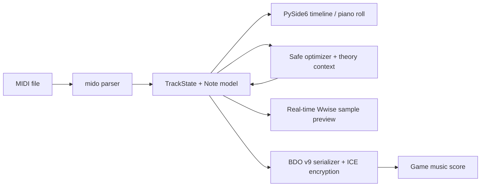

# BDO Music Composer

<p align="center">
  
</p>

An unofficial desktop MIDI editor, optimizer, game-sample previewer, and Black Desert Online music-score exporter.

中文简介：这是一个面向《黑色沙漠》作曲系统的 MIDI 编排工具，支持钢琴卷帘编辑、单轨/全局优化、奏法、游戏音源近似试听和 BDO v9 曲谱导出。

> [!IMPORTANT]
> This is an independent community project. It is not affiliated with, endorsed by, or supported by Pearl Abyss. No game assets are distributed in this repository. Users must supply their own legally obtained game files and audio extracts.

## 功能实现

### MIDI 导入与工程管理

- 读取标准 MIDI 文件，解析轨道、速度、BPM、拍号、tempo 变化、踏板控制和歌词事件。
- 在可缩放时间轴中查看全部轨道，并支持静音、独奏、音量、乐器分配和播放位置控制。
- 自动保存当前工程，保留轨道映射、编辑后的音符、奏法、力度策略和导出设置。

### 音符编辑

- 提供钢琴卷帘编辑器，可新建、删除、移动和缩放音符。
- 支持多选、框选、复制、剪切、粘贴、撤销、重做和量化吸附。
- 可修改音高、起始时间、时值、力度及 BDO `ntype` 奏法。
- 手工编辑直接写回当前工程模型，导出时不会重新读取原始 MIDI 覆盖修改。

### MIDI 优化

- 支持单轨优化和全局优化，并读取完整歌曲的和声、节奏、配器及歌词上下文。
- 游戏安全模式保持音符数量、音高集合、轨道和乐器映射，不擅自新增或删除音符。
- 可处理力度平衡、轻微时序、软量化、音块修复和保守奏法建议。
- 优化结果可预览、查看报告并选择是否应用。

### BDO 乐器与奏法

- 将 MIDI 轨道映射到支持的《黑色沙漠》乐器。
- 支持轨道级和音符级奏法，并在导出时保存 `ntype`。
- 支持玛勒尼斯乐器的 Basic、Stereo、Super 和 Super Octave 音源模式。
- 转换检查会提示音域越界、未知打击乐映射、无效 FX、轨道合并和容量问题。

### 游戏音源试听

- 使用用户自行提取的 Wwise WAV 样本进行低延迟实时试听。
- 样本在播放前预载和解码，实时音频回调不读取磁盘文件。
- 支持精确事件帧调度、播放定位、有界声部池和输出限幅。
- 未经游戏内 A/B 验证的 DSP 和奏法会明确标记为近似效果。

### BDO v9 曲谱导出

- 从当前编辑器模型生成 BDO v9 曲谱，保留新增、删除、移动、缩放和奏法修改。
- 支持 Owner ID、角色名、BPM、移调、力度策略和游戏效果参数。
- 按每轨 730 个音符自动拆分，并生成每种乐器要求的空结尾轨道。
- 输出采用 BDO v9 二进制结构和 ICE 加密；非 `/4` 拍号会明确拒绝，不会静默错误导出。

### 界面与发布

- 界面支持简体中文、英语、日语和韩语。
- 可选择根据系统时区自动切换语言，也可以手动固定语言。
- 支持使用 PyInstaller 构建便携式 Windows 单文件程序。
- 软件不包含联网、遥测、账号登录或文件上传功能；MIDI、Owner ID、音源和导出文件均在本地处理。

## Current status and limitations

- The editor and BDO v9 serialization path are functional and covered by automated tests.
- In-game edit permission requires an Owner ID copied from a score saved by your own account.
- BDO v9 stores a `/4` meter representation; non-`/4` MIDI files are rejected instead of silently converted incorrectly.
- Wwise preview requires local extracted WAV files. Preview routing and some DSP-heavy articulations are approximate until verified by in-game A/B testing.
- Marnian source modes use the reserved contiguous instrument IDs documented in the code and tests.
- This repository currently has **no root `LICENSE` file**. Do not describe a public copy as open source until the maintainer selects a license and verifies the licensing status of vendored code under `tools/midi-to-bdo/`.

## Quick start from source

Requirements: Windows, Python 3.12 recommended, and a working audio device for preview.

```powershell
git clone <your-repository-url>
cd BDO_Music_Composer
python -m venv .venv
.\.venv\Scripts\python.exe -m pip install -r requirements-pyside.txt
.\.venv\Scripts\python.exe main.py
```

The GUI can import and edit MIDI without game audio. Configure extracted audio paths in the application before using real-time preview.

## Tests

```powershell
.\.venv\Scripts\python.exe -m unittest discover -s tests -q
.\.venv\Scripts\python.exe -m py_compile main.py project_paths.py pyside_bdo_gui.py i18n.py
```

The test suite covers optimizer safety, real-time audio behavior, export round trips, BDO v9 structure, Marnian mode IDs, and localization catalogs.

## Build the Windows executable

```powershell
.\.venv\Scripts\python.exe -m pip install -r requirements-build.txt
powershell -ExecutionPolicy Bypass -File packaging\windows\build.ps1
```

Output: `dist\BDO-Music-Composer.exe`.

The executable embeds the application icon, UI background, and the runtime MIDI/Wwise zone map. It does **not** embed extracted game audio, personal settings, Owner IDs, autosaves, or exported scores.

## Architecture at a glance



Primary entry points:

- `main.py` — unified application entry point.
- `pyside_bdo_gui.py` — desktop UI, editor state, export orchestration, and autosave.
- `optimization/` — extensible optimization package, built-in pipeline, and algorithm registry.
- `bdo_midi_optimizer.py` — backward-compatible facade for older integrations.
- `bdo_realtime_audio.py` — low-latency sample preview engine.
- `tools/midi-to-bdo/midi2bdo.py` — vendored BDO v9 serializer and MIDI parser.
- `i18n.py` — runtime localization catalogs.

See [Architecture](docs/ARCHITECTURE.md), [AI Context](docs/AI_CONTEXT.md), and [Project Structure](docs/PROJECT_STRUCTURE.md) for deeper documentation.

## Repository hygiene and privacy

The following must never be committed:

- `.pyside_bdo_gui.json`, `auto_save/`, `out/`, `build/`, and `dist/`;
- game scores containing a real Owner ID or character name;
- extracted PAZ, BNK, WEM, or WAV assets;
- local absolute paths, API keys, crash logs, and generated release archives.

Run this before publishing:

```powershell
git status --short
git ls-files out auto_save dist build
git grep -n -I -E "(C:\\Users\\|OPENAI_API_KEY|api[_-]?key|password)"
.\.venv\Scripts\python.exe -m unittest discover -s tests -q
```

## Attribution

- [mido](https://mido.readthedocs.io/) for Standard MIDI parsing and writing.
- Bishop-R's `midi-to-bdo` work for the original BDO conversion foundation vendored under `tools/midi-to-bdo/`.
- Community research around Black Desert music-score files, instrument IDs, and game UI behavior.
- PySide6 / Qt and NumPy for the desktop and audio runtime.

Before public release, add exact upstream commit references and license texts for all vendored components.

## Contributing

Read [CONTRIBUTING.md](CONTRIBUTING.md). AI coding agents must read [AGENTS.md](AGENTS.md) before changing code.

## License

License selection is pending. Add a root `LICENSE` file before publishing this repository as open source.
