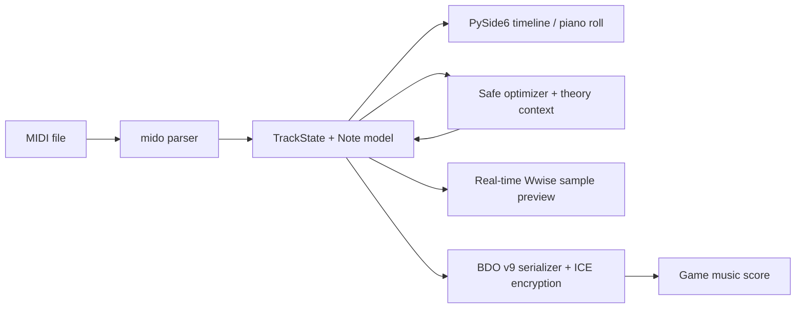

# BDO Music Composer

<p align="center">
  
</p>

An unofficial desktop MIDI editor, optimizer, game-sample previewer, and Black Desert Online music-score exporter.

中文简介：这是一个面向《黑色沙漠》作曲系统的 MIDI 编排工具，支持钢琴卷帘编辑、单轨/全局优化、奏法、游戏音源近似试听和 BDO v9 曲谱导出。

> [!IMPORTANT]
> This is an independent community project. It is not affiliated with, endorsed by, or supported by Pearl Abyss. No game assets are distributed in this repository. Users must supply their own legally obtained game files and audio extracts.

## Highlights

- Import standard MIDI and inspect tracks on a scalable timeline.
- Edit notes in a piano roll: create, delete, move, resize, multi-select, copy/paste, velocity, and articulation.
- Run conservative single-track or whole-song optimization with music-theory context.
- Map tracks to supported BDO instruments and serialize note-level `ntype` articulations.
- Preview with user-provided extracted Wwise samples.
- Export encrypted BDO v9 music scores with Owner ID support.
- Interface languages: Simplified Chinese, English, Japanese, and Korean.
- Build a portable Windows one-file executable with PyInstaller.

## Current status and limitations

- The editor and BDO v9 serialization path are functional and covered by automated tests.
- In-game edit permission requires an Owner ID copied from a score saved by your own account.
- BDO v9 stores a `/4` meter representation; non-`/4` MIDI files are rejected instead of silently converted incorrectly.
- Wwise preview requires local extracted WAV files. Preview routing and some DSP-heavy articulations are approximate until verified by in-game A/B testing.
- Marnian source modes use the reserved contiguous instrument IDs documented in the code and tests.
- This repository currently has **no root `LICENSE` file**. Do not describe a public copy as open source until the maintainer selects a license and verifies the licensing status of vendored code under `tools/midi-to-bdo/`.

## Quick start from source

Requirements: Windows, Python 3.12 recommended, and a working audio device for preview.

```powershell
git clone <your-repository-url>
cd BDO_Music_Composer
python -m venv .venv
.\.venv\Scripts\python.exe -m pip install -r requirements-pyside.txt
.\.venv\Scripts\python.exe main.py
```

The GUI can import and edit MIDI without game audio. Configure extracted audio paths in the application before using real-time preview.

## Tests

```powershell
.\.venv\Scripts\python.exe -m unittest discover -s tests -q
.\.venv\Scripts\python.exe -m py_compile main.py project_paths.py pyside_bdo_gui.py i18n.py
```

The test suite covers optimizer safety, real-time audio behavior, export round trips, BDO v9 structure, Marnian mode IDs, and localization catalogs.

## Build the Windows executable

```powershell
.\.venv\Scripts\python.exe -m pip install -r requirements-build.txt
powershell -ExecutionPolicy Bypass -File packaging\windows\build.ps1
```

Output: `dist\BDO-Music-Composer.exe`.

The executable embeds the application icon, UI background, and the runtime MIDI/Wwise zone map. It does **not** embed extracted game audio, personal settings, Owner IDs, autosaves, or exported scores.

## Architecture at a glance



Primary entry points:

- `main.py` — unified application entry point.
- `pyside_bdo_gui.py` — desktop UI, editor state, export orchestration, and autosave.
- `optimization/` — extensible optimization package, built-in pipeline, and algorithm registry.
- `bdo_midi_optimizer.py` — backward-compatible facade for older integrations.
- `bdo_realtime_audio.py` — low-latency sample preview engine.
- `tools/midi-to-bdo/midi2bdo.py` — vendored BDO v9 serializer and MIDI parser.
- `i18n.py` — runtime localization catalogs.

See [Architecture](docs/ARCHITECTURE.md), [AI Context](docs/AI_CONTEXT.md), and [Project Structure](docs/PROJECT_STRUCTURE.md) for deeper documentation.

## Repository hygiene and privacy

The following must never be committed:

- `.pyside_bdo_gui.json`, `auto_save/`, `out/`, `build/`, and `dist/`;
- game scores containing a real Owner ID or character name;
- extracted PAZ, BNK, WEM, or WAV assets;
- local absolute paths, API keys, crash logs, and generated release archives.

Run this before publishing:

```powershell
git status --short
git ls-files out auto_save dist build
git grep -n -I -E "(C:\\Users\\|OPENAI_API_KEY|api[_-]?key|password)"
.\.venv\Scripts\python.exe -m unittest discover -s tests -q
```

## Attribution

- [mido](https://mido.readthedocs.io/) for Standard MIDI parsing and writing.
- Bishop-R's `midi-to-bdo` work for the original BDO conversion foundation vendored under `tools/midi-to-bdo/`.
- Community research around Black Desert music-score files, instrument IDs, and game UI behavior.
- PySide6 / Qt and NumPy for the desktop and audio runtime.

Before public release, add exact upstream commit references and license texts for all vendored components.

## Contributing

Read [CONTRIBUTING.md](CONTRIBUTING.md). AI coding agents must read [AGENTS.md](AGENTS.md) before changing code.

## License

License selection is pending. Add a root `LICENSE` file before publishing this repository as open source.
