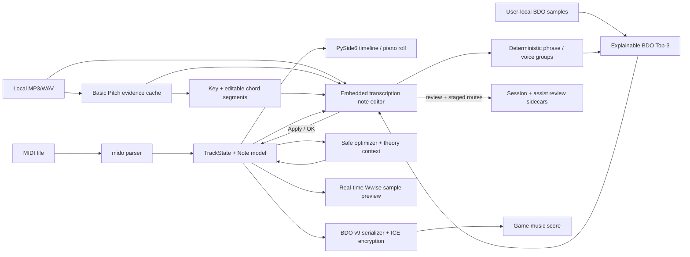

# BDO Music Composer

Current release: **[v1.0.0](https://github.com/CocoaMist/3007-BDO_Music_Composer/releases/tag/v1.0.0)** · [Download for Windows](https://github.com/CocoaMist/3007-BDO_Music_Composer/releases/download/v1.0.0/BDO-Music-Composer.exe) · [Report an issue](https://github.com/CocoaMist/3007-BDO_Music_Composer/issues)

<p align="center">
  🌐 <a href="#简体中文">简体中文</a> ·
  <a href="#繁體中文">繁體中文</a> ·
  <a href="#english">English</a> ·
  <a href="#한국어">한국어</a>
</p>

<p align="center">
  
</p>

An unofficial Windows desktop workstation for arranging MIDI, editing notes, previewing user-supplied game samples, and exporting Black Desert Online v9 music scores.

## v1.0.0 public release

### 简体中文

v1.0.0 已公开发布。感谢 Reddit 和《黑色沙漠》音乐社区的关注与期待！这是项目的
第一个稳定主版本，MIDI 编辑、工程保存、近似试听、转换检查和 BDO v9 导出等核心
流程已经过自动化与冻结程序验证。不过，不同 Windows、声卡、MIDI 文件及游戏环境
下仍可能出现一些小问题，我们正在持续排查和修复。

如果遇到问题，欢迎在 [Issues](https://github.com/CocoaMist/3007-BDO_Music_Composer/issues)
中提供版本号、复现步骤和已脱敏的日志。请勿上传 Owner ID、角色名、私人曲谱、游戏
资源或本地绝对路径。

### 繁體中文

v1.0.0 已公開發布。感謝 Reddit 與《黑色沙漠》音樂社群的關注和期待！這是專案的
第一個穩定主版本，MIDI 編輯、專案儲存、近似試聽、轉換檢查與 BDO v9 匯出等核心
流程均已通過自動化及凍結程式驗證。不過，在不同 Windows、音效裝置、MIDI 檔案及
遊戲環境中仍可能出現一些小問題，我們正在持續調查與修正。

如遇問題，歡迎在 [Issues](https://github.com/CocoaMist/3007-BDO_Music_Composer/issues)
提供版本號、重現步驟與已移除敏感資訊的記錄。請勿上傳 Owner ID、角色名稱、私人
樂譜、遊戲資源或本機絕對路徑。

### English

v1.0.0 is now publicly available. Thank you to everyone on Reddit and in the
Black Desert music community who has shown interest in the project. This is the
first stable major release: the core MIDI editing, project persistence,
approximate preview, conversion checks, and BDO v9 export workflows have passed
automated and frozen-application verification. Minor bugs or environment-specific
issues may still appear across different Windows systems, audio devices, MIDI
files, and game environments. They are being actively investigated and fixed.

If you find a problem, please open an [Issue](https://github.com/CocoaMist/3007-BDO_Music_Composer/issues)
with the version, reproduction steps, and sanitized logs. Do not upload Owner IDs,
character names, private scores, game assets, or local absolute paths.

### 한국어

v1.0.0이 공개되었습니다. Reddit과 검은사막 음악 커뮤니티에서 관심을 보여 주시고
기대해 주신 모든 분께 감사드립니다. 이번 버전은 첫 번째 안정화 메이저 릴리스로,
MIDI 편집, 프로젝트 저장, 근사 미리듣기, 변환 검사 및 BDO v9 악보 내보내기 핵심
과정이 자동화 테스트와 패키징된 프로그램 검증을 통과했습니다. 다만 Windows 환경,
오디오 장치, MIDI 파일 및 게임 환경에 따라 작은 버그나 호환성 문제가 발생할 수
있으며, 현재 지속적으로 조사하고 수정하고 있습니다.

문제를 발견하면 버전, 재현 단계, 민감한 정보를 제거한 로그와 함께
[Issues](https://github.com/CocoaMist/3007-BDO_Music_Composer/issues)에 제보해 주세요.
Owner ID, 캐릭터 이름, 개인 악보, 게임 리소스 또는 로컬 절대 경로는 업로드하지 마세요.

> [!IMPORTANT]
> This is an independent community project. It is not affiliated with, endorsed by, or supported by Pearl Abyss. No game assets are distributed in this repository. Users must supply their own legally obtained game files and audio extracts.

## 项目概览

BDO Music Composer 适合希望把已有 MIDI 整理为游戏曲谱、继续手工编排，或借助本地参考音频人工扒谱的玩家。所有工程、Owner ID、音源、自动保存和导出文件都留在本地；程序没有账号系统、遥测或上传功能。

```text
MIDI/BDO/空白工程 → 编排 ↔ 音频辅助扒谱 → 游戏音色对照 → 转换检查 → BDO v9 导出
```

## 功能实现

### MIDI 导入与工程管理

- 读取标准 MIDI 文件，解析轨道、速度、BPM、拍号、tempo 变化、踏板控制和歌词事件。
- 在可缩放时间轴中查看全部轨道；每条轨道直接提供与游戏一致的 `0–100`
  音量控件，并支持静音、独奏、乐器分配和播放定位。输出目录已集中到设置页，
  时间轴底边只保留性能指标。
- 主页可置顶本地示例工程，并以游戏式乐器图标摘要标注项目和游戏曲谱使用的实体乐器；1–5 种乐器显示独奏/合奏人数，超过五种则明确显示游戏合奏人数上限。主页结构扫描不会解码 Owner ID、角色名、歌词或音符。维护者当前安装的“淘金小镇 · 示例”明确标注 MIDI 来源为 MidiShow，并已清除 Owner ID、角色名、歌词、外部绝对路径和扒谱审阅。由于未验证该 MIDI 的再分发授权，它只安装在本机用户数据目录，不随源码或安装包发布。
- 26 个 BDO 乐器共用一套只读编辑适配：打开钢琴卷帘时按已验证音域或样本建议聚焦；架子鼓使用原生 48–64 鼓件标签并避免把 BDO 鼓音再次当作 GM 重映射。时间轴默认使用 12 组原创 AI 辅助乐器族图标，并以原创暗色音乐厅作为低对比背景；主页使用原创 AI 辅助山谷音乐工坊场景和左侧半透明功能层。也可从设置选择用户本地图片目录覆盖时间轴乐器图。内置图片不含游戏素材，生成与处理记录见 [assets/README.md](assets/README.md)。“游戏图”只从用户自己的 PAZ 解密白名单 CSS 与乐器 sprite，在 Local AppData 生成 26 张本地缓存图。未知 PAZ 版本、越界坐标或缓存校验失败会拒绝导入，游戏图片不进入工程、Git 或安装包。
- 自动保存当前工程，保留轨道映射、编辑后的音符、奏法、力度策略和导出设置。

### 音符编辑

- 提供钢琴卷帘编辑器，可新建、删除、移动和缩放音符。
- 支持多选、框选、复制、剪切、粘贴、撤销、重做和 `1/4–1/64` 量化吸附；`1/64` 对齐游戏编辑器内部最细网格，新建音符仍默认使用更易操作的 `1/16`。
- 绘制模式可在一次拖动中设置音符长度与初始力度；支持点击琴键试听、Alt 临时取消吸附、方向键微调和 `Ctrl+D` 复制。
- 可修改音高、起始时间、时值、力度及 BDO `ntype` 奏法。
- 手工编辑直接写回当前工程模型，导出时不会重新读取原始 MIDI 覆盖修改。

### 音频辅助扒谱编辑器

- 主时间轴最下方可载入一个本地 MP3/WAV 参考音频；它与游戏音源共用唯一一组播放、暂停、停止、定位和 A–B 循环控制，默认音量为 50%。扒谱编辑器默认“工程 + 原音”，空草稿会直接使用参考音频时钟，媒体时长尚未返回时仍保留定位；游戏候选 A/B 不可用时不会偷偷换成原音。
- 主编辑页的“扒谱模式”入口直接打开所选旋律乐器轨的音符编辑器；未选择合法目标时会先要求选择旋律轨，不会切换到第二个中央页面或启动另一套程序。
- 扒谱模式复用音符编辑器唯一的 `PianoRollCanvas` 和既有播放控制：正式草稿音符、其他轨道的低对比幽灵音符、候选与音高证据使用同一时间/音高坐标，参考波形固定在卷帘下方并与其滚动、缩放和播放头严格对齐。
- `reference_audio_offset_ms` 只定义音频 0 ms 在工程时间中的位置；`beat_origin_ms` 只定义小节网格与量化相位。设置第一拍不会移动正式音符，两者也不会写入 BDO 二进制。
- 程序内置的 Basic Pitch ONNX CPU 后端提供“标准/独奏”和“混音增强”两种模式。两者都用 SoundFile/soxr 分块解码为匿名的 22.05 kHz 单声道临时缓冲，不在内存中复制整首 padding。混音增强以 30 秒块、2 秒交叠、`n_fft=1024`、`hop=512`、`kernel=9` 快速提取 harmonic 信号；每对原音/harmonic 窗口依次使用同一 ONNX 会话并立即融合，只向磁盘预分配一份 float16 frame/onset/contour 证据。临时工作区在成功、取消、失败及下次启动时清理。2026-07-25 的 [BabySlakh v2 留出报告](docs/benchmarks/babyslakh_transcription_v2.json) 中，onset+offset F1 提升 2.222 个绝对百分点，onset F1 与 precision 同时提升，完整流水线耗时为 1.9668×，独立预热进程峰值为 414.22 MiB，全部通过固定门槛。因此新工程默认“混音增强”；旧工程迁移仍固定“标准/独奏”，避免静默改变历史结果。
- 首次分析、整首缓存重解码和“重新分析区间”共用同一个帧级解码/后处理入口，并统一通过缓存中的精确 `times_ms.npy` 转换为毫秒。首次结果也从即将持久化的 float16 `frame`/`onset` 证据解码，避免首次结果与缓存恢复在量化阈值附近分叉。区间重解码只读取 A–B 及其上下文，不会再次运行模型。
- 碎音整理独立于识别灵敏度，提供“保留（安全默认）/ 平衡（实验）/ 干净（实验）”三档。`preserve` 只排序并清除完全重复项；用户显式选择 `balanced` 时会实际执行同音 NMS 和证据门控的伪分裂合并，显式选择 `clean` 时还会把孤立、弱证据的严重碎音放入可恢复的隐藏审计 sidecar。档位选择本身就是动作语义，不存在另一个会把所选档位静默改回“仅标记”的开关；只查看潜在动作时使用独立预演路径。两种实验档均尚未通过留出集发布门槛，因此不会成为默认值，也不能描述为经过验证。所有动作仍只改变扒谱候选，只有 Apply/OK 才能修改正式音符。
- 切换灵敏度或碎音整理档只从同一份缓存重解码。碎音档位采用事务式切换：缓存重解码成功后才提交档位并自动保存，失败或取消会同时恢复原档位、原候选和界面选项。cleanup profile、`fragment-cleanup-v3-explicit-opt-in` 后处理版本和候选 lineage 不进入 v4 证据 cache key，因此不会重复运行 ONNX/HPSS；模型、文件读取和 NPY 读取也不会进入实时音频回调。
- 候选默认使用“平衡”灵敏度；置信度只影响显示与可选性。可点击、`Ctrl` 多选、框选、拒绝和恢复候选。路由时优先处理所选候选；没有选择时只处理 A–B 内可见且未拒绝的候选；两者都没有时禁止写入，避免误把整首加入工程。
- “写入当前轨草稿”先把候选加入编辑器草稿；“显式复制到…”可把同一批候选暂存到其他旋律轨。打击乐轨、目标乐器音域外候选、重复正式音符和孤立路由会在提交前拒绝或保留为待处理项。
- 路由仍是轻量 sidecar；Apply/OK 才把当前草稿和跨轨暂存作为一次工程操作提交为普通 `Note(..., ntype=0)`。Cancel 丢弃本次音符草稿和暂存，但保留打开编辑器前已有的审阅状态。
- 默认画面用一枚紧凑“旋律线”开关投影主旋律、低音与和声候选，并可分别筛选 M/B/H 三类角色。远景只画半拍压缩轮廓，中景展开音符骨架与连接，近景才显示低置信虚线分支；主旋律使用有界连续性 beam，避免逐簇追最高音。线宽表示置信度，点击只选择 lineage 对应候选并定位，不会改正式音符。轨迹按可见时间块批量绘制；原始声谱、`frame`、`onset`、`contour` 热图仍收进“诊断证据”。同类平台的只读 layer、缩放逐级披露与和弦同步调研见 [声部引导线设计](docs/TRANSCRIPTION_VOICE_GUIDES.md)。
- 和声分析直接复用 Basic Pitch 帧缓存，按第一拍与固定 BPM 聚合 12 音级，不重新解码参考音频。编辑器显示全局主调备选和拍对齐和弦带；证据不足或最佳结果不明确时保守输出 `N`。人工选择、修改或锁定的主调/和弦不会被普通重新分析覆盖。
- 候选会按同起音、音高跳进、间隔和重叠关系确定性地组成乐句声部，并给出主旋律、第二旋律、和声、低音、节奏、Pad 或装饰等可修改角色；声部还可人工拆分、合并或改色。上一/下一乐句、循环当前乐句和待审队列只负责定位与 A–B，不会自动选择、写入或改轨。
- 每个声部只显示三个 BDO 乐器建议。存在用户本地样本时，后台最多抽取有限代表样本并结合音色、音域、角色和奏法评分；没有样本或片段复音污染严重时，只按音域/角色/奏法降级排序，分数上限为 45%，并明确标为“无本地音色证据”。“工程 + 原音 / 原音 / 游戏候选 A / B”复用既有 transport；前两项不依赖声部分析，候选项仍要求有效声部与本地游戏音源。确认匹配仍只是人工审阅决定，只有显式暂存并 Apply 才会创建或修改轨道。
- 工程 schema v9 使用 transcription-review payload v4，保存音频 offset、第一拍锚点、识别模式、碎音整理档、A–B、灵敏度、选择/拒绝状态、pending/applied 路由，以及人工主调、锁定和弦和人工声部/BDO 乐器确认；同时保存幽灵音块显隐/透明度，以及旋律线、Frame/Onset/Contour 和声谱图共用的参考背景透明度与各自显隐。schema v8 工程迁移时保持旧版 100% 显示强度，新工程使用不压过正式音块的保守透明度。新工程默认“保留（安全默认）”；schema v1–v7 或 review v1–v3 迁移时也固定为 `preserve`，避免把旧版本中不执行动作的 `balanced/clean` 值静默升级为真实自动处理。只有当前 v8/v9 review-v4 中由用户显式选择的实验档才会持久化并在重解码时执行；旧工程仍迁移为“标准/独奏”。lineage/flags、隐藏候选和自动分析结果是可重建的运行时 sidecar，不写入工程。自动保存会把 MIDI/BDO 源副本放在工程目录内，并只写入经过边界校验的工程相对引用；外部原始文件和参考音频的绝对路径不会写入 `project.json`，恢复时如需参考音频会提示用户重新载入。工程也不复制参考音频、候选矩阵、样本路径或证据图像。大型 `frame`/`onset`/`contour` 证据、精确 `times_ms.npy` 和不含音频片段/源路径的聚合样本特征索引留在 Local AppData 缓存中。
- [BabySlakh v4 cleanup 精简报告](docs/benchmarks/babyslakh_transcription_v4_cleanup.json) 是 `fragment-cleanup-v3-explicit-opt-in` 对 Track00013–00020 的当前固定 [协议](docs/benchmarks/fragment_cleanup_protocol.md) 留出评估。108 个配置中，`balanced` 发布门槛通过 0 个、`clean` safety 通过 91 个、联合 selection 通过 0 个。固定实验参数实际把 balanced 候选从 28,215 减到 28,083（碎片减少约 1.00%、precision `+0.00064`），clean 再隐藏 18 个；两档的召回、最差单曲、安全与耗时门槛均通过，但碎片减少和 precision 增益未达到发布要求。因此 `preserve` 仍是安全默认，balanced/clean 只有在用户明确选择“实验”档时才执行，不能描述为已验证或推荐。[v3 精简报告](docs/benchmarks/babyslakh_transcription_v3_cleanup.json) 仅保留作旧 annotation-only 算法的历史证据。
- 候选、和声、声部分组与 Top-3 都是可纠正的启发式辅助，不是验证过的曲谱、原始频谱或“真实乐器识别”。扒谱模式不做 stem 分离、鼓件转录、自动配器、自动分轨、变速或时间拉伸；多声部、噪声、混响和叠加乐器仍可能产生漏音、误音或错误推荐。

### MIDI 优化

- 支持单轨优化和全局优化，并读取完整歌曲的和声、节奏、配器及歌词上下文。
- 游戏安全模式保持音符数量、音高集合、轨道和乐器映射，不擅自新增或删除音符。
- 可处理力度平衡、轻微时序、软量化、音块修复和保守奏法建议。
- 优化结果可预览、查看报告并选择是否应用。

### BDO 乐器与奏法

- 将 MIDI 轨道映射到支持的《黑色沙漠》乐器。
- 支持轨道级和音符级奏法，并在导出时保存 `ntype`。
- 支持玛勒尼斯乐器的 Basic、Stereo、Super 和 Super Octave 音源模式。
- 转换检查会提示音域越界、未知打击乐映射、无效 FX、轨道合并和容量问题。
- 多轨时间轴会把阻止导出的错误标到对应乐器轨道（红色），把相同乐器导出
  合并标为非阻断注意项（琥珀色）；悬停显示原因，点击标记可定位完整转换检查。
  状态发生变化时仅用全局信息框短暂提醒，不在时间轴上方常驻额外提示栏。

### 游戏音源试听

- 使用用户自行提取的 Wwise WAV 样本进行低延迟实时试听。
- 未配置游戏样本时，时间轴、钢琴卷帘和琴键试听会使用有界的通用 MIDI
  音色，并明确标注“非游戏原声”。工具栏状态可直接切换“自动 / 锁定本地
  BDO / 锁定内置通用 MIDI”，设置页提供同一选项。内置后备按钢琴、拨弦、
  竖琴、弓弦、木管、铜管、贝斯、手碟和合成器分族合成，并为 BDO 48–64
  鼓件生成不同的确定性 one-shot；游戏候选 A/B 仍要求真实本地游戏样本，
  不会用通用音色冒充游戏效果。
- 样本在播放前预载和解码，实时音频回调不读取磁盘文件。
- 支持精确事件帧调度、播放定位、有界声部池和输出限幅；优先使用游戏样本原生
  36 kHz 输出，并按 HIRC 音量、Release、循环、播放列表和实例限制近似游戏行为。
- 相同 Wwise 样本的基础声部可跨轨聚合到固定、预分配的插值瓦片；DSP、包络、Seek、暂停、实例限制和逐轨电平仍保持逻辑声部隔离。≥64 活跃声部时才启用额外设备缓冲余量，稀疏试听维持低延迟；时间轴下方每秒显示本程序 CPU、RAM、音频负载、XRUN 和活跃声部数，采样不进入音频回调。
- 实时与离线试听都读取独立的游戏轨道音量；当前采用有界线性预览，游戏的
  Wwise 音量曲线仍待 A/B。轨道 Aux Send 与主效果会准确保存，但不会伪造未经
  验证的本地 Reverb / Delay / Chorus DSP。
- 每条乐器行的“轨道 FX”只控制该乐器发送量；工作区工具栏的“全局效果”只
  控制整首曲子共享的五个主参数。两层分别撤销和保存，不写入常规应用设置。
- 未经游戏内 A/B 验证的 DSP 和奏法会明确标记为近似效果。

### BDO v9 曲谱导出

- 从当前编辑器模型生成 BDO v9 曲谱，保留新增、删除、移动、缩放和奏法修改。
- 支持 Owner ID、角色名、BPM、移调、力度策略和两层游戏效果参数：每乐器
  Reverb/Delay/Chorus Send，以及全局 Reverb Time、Delay Feedback 和 Chorus
  Feedback/LFO。新编辑值限制为 `0–100`，导入的旧 wire byte 保持无损。
- 按每轨 730 个音符自动拆分，并生成每种乐器要求的空结尾轨道。
- 输出采用 BDO v9 二进制结构和 ICE 加密；非 `/4` 拍号会明确拒绝，不会静默错误导出。

### 界面与发布

- 界面支持简体中文、繁体中文、英语、日语和韩语。
- 可跟随系统界面语言自动选择；未支持的系统语言回退英语，也可以手动固定语言。
- 世界服术语、动态数据不翻译边界和发布检查见
  [本地化与地区术语](docs/LOCALIZATION.md)。
- 支持使用 PyInstaller 构建便携式 Windows 单文件程序。
- 主页以紧凑的单行身份入口显示当前角色名，状态点和悬停说明呈现 Owner ID 配置状态；身份缺失时启动后以非阻塞提示提醒，
  最终导出仍由 Owner ID 强校验兜底。未载入参考音频时，时间轴参考层缩为
  34 px 单行，载入或分析后自动展开。
- 软件不包含联网、遥测、账号登录或文件上传功能；MIDI、Owner ID、音源和导出文件均在本地处理。

### Optimizer packages

The optimization panel exposes algorithm, conservative/balanced/deep intensity,
track scope, explicit analysis, and preview application. Trusted local
algorithms can be distributed as one `.bdoopt` file; use the panel's algorithm
package button to open the install directory, copy the file there, and refresh.

### Lossless BDO v9 codec

The independent `bdo_codec` package can inspect and byte-for-byte round-trip an
unchanged v9 score, or canonically encode an edited document. It preserves both
velocity bytes, physical tracks, game track volume, eight settings bytes, and
opaque data with a fail-closed safety policy. See
[BDO v9 codec](docs/BDO_V9_CODEC.md) for its Python API, CLI, and private
in-game evidence workflow.

## Current status and limitations

- v1.0.0 is the first public stable major release. Core workflows pass the
  automated regression and frozen-startup gates, but minor bugs and
  hardware/environment-specific compatibility issues may still exist. Active
  investigation and maintenance are ongoing.
- The editor and BDO v9 serialization path are functional and covered by automated tests.
- The project is intentionally developed as a small BDO score laboratory for the maintainer and friends, not as a general DAW or commercial product.
- Conversion checks use a versioned, evidence-labelled game profile; issues can locate affected tracks/notes and destructive export changes are blocked.
- Exported BDO v9 files are structurally read back, and any two local scores can be compared without exposing private fields by default.
- In-game edit permission requires an Owner ID copied from a score saved by your own account.
- BDO v9 stores a `/4` meter representation; non-`/4` MIDI files are rejected instead of silently converted incorrectly.
- Wwise preview requires local extracted WAV files. Preview routing and some DSP-heavy articulations are approximate until verified by in-game A/B testing.
- Basic Pitch output, harmony labels, voice groups, and BDO Top-3 matches are
  editable aids, not a verified score or reliable identification of the
  instruments in a mix. The embedded note-editor mode deliberately excludes
  automatic percussion mapping and never treats analysis as permission to
  alter formal notes or track assignments.
- Marnian source modes use the reserved contiguous instrument IDs documented in the code and tests.
- Original project code is available under the MIT License.
- MIDI import, MIDI-to-BDO adaptation, BDO v9 serialization, and ICE are maintained as independent project code under `bdo_midi/`, `bdo_export/`, and `bdo_codec/`.

## Quick start from source

Requirements: Windows, Python 3.12.10 for the reproducible release environment,
and a working audio device for preview.

```powershell
git clone https://github.com/CocoaMist/3007-BDO_Music_Composer.git
cd 3007-BDO_Music_Composer
python -m venv .venv
.\.venv\Scripts\python.exe -m pip install --constraint constraints-windows-py312.txt -r requirements-pyside.txt
powershell -ExecutionPolicy Bypass -File scripts\install_transcription.ps1
.\.venv\Scripts\python.exe main.py
```

The GUI can import and edit MIDI without game audio. Configure extracted audio paths in the application before using real-time preview.

`scripts\install_transcription.ps1` installs the same Basic Pitch ONNX CPU
runtime that is bundled in the Windows executable. It is a source-environment
setup step, not an extension mechanism for an existing EXE. The program has one
UI, one project schema, one cache format, and one executable; transcription
analysis is enabled inside its embedded note-editor mode.

Basic Pitch and its scientific/native dependency closure retain their upstream
terms. The Basic Pitch 0.4.0 code and bundled ONNX model are covered by the
official Apache-2.0 release tree and preserved NOTICE, as recorded in the
[license evidence](docs/BASIC_PITCH_LICENSE_REVIEW.md). The published v1.0.0
Windows artifact passed the checked-in release gate for its exact generated
dependency inventory, native-library notices, and complete bundled notice set.
Every future public artifact must pass that gate again before upload.

### Local sample packs

The application settings accept one user-created `.bdosamples` archive. A pack is a ZIP-compatible local container with a versioned manifest and SHA-256 verification. It is extracted to `sample_cache/` before playback, so the real-time callback never reads compressed files. Developers may still use `BDO_AUDIO_ROOT` for an unpacked local WAV tree.

Create a pack only from audio you are legally entitled to use:

```powershell
.\.venv\Scripts\python.exe -m bdo_sample_pack "D:\your-audio-root" "D:\private\my-samples.bdosamples"
```

`.bdosamples` files and extracted caches are ignored by Git. Do not upload them to this repository or attach them to a Release. The program has no sample-pack sharing or upload feature.

### Local game instrument artwork

The packaged default is a small set of original AI-assisted family icons; it
contains no extracted game art. A configured local folder takes priority per
instrument, while missing images fall back to those packaged icons.

Users who are entitled to read their own installed game files can create a
local timeline-art cache without adding game assets to this repository:

```powershell
.\.venv\Scripts\python.exe tools\import_bdo_game_art.py "<BlackDesert-Paz>" --cache-root "<private-local-cache>"
```

The importer is not a general PAZ unpacker. It reads only the composition CSS
and instrument sprite, validates version, paths, sizes, CSS crop coordinates,
PNG bounds, and cache hashes, then writes 26 `instrument_XX.png` tiles. The
desktop shortcut is **设置 → 音源与外观 → 游戏图**; it performs the same import
on a worker and selects the returned cache automatically. A newer PAZ meta
version is rejected by default; `--allow-unverified-meta-version` is an explicit
local override that retains all structural checks. Never upload the generated
cache or include it in a build, project, ZIP, or release.

## Tests

```powershell
.\.venv\Scripts\python.exe -m unittest discover -s tests -t . -q
.\.venv\Scripts\python.exe -m py_compile main.py project_paths.py pyside_bdo_gui.py i18n.py
```

The test suite covers optimizer safety, real-time audio behavior, transcription
cache/session/evidence behavior, project-schema migration, export round trips,
BDO v9 structure, Marnian mode IDs, and localization catalogs.

## Build the Windows executable

```powershell
.\.venv\Scripts\python.exe -m pip install --constraint constraints-windows-py312.txt -r requirements-build.txt
powershell -ExecutionPolicy Bypass -File scripts\install_transcription.ps1
powershell -ExecutionPolicy Bypass -File packaging\windows\build.ps1
```

The only output is `dist\BDO-Music-Composer.exe`.

The build then runs two checks against that exact frozen executable:
`--self-test-transcription` performs synthetic Basic Pitch ONNX/CPU inference,
and `--self-test-startup` keeps the GUI alive for at least 10 seconds. Either
failure aborts the build. The build waits for each GUI-subsystem process and
checks its real exit code; the startup test uses a pre-created disposable
user-data directory.

The executable includes the application resources, Basic Pitch `nmp.onnx`
model, ONNX Runtime CPU backend, and the scientific dependencies required by
the embedded transcription mode. TensorFlow, TFLite, Core ML, and their
alternate models remain excluded. Every build generates an exact
dependency/license inventory from the active environment and embeds it with
the notices.

The Basic Pitch model evidence and the exact native/transitive notice review
for the published v1.0.0 build are recorded in
`packaging/transcription_release_policy.json`. The release passed this exact
inventory gate. `build.ps1 -PublicRelease` remains fail-closed to the approved
digest, so any future dependency or artifact change requires a new review. See
[Windows packaging](docs/WINDOWS_PACKAGING.md).

The executable never embeds extracted game audio, personal settings, Owner IDs,
autosaves, transcription caches, reference audio, or exported scores.
At runtime, the frozen application writes its config, autosaves, logs, and
default exports under `%LOCALAPPDATA%\BDO Music Composer` (override with
`BDO_USER_DATA_DIR`), so the `dist` folder remains a distributable-only folder.
Source launches use the same user-data boundary, so tests and normal development
runs do not place autosaves, configuration, or exports in the repository.

## Architecture at a glance


```mermaid
flowchart LR
    MIDI["MIDI file"] --> Parse["mido parser"]
    Parse --> Model["TrackState + Note model"]
    Model --> UI["PySide6 timeline / piano roll"]
    Audio["Local MP3/WAV"] --> Editor["Embedded transcription note editor"]
    Audio --> Evidence["Basic Pitch evidence cache"]
    Evidence --> Editor
    Evidence --> Harmony["Key + editable chord segments"]
    Editor --> Groups["Deterministic phrase / voice groups"]
    Samples["User-local BDO samples"] --> Match["Explainable BDO Top-3"]
    Groups --> Match
    Match --> Editor
    Harmony --> Editor
    Model --> Editor
    Editor -->|"review + staged routes"| Review["Session + assist review sidecars"]
    Editor -->|"Apply / OK"| Model
    Model --> Optimize["Safe optimizer + theory context"]
    Optimize --> Model
    Model --> Preview["Real-time Wwise sample preview"]
    Model --> Export["BDO v9 serializer + ICE encryption"]
    Export --> Score["Game music score"]
```

Primary entry points:

- `main.py` — unified application entry point.
- `pyside_bdo_gui.py` — desktop UI, editor state, and Qt worker lifecycle.
- `export_workflow.py` / `atomic_io.py` — immutable export snapshots and atomic score publication.
- `project_persistence.py` / `home_catalog.py` — background autosave serialization and bounded project discovery.
- `optimization/` — extensible optimization package, built-in pipeline, and algorithm registry.
- `bdo_midi_optimizer.py` — backward-compatible facade for older integrations.
- `bdo_midi/` — independent MIDI parser, immutable note model, instrument maps, and transforms.
- `bdo_export/` — current-editor/MIDI adaptation into canonical BDO v9 documents.
- `bdo_realtime_audio.py` — low-latency sample preview engine.
- `bdo_transcription.py` — Qt-free Basic Pitch ONNX analysis backend, strict evidence cache, and cached interval re-decoding.
- `bdo_transcription_postprocess.py` — deterministic frame-level fragment annotation, NMS/merge cleanup, lineage, and reversible suppression.
- `bdo_transcription_session.py` — lightweight candidate review, lineage-protected replacement, routing, and review-only undo state.
- `bdo_transcription_harmony.py` — conservative key/chord analysis and manual-lock overlay.
- `bdo_transcription_instruments.py` — deterministic voice grouping and explainable BDO Top-3 ranking.
- `bdo_transcription_timbre.py` — bounded, local-only sample feature extraction and path-free cache.
- `bdo_transcription_assist.py` — lightweight manual harmony/voice/instrument review state and fail-closed recovery.
- `transcription_editor_qt.py` — lightweight controls and aligned waveform used by the embedded note-editor mode.
- `bdo_transcription_evidence_qt.py` — bounded, asynchronous evidence-tile rendering.
- `project_schema.py` — versioned autosave migration, including schema-v8/review-v4 explicit cleanup opt-in compatibility.
- `bdo_codec/` — independent BDO v9 lossless codec, validation, and CLI.
- `i18n.py` — runtime localization catalogs.
- `third_party_credits.py` — categorized credits, license/usage labels,
  GitHub links, and research citations used by the in-app Credits dialog.

See [Architecture](docs/ARCHITECTURE.md), [AI Context](docs/AI_CONTEXT.md),
[Localization](docs/LOCALIZATION.md), and [Project Structure](docs/PROJECT_STRUCTURE.md)
for deeper documentation.
The optional, review-only DeepSeek direction and its privacy boundary are
documented in [DeepSeek integration direction](docs/DEEPSEEK_INTEGRATION.md);
no cloud or local LLM runtime is currently built into the application.
The v0.3.0 clean-room boundary and validation gates are recorded in
[Independent MIDI-to-BDO implementation](docs/INDEPENDENT_MIDI_IMPLEMENTATION.md).

## Repository hygiene and privacy

The following must never be committed:

- `.pyside_bdo_gui.json`, `auto_save/`, `out/`, `build/`, and `dist/`;
- game scores containing a real Owner ID or character name;
- extracted PAZ, BNK, WEM, or WAV assets;
- local absolute paths, API keys, crash logs, and generated release archives.

Run this before publishing:

```powershell
git status --short
git ls-files out auto_save dist build
git grep -n -I -E "(C:\\Users\\|OPENAI_API_KEY|api[_-]?key|password)"
.\.venv\Scripts\python.exe -m unittest discover -s tests -t . -q
```

## Attribution and research citations

The in-app Credits dialog presents a categorized, clickable list with a GitHub
link and license/usage label for every software or research entry. The complete
human-readable table is also maintained in
[Third-party notices](THIRD_PARTY_NOTICES.md); each frozen EXE additionally
contains the exact build-specific transitive inventory and copied notices.

Core acknowledgements include:

| Project | Contribution | License / terms | GitHub |
|---|---|---|---|
| Spotify Basic Pitch + `nmp.onnx` | Local automatic music transcription | Apache-2.0 | [spotify/basic-pitch](https://github.com/spotify/basic-pitch) |
| Microsoft ONNX Runtime | CPU inference for the bundled ONNX model | MIT | [microsoft/onnxruntime](https://github.com/microsoft/onnxruntime) |
| PySide6 / Qt | Desktop UI and multimedia runtime | LGPL/GPL, module-specific | [Qt official GitHub mirror](https://github.com/qt) |
| Mido | Standard MIDI parsing and writing | MIT | [mido/mido](https://github.com/mido/mido) |
| NumPy / SciPy / librosa | Audio and scientific computation | Upstream BSD/ISC terms | [NumPy](https://github.com/numpy/numpy), [SciPy](https://github.com/scipy/scipy), [librosa](https://github.com/librosa/librosa) |
| SoundFile / libsndfile | Audio-file I/O | BSD-3-Clause / LGPL-2.1-or-later | [SoundFile](https://github.com/bastibe/python-soundfile), [libsndfile](https://github.com/libsndfile/libsndfile) |
| python-soxr / libsoxr | High-quality streaming resampling | LGPL-2.1-or-later | [python-soxr](https://github.com/dofuuz/python-soxr), [libsoxr](https://github.com/chirlu/soxr) |
| PyInstaller | Windows one-file packaging | GPL-2.0-or-later with special exception | [pyinstaller/pyinstaller](https://github.com/pyinstaller/pyinstaller) |

Basic Pitch 0.4.0 publishes its code, Apache-2.0
[`LICENSE`](https://github.com/spotify/basic-pitch/blob/v0.4.0/LICENSE),
[`NOTICE`](https://github.com/spotify/basic-pitch/blob/v0.4.0/NOTICE), and the
packaged
[`nmp.onnx`](https://github.com/spotify/basic-pitch/blob/v0.4.0/basic_pitch/saved_models/icassp_2022/nmp.onnx)
in the same official tagged tree. No separate restrictive model license was
found; this application's model/notice handling is recorded in the
[Basic Pitch license evidence](docs/BASIC_PITCH_LICENSE_REVIEW.md).

For academic use, Spotify asks users to cite both the paper and the code version:

> Bittner, Rachel M.; Bosch, Juan José; Rubinstein, David;
> Meseguer-Brocal, Gabriel; Ewert, Sebastian. “A Lightweight
> Instrument-Agnostic Model for Polyphonic Note Transcription and Multipitch
> Estimation.” ICASSP 2022.

- [Basic Pitch GitHub](https://github.com/spotify/basic-pitch)
- [Paper record](https://arxiv.org/abs/2203.09893)

Historical/reference credits:

- [Bishop-R](https://github.com/Bishop-R) and
  [Skyro468](https://github.com/Skyro468) for early public BDO-format research;
  v0.3.0 contains none of their runtime or vendored code.
- [iDevelopThings / bdo-data-extractor](https://github.com/iDevelopThings/bdo-data-extractor)
  for a clear read-only PAZ, ICE, and LZ research reference used by the
  separate local extraction workflow.
- [OpenAI](https://github.com/openai) for development collaboration; the
  application has no OpenAI API or cloud-model runtime dependency.

Players from **CN Server · Rainbow Club / 彩虹乐队**, documentation authors,
testers, and the wider Black Desert music community are thanked for support,
testing, music exchange, and public discussion of score files, instrument IDs,
and game UI behavior.

Before every public release, inspect the source archive and executable to confirm that
historical vendor modules and private/generated artifacts are absent.

## Contributing

Read [CONTRIBUTING.md](CONTRIBUTING.md). AI coding agents must read [AGENTS.md](AGENTS.md) before changing code.

## License

Original project code owned by CocoaMist is licensed under the [MIT License](LICENSE).

Third-party and vendored components retain their own license terms. See [THIRD_PARTY_NOTICES.md](THIRD_PARTY_NOTICES.md); the root license does not claim ownership of or relicense upstream work.
