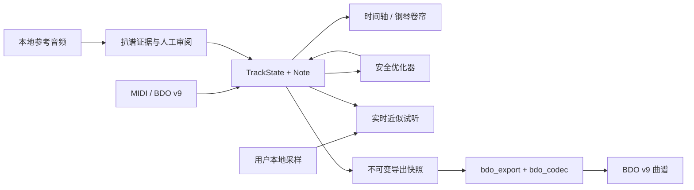

# BDO Music Composer

[简体中文](README.zh-CN.md) · [English](README.en.md) · [日本語](README.ja.md) · [한국어](README.ko.md) · [语言入口](README.md)

> AI Agent 与新维护者：修改代码前先阅读 [`AGENTS.md`](AGENTS.md) 和 [Agent 接手与协作手册](docs/AGENT_HANDOFF.md)。优化与扩展计划见 [解耦、性能与扩展路线图](docs/OPTIMIZATION_EXTENSION_ROADMAP.md)。

BDO Music Composer 是非官方 PySide6 MIDI 编辑器、本地音频扒谱工作台、确定性优化器、游戏采样试听器和 Black Desert v9 曲谱导出工具。它面向维护者和朋友的小型曲谱实验室，不是通用 DAW，也不隶属于 Pearl Abyss。

<!-- section:screenshots -->
## 界面预览


| 多轨编曲时间线 | 钢琴卷帘音符编辑器 |
|---|---|
|  |  |

<!-- section:status -->
## 状态与免责声明

v1.0.0 是首个公开稳定大版本。编辑、自动保存、优化、预览、扒谱辅助和 BDO v9 导出主流程均有自动回归，但不同音频硬件、Windows 环境和游戏版本仍可能出现兼容差异。

- 导出和游戏内继续编辑需要从自己账号保存的曲谱中取得有效 Owner ID。
- BDO v9 只表示 `/4` 拍号；其他分母会明确拒绝，不会静默错误导出。
- 游戏采样试听及部分 DSP/奏法在没有游戏内 A/B 证据时属于近似预览。
- Basic Pitch 音符、和声、声部分组和 BDO Top-3 都是可编辑辅助，不是已验证曲谱或可靠的混音乐器识别结果。
- 软件不包含账号登录、遥测、文件上传、OpenAI API 或云端模型运行时。

<!-- section:features -->
## 主要功能

### MIDI、工程和编辑

- 导入 MIDI，解析速度、时值、控制器、歌词、延音和速度变化。
- 从空白工程创建轨道；创建、删除、移动、缩放、选择和批量编辑音符。
- 多轨时间轴、单轨钢琴卷帘、力度通道、量化网格、奏法和无损 `ntype=0` 编辑；卷帘内的上下文 HUD 会提示当前真实可用的快捷操作。
- 打开 BDO v9 曲谱后保留双力度、轨道音量/设置、奏法和物理分块；未修改文档可字节级往返。
- 工程撤销/重做、后台自动保存、版本列表和安全首页索引。

### 实用扒谱

- 载入本地 WAV 或标准 MP3，点击“分析”运行本地 Basic Pitch ONNX/CPU 分析。
- 生产界面固定使用经过保护的标准场景、平衡灵敏度和保留式清理，不暴露实验参数、乐句、和声、声部分组或配器诊断。
- “分析音块”以轻量线框显示，底部短线表达识别置信度，可框选、筛选并采纳为草稿；只读连续性预判会连接证据充分的同音高弱分割，但保留每个起音和候选身份。“音高线”是独立的连续音高证据，使用滞回续接、受约束贝塞尔双层笔触、独立透明度及低/标准/高三级显示去噪。自动音色分类优先建立可靠原型，再吸附短片段并显示覆盖数和分类置信度；唯一归属的音高线沿用对应音色，冲突或证据不足时保持中性。可选“旋律引导”按时间段对手工音符命中的音色组施加去重且有上限的权重；稳定后以最高优先级把该组的音块和音高线标记为当前轨道乐器，但不改写声学识别或导出。
- 草稿可运行只读游戏适配检查，再收起扒谱参考层继续普通编辑；检查不会自动删音、移调或量化。
- 结果先进入编辑器草稿，只有确认编辑器 Apply/OK 后才写入正式轨道；不会自动覆盖现有音符，也不自动映射打击乐。

### 优化、试听和导出

- 统一的“MIDI 优化”工作台支持保守/平衡/深度强度；全工程与单轨范围在首层选择，均先分析预览再应用。
- 可信本地算法可以 `.bdoopt` 包安装；生产管线和插件注册边界分离。
- 使用用户本地 Wwise WAV 或校验过的 `.bdosamples` 包实时试听；回调路径无磁盘 I/O。
- BDO 乐器/奏法、全局与单轨八度变换、Marnian `basic/stereo/super/superoct` 模式。
- 导出当前编辑器模型为 BDO v9，单物理轨按 730 音符拆分，并生成每乐器空结尾轨。
- 导出先建立不可变快照，再原子发布到输出目录和配置的游戏音乐目录。

### 界面与语言

- Windows 深色 Fluent 风格、响应式工具栏、项目首页、性能指标和非阻塞提示。
- 应用界面支持简体中文、繁体中文、英语、日语和韩语；固定 UI 文本翻译，曲名、轨名和文件名保持原文。
- 可使用原创打包图标，也可从用户自己有权读取的本地游戏安装生成私有时间轴图像缓存。

<!-- section:requirements -->
## 环境要求与源码启动

可复现发布环境：Windows、Python 3.12.10、可用音频设备。仅导入/编辑 MIDI 不要求游戏音频。

```powershell
git clone https://github.com/CocoaMist/3007-BDO_Music_Composer.git
cd 3007-BDO_Music_Composer
python -m venv .venv
.\.venv\Scripts\python.exe -m pip install --constraint constraints-windows-py312.txt -r requirements-pyside.txt
powershell -ExecutionPolicy Bypass -File scripts\install_transcription.ps1
.\.venv\Scripts\python.exe main.py
```

`install_transcription.ps1` 安装与 Windows EXE 相同的 Basic Pitch ONNX CPU 运行时。它是源码环境步骤，不是给现有 EXE 添加扩展。程序只有一个 UI、一个工程 schema、一个缓存格式和一个可执行文件。

<!-- section:workflow -->
## 典型工作流

1. 新建工程、导入 MIDI，或打开 BDO v9 曲谱。
2. 在设置中配置角色名、Owner ID、输出目录和可选的本地音源。
3. 选择 BDO 乐器，编辑音符、力度、奏法、FX 和移调计划。
4. 可选：载入参考音频并分析，用参考音块或音高轨迹定位旋律，并把所选音块采纳为草稿。
5. 可选：运行优化分析，预览后应用到全曲或目标轨。
6. 运行“转换检查”，修复音域、无效 FX、打击乐映射和乐器合并问题。
7. 试听当前编辑器模型并导出；导出会依次核对内存结果、主文件和游戏目录副本的
   可表示字段与字节一致性。

导出始终以当前 `TrackState` / `Note` 模型为事实源，不会偷偷重新读取原始 MIDI。
导入 BDO 后的第二力度值会先绑定到具体音符，再随移调、时值、奏法和鼓映射一起
投影；调整音量、第二力度或打击乐语义也会关闭不再适用的原文件复用路径。
一致性通过只说明本次编辑器→BDO v9 写入链路匹配，不代表程序绝对无 Bug，也不
等于游戏内音色、效果或体感响度已经完成 A/B 验证。

<!-- section:local-assets -->
## 本地音源与游戏图像

设置可选择一个用户自行创建的 `.bdosamples`。它是带版本化 manifest 和 SHA-256 校验的 ZIP 兼容容器，播放前解压到本地缓存：

```powershell
.\.venv\Scripts\python.exe -m bdo_sample_pack "D:\your-audio-root" "D:\private\my-samples.bdosamples"
```

只处理你有权使用的音频。包、解压缓存、WEM/WAV、参考音频不得上传到仓库或 Release。

打包版本只带原创 AI 辅助的乐器家族图标。拥有本地游戏文件读取权限的用户可生成私有缓存：

```powershell
.\.venv\Scripts\python.exe tools\import_bdo_game_art.py "<BlackDesert-Paz>" --cache-root "<private-local-cache>"
```

导入器只读取白名单 CSS 和乐器 sprite，限制解码范围并校验版本、尺寸、裁剪坐标和哈希；它不是通用 PAZ 解包器。生成物不能进入工程、构建、ZIP 或发布包。

<!-- section:architecture -->
## 架构概览



主要边界：

- `bdo_music_composer/ui/main_window.py`：主窗口、Qt 生命周期和工作流编排；兼容导出旧公开类。
- `bdo_music_composer/editor/editor_import.py`：事务式 MIDI、BDO、工程轨道导入；通过类型化错误整体失败，
  不在损坏输入上恢复半份谱面。
- `bdo_music_composer/editor/game_score_model.py`：正式谱面/试听范围、最终游戏乐器 ID、力度迁移和同乐器
  Volume/Aux 规则。
- `bdo_music_composer/editor/model_revision.py`、
  `bdo_music_composer/app/conversion_validation_controller.py`、
  `bdo_music_composer/transcription/transcription_workspace_controller.py`、
  `bdo_music_composer/project/project_lifecycle_controller.py` 与
  `bdo_music_composer/audio/preview_transport_controller.py`：转换校验、扒谱
  worker/审阅历史、工程载入和预览传输命令的 Qt-free 状态。
- `bdo_music_composer/editor/editor_models.py`、
  `bdo_music_composer/editor/editor_commands.py`、
  `bdo_music_composer/editor/interval_index.py`、
  `bdo_music_composer/editor/velocity_curve.py`、
  `bdo_music_composer/editor/preview_midi_writer.py` 与 `bdo_midi/`：Qt-free
  共享轨道状态、命令、区间查询、力度曲线、标准 MIDI 投影、不可变音符和纯变换。
- `bdo_music_composer/ui/editor/`：可见区索引的时间轴、钢琴卷帘和音符编辑界面。
- `bdo_music_composer/app/application_config.py`、
  `bdo_music_composer/app/game_profile_provider.py`、
  `bdo_music_composer/app/application_metadata.py`：原子配置读写、按需缓存的
  游戏规则 profile，以及统一版本/公开仓库元数据，不在导入期发起网络请求。
- `bdo_music_composer/app/home_catalog.py`、`bdo_music_composer/ui/home_widgets.py`、
  `bdo_music_composer/ui/startup_widgets.py`：有界首页数据发现与 Qt 展示分离。
- 聚焦对话框位于 `bdo_music_composer/ui/dialogs/`，应用级语义主题位于
  inert 的 `bdo_music_composer/ui/theme/` 子包。
- `optimization/`：生产优化管线、registry 和可信本地算法边界。
- `bdo_music_composer/audio/bdo_realtime_audio.py`、`bdo_music_composer/audio/bdo_sample_renderer.py`：实时与离线采样试听；
  `bdo_music_composer/editor/preview_midi_writer.py` 单独拥有标准 MIDI
  确定性投影，不参与 BDO v9 导出。
- `bdo_music_composer/export/export_workflow.py`、`bdo_music_composer/export/export_verification.py`、`bdo_export/`、`bdo_codec/`：不可变请求、字段级导出自检、原文档复用、适配、二进制读写和分阶段原子发布；Codec 不依赖编辑器。
- `bdo_music_composer/app/project_document.py`、
  `bdo_music_composer/project/project_persistence.py`、
  `bdo_music_composer/project/project_schema.py`：提交前完整 `ProjectLoadPlan`、
  递归深冻结的 `ProjectMetadataSnapshot`、原子自动保存和只执行一次的历史迁移。
- `bdo_transcription*.py`、`bdo_music_composer/transcription/transcription_commit_plan.py`、
  `bdo_music_composer/ui/transcription/transcription_workers.py`：Qt-free 分析、稳定候选区间索引、正式提交纯计划和后台 worker。
- `bdo_music_composer/ui/i18n.py`、`bdo_music_composer/core/project_paths.py`：运行时目录和源码/冻结资源边界。

深入阅读：[架构](docs/ARCHITECTURE.md)、[AI 路由](docs/AI_CONTEXT.md)、[AI 编辑与结构演进指南](docs/AI_EDITING_GUIDE.md)、[工程结构](docs/PROJECT_STRUCTURE.md)、[转换设置边界](docs/CONVERSION_SETTINGS.md)、[BDO v9 codec](docs/BDO_V9_CODEC.md)。

无 shim 的包迁移在此前根 Python 文件 89→69 的基础上，先迁移 6 个 Qt-free
editor owner，再迁移 7 个 dialogs/theme owner，随后把 5 个编辑器 Qt owner
收拢到 `bdo_music_composer/ui/editor/`，并将版本/公开仓库元数据集中到
`bdo_music_composer/app/application_metadata.py`，将根目录收敛到 52 个文件。
7～10 个根文件仍是长期方向，并非当前已完成状态。

<!-- section:invariants -->
## 正确性和性能约束

- `Note` 形状保持 `Note(pitch, vel, start, dur, ntype)`。
- game-safe 优化不意外改变音符数、音高多重集、乐器映射和无关轨。
- BDO v9 字段小端，音符为 20 字节 `<BBBBdd>`，加密明文 8 字节对齐。
- 自动保存、导出 worker 只接收 GUI 线程冻结的不可变数据；工程 metadata 的嵌套
  mapping/list 也必须递归脱离。
- 音频回调禁止文件读取、JSON/WAV 解码和无界分配。
- 时间轴、卷帘和证据绘制使用可见区索引、批处理和有界缓存。
- 同一确定性输入必须产生相同优化和导出结果。

性能基准见 `tools/benchmark_dense_ui.py`；后续优化候选和风险见 [路线图](docs/OPTIMIZATION_EXTENSION_ROADMAP.md)。

<!-- section:testing -->
## 测试与验证

```powershell
.\.venv\Scripts\python.exe -m unittest discover -s tests -t . -q
.\.venv\Scripts\python.exe -m unittest tests.test_architecture_dependencies tests.test_gui_module_boundaries -q
.\.venv\Scripts\python.exe -m py_compile main.py bdo_music_composer/core/project_paths.py bdo_music_composer/ui/main_window.py bdo_music_composer/ui/i18n.py
git diff --check
```

测试覆盖优化器安全性、实时音频、扒谱 cache/session/evidence、工程迁移、导出 round trip、BDO v9 结构、Marnian ID、本地化和 README 一致性。UI 改动还需 `QT_QPA_PLATFORM=offscreen` 烟测；打包改动需干净构建及启动自测。

<!-- section:packaging -->
## Windows 单文件构建

```powershell
.\.venv\Scripts\python.exe -m pip install --constraint constraints-windows-py312.txt -r requirements-build.txt
powershell -ExecutionPolicy Bypass -File scripts\install_transcription.ps1
powershell -ExecutionPolicy Bypass -File packaging\windows\build.ps1
```

唯一产物是 `dist\BDO-Music-Composer.exe`。构建会对该 EXE 运行合成 Basic Pitch ONNX/CPU 自测和至少 10 秒 GUI 启动测试，并生成精确依赖/许可证清单。`-PublicRelease` 对批准过的清单摘要 fail-closed；依赖或产物变化必须重新人工审核。详见 [Windows 打包](docs/WINDOWS_PACKAGING.md)。

EXE 不包含游戏音频、游戏图像、Owner ID、个人配置、自动保存、参考音频或导出文件。运行时可写数据位于 `%LOCALAPPDATA%\BDO Music Composer`，可用 `BDO_USER_DATA_DIR` 覆盖。

<!-- section:privacy -->
## 隐私与仓库卫生

严禁提交：`.pyside_bdo_gui.json`、`auto_save/`、`out/`、`build/`、`dist/`；包含真实 Owner ID/角色名的曲谱；PAZ/BNK/WEM/WAV；参考音频、缓存、崩溃日志、密钥、本机绝对路径和发布 ZIP。

发布前执行：

```powershell
git status --short
git ls-files out auto_save dist build
git grep -n -I -E "(C:\\Users\\|OPENAI_API_KEY|api[_-]?key|password)"
.\.venv\Scripts\python.exe -m unittest discover -s tests -t . -q
```

<!-- section:docs -->
## 文档与协作

- [Agent 接手与协作手册](docs/AGENT_HANDOFF.md)
- [架构](docs/ARCHITECTURE.md) / [AI 任务路由](docs/AI_CONTEXT.md) / [AI 编辑与结构演进指南](docs/AI_EDITING_GUIDE.md)
- [解耦、性能与扩展路线图](docs/OPTIMIZATION_EXTENSION_ROADMAP.md)
- [本地化与地区术语](docs/LOCALIZATION.md)
- [Windows 打包](docs/WINDOWS_PACKAGING.md) / [BDO v9 codec](docs/BDO_V9_CODEC.md)
- [贡献指南](CONTRIBUTING.md) / [第三方声明](THIRD_PARTY_NOTICES.md)

AI Agent 必须先读 `AGENTS.md`，保留用户工作树改动，并按手册中的验证矩阵和对接包模板交付。

<!-- section:license -->
## 致谢与许可

Basic Pitch、ONNX Runtime、PySide6/Qt、Mido、NumPy、SciPy、librosa、SoundFile、soxr、PyInstaller 等保留各自上游许可。Basic Pitch 0.4.0 代码与 `nmp.onnx` 位于官方 Apache-2.0 发布树，并保留 LICENSE/NOTICE。完整清单、研究引用和历史参考见 [THIRD_PARTY_NOTICES.md](THIRD_PARTY_NOTICES.md) 与应用内“致谢”。

CocoaMist 拥有的原创项目代码采用 [MIT License](LICENSE)。根许可证不主张拥有或重新许可第三方代码、模型和资产。
