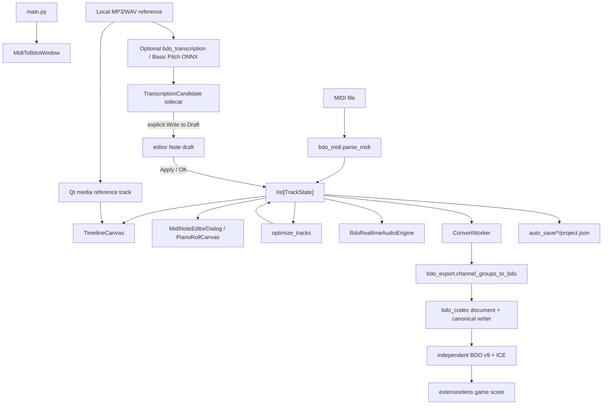

# Architecture

## System overview

BDO Music Composer is a desktop application with one mutable project model and three major consumers: the UI, the preview engine, and the BDO exporter.



## Runtime model

`TrackState` owns track metadata and a list of immutable namedtuple `Note` values:

```text
Note(pitch: int, vel: int, start: float ms, dur: float ms, ntype: int)
```

Widgets mutate a draft list through `_replace()`. The note editor commits a sorted list back to its `TrackState` only on Apply/OK. Project autosave serializes all five note fields.

## Import

1. `main.py` launches `pyside_bdo_gui.main()`.
2. The user selects a MIDI file.
3. `bdo_midi.parse_midi()` extracts BPM, `/4` meter numerator, grouped notes, controls, and lyrics.
4. UI mapping assigns a BDO instrument to every group.
5. `TimelineCanvas.set_tracks()` builds visible-range indexes and cached pitch/time bounds.

## Editing and optimization

- Main timeline: mute, solo, instrument assignment, FX, selection, and preview
  seeking. Its compact command bar keeps global transport on the left, collapses
  secondary track actions into one menu, and groups zoom/pan/fit on the right.
  A hidden extension host leaves room for later transcription tools without
  crowding or restructuring the transport.
- Reference audio: a pinned layer at the bottom of the main timeline loads one
  local MP3/WAV file. It stays below the scrolling instrument rows, decodes a
  bounded 50 ms peak envelope off the paint path, and draws that waveform against
  their shared zoomed time scale. The row retains load, gain, and waveform-seek
  controls; play, pause, and stop belong exclusively to the global transport. The
  main transport aligns Qt media playback with the real-time BDO engine at start,
  resume, and explicit seek, but never re-seeks a reference stream while it is
  actively playing. It falls back to the reference clock when game samples are
  unavailable or the reference outlasts the MIDI preview. Reference gain defaults
  to 50% and can be changed in 5% steps from
  the row; the project stores its path and gain but does not copy the audio into
  autosaves, exports, or builds.
- Blank projects: a project can originate without an imported MIDI/BDO file. Its
  editor tracks remain the source of truth, are autosaved directly to
  `project.json`, and can be reopened and exported without manufacturing a hidden
  source MIDI track.
- Piano roll: draft note creation/deletion/movement/resizing, batch properties, articulations, undo/redo, and isolated track preview. It opens at a screen-aware large working size and uses a square-corner editing surface, taller note rows, measure bands, octave guides, velocity-responsive note shading, and an empty-score creation prompt without changing hit testing. Selection mode uses an empty click to place the edit cursor, an empty drag to marquee-select, and a double-click to create; `Ctrl`-drag clones the grabbed selection and paste targets the edit cursor. Draw mode sets duration and initial velocity in one gesture; Alt temporarily bypasses snap, arrow keys edit selections, and `Ctrl+D` duplicates them. Clicking the piano ruler, creating, selecting, or repitching a note asynchronously auditions it with the current game instrument without doing sample I/O in the audio callback. Its ruler owns seeking, playhead display, and sample-preload progress; there is no separate editor timeline slider. Note, articulation, grid, and velocity controls share the fixed-height top switcher, while apply/cancel/confirm live in the top command bar. The compact footer retains selection status, controls the shared reference-audio gain, and opens a fixed-height transcription panel. The collapsible velocity lane is opened by a curve icon and groups every simultaneous onset into one control point. Dragging a point applies a smooth time-distance falloff to neighbouring points, while the mouse wheel changes the influence radius; each drag remains one undoable edit.
- Piano-key audition is monophonic: a new key invalidates an older preload, clears active voices, and flushes already queued device PCM before the replacement starts. Pressed and hovered keys are painted distinctly, and a held left-button drag triggers each newly entered key once for glissando-style browsing.
- Optimizer: full-song read context plus scoped writes. Reports are generated before the result is applied.

The `optimization/` package separates the BDO-safe implementation from optimizer
API v1. `.bdoopt` archives are discovered by manifest without executing code,
then lazily loaded from a hash-isolated user cache. Plugins receive immutable
editor snapshots and return structured preview operations; the host owns stale
checks, scope validation, BDO instrument/drum rules, resource limits, and final
application. Analysis runs on a Qt worker thread so a large or external
optimizer cannot block repainting the main UI. `registry.py` and
`bdo_midi_optimizer.py` remain compatibility surfaces for older integrations.

`bdo_profile.py` loads the versioned game constraint profile. `bdo_validation.py`
produces location-aware `ValidationIssue` values and is the export gate;
known note loss, unsupported pitches, illegal articulations, and unmapped drums
cannot pass silently. `bdo_score.py` owns full BDO v9 snapshots and score diffs,
with private Owner/name fields excluded from comparison unless explicitly requested.
`bdo_codec/` owns lossless decoding, the reversible document model, canonical
encoding, ICE, opaque-data safety, and the CLI. See `docs/BDO_V9_CODEC.md`.

Marnian Muse is the first external optimizer package. Its runtime package is
built by the independent project and is not embedded in Music Composer. Corpus
MIDI, audio, reports, profiles under development, and model assets remain owned
outside this repository.

## Transcription candidate boundary

`bdo_transcription.py` is a Qt-free optional analysis service. It lazily loads
Basic Pitch and ONNX Runtime, serializes inference behind a process-local lock,
and returns immutable `TranscriptionCandidate` values. The editor runs that
service on `TranscriptionAnalysisWorker`; starting analysis first stops both the
BDO preview and reference playback so inference cannot compete with an audible
stream.

Candidates are sidecar state owned by `MidiNoteEditorDialog`, not `ghost_notes`,
`TrackState`, or the five-field `Note` wire shape. `PianoRollCanvas` paints the
sidecar as a confidence-weighted candidate overlay. Clicking **Write to Draft**
performs instrument-range checks and duplicate suppression, pushes one undo
snapshot, and creates ordinary `Note(..., ntype=0)` values in the dialog draft.
The overlay remains available after insertion, so undo can restore writeability
without rerunning the model. Only the existing Apply/OK path commits that draft
to `TrackState`, autosave, preview, and eventual BDO export.

The first stage deliberately targets the one melodic instrument track whose
editor is open. Percussion tracks are blocked because Basic Pitch pitches are
not BDO drum-piece mappings; there is no stem separation, automatic instrument
assignment, or claim that a candidate is game-verified.

Completed inference writes a versioned JSON manifest plus float16
frame/onset/contour evidence to `TRANSCRIPTION_CACHE_DIR`. Cache identity includes
source file metadata and analysis parameters; cached evidence is memory-mapped
only when requested. The default directory is under the user's Local AppData,
with `BDO_TRANSCRIPTION_CACHE` as an explicit override. Cache files are
performance artifacts and never become project data, game-score data, or
real-time callback inputs.

## Preview

`BdoRealtimeAudioEngine` reads the Wwise MIDI-zone map, resolves every note to a user-provided WAV, decodes/cache-loads off the callback path, and schedules events by exact sample frame. Async consumers poll `AudioStatus.preload_progress`, commit with `finish_loading()`, and invalidate abandoned work with `cancel_loading()`. The Qt audio worker only pulls prepared PCM. The Windows output queue uses a precise refill timer, keeps roughly 96 ms of device headroom, and retains partially accepted PCM writes so the mixer timeline cannot skip samples at a block boundary. Repeated note/velocity zone lookups are memoized during preload. Reference waveform decoding yields completely while its media stream is playing, preventing a second full-file decoder from starving the audible stream.

The transcription reference row uses Qt Multimedia for ordinary MP3/WAV playback
and asynchronous waveform decoding. A GUI-thread transport coordinator keeps it
aligned with `BdoRealtimeAudioEngine`; decoded reference audio never enters the
real-time sample callback or BDO export. Peak-envelope extraction uses vectorized
buffer reduction so long files do not monopolize the GUI thread during playback.
The note editor can also use the reference clock by itself when no game sample
preview is available.

The repository contains metadata and mappings, not game audio. `audio_root` points to a user-owned extracted directory.

`bdo_audio_research.py` reports key/velocity-zone coverage and measures local
render versus game-capture alignment. `bdo_experiments.py` stores only hashes and
experiment metadata, never local paths or audio assets.

## Export

`MidiToBdoWindow._build_params()` always passes active `TrackState` objects as
`direct_tracks`. An unchanged imported BDO document is emitted byte-for-byte;
edited documents preserve bound dual velocities, track volume/settings, and
then use deterministic canonical encoding through `bdo_export` and `bdo_codec`.
After a successful conversion the score is always copied into the user's default
Black Desert music directory; choosing that directory as the output destination
is handled as a safe no-op instead of attempting to copy a file onto itself.

BDO v9 payload invariants:

- 4-byte version prefix followed by ICE-encrypted payload;
- fixed `0x150` plaintext header;
- Owner ID and two UTF-16LE name fields;
- BPM and `/4` meter numerator;
- instrument groups with tracks capped at 730 notes;
- `<HH8sH` track prefix and `<BBBBdd` note records;
- empty trailing track per instrument;
- 8-byte plaintext alignment before encryption.

## Persistence and frozen builds

- Source resources resolve from the repository.
- PyInstaller resources resolve from `sys._MEIPASS`.
- Writable config, autosaves, logs, and exports resolve beside the executable in frozen builds.
- Transcription evidence is a disposable user cache under Local AppData (or the
  explicit `BDO_TRANSCRIPTION_CACHE` override), never under `sys._MEIPASS`.
- Personal/game files are never bundled.

## Performance strategy

- Timeline and piano-roll canvases use time-sorted visible-range indexes.
- The multi-track timeline iterates only visible track rows, reuses its
  size-matched background pixmap, and caches conversion-range results by
  instrument, pitch, and transpose.
- The piano roll shares a cached visible-note window with its velocity lane,
  bisects sorted ghost-track notes, and keeps zoom anchored beneath the cursor.
- Editor playhead repaints are bounded to the old and new cursor regions;
  status hover updates reuse cached invalid-note counts.
- Timeline note rectangles are batched by articulation color.
- Supported-pitch maps, track durations, and pitch bounds are cached.
- Audio decode is concurrent and deduplicated by Wwise source ID.
- Real-time preview keeps a bounded NumPy peak slot per loaded track. Voice
  mixing updates those slots in place; the existing 10 FPS GUI status poll
  copies the values into narrow timeline meters, so meter repainting is limited
  to the track-header strip and adds no file I/O to the audio callback.

## UI theme

`fluent_theme.py` selects the newest available native Windows widget style
(`windows11`, with compatibility fallbacks), applies the application's fixed
dark palette, and owns the shared Fluent-inspired component rules and monochrome
line icons. `pyside_bdo_gui.py` supplies the BDO-branded base QSS and keeps the
timeline, piano roll, and velocity lane custom-painted. The piano-roll keyboard
uses dark natural-key beds with shorter raised black keys and right-aligned pitch
labels; the roll uses a neutral charcoal grid and gray note bodies with a warm
velocity line to mirror the game's composition workspace. Theme work must not
replace those visible-range paint paths or introduce UI-library licensing into
the MIDI, preview, or export layers.

The settings dialog uses a persistent left navigation rail for three bounded
domains: export identity, MIDI/velocity processing, and local audio/effects.
The acknowledgements dialog shares the same charcoal surfaces, amber accents,
panel rhythm, and button hierarchy as the editor instead of defining a separate
feature palette.

Application startup uses a portrait, full-image conductor line-art splash with a
small overlaid status panel and code-drawn indeterminate spinner. It reports
extension discovery, main-window construction, and local home-page loading
phases, then hands focus to the main window after a short minimum display
interval. The packaged illustration is static; the loading animation has no GIF
dependency.

Transient guidance uses one reusable `GlobalToast` per top-level window. It
fades in, holds briefly, and fades out without accepting input. Homepage privacy
guidance, piano-roll shortcuts, drawing-mode help, and settings FX notes use this
surface instead of permanently occupying layout rows; durable state, errors,
selection details, and export results remain in their existing status surfaces.

The main window starts on a lightweight home page before entering the editor
workspace. It has two collections: immediate files from the default Black
Desert music folder, and a unified project list that merges autosaved
`project.json` files with the bounded recent-file list stored in local config.
The project list is path-deduplicated and ordered by recent activity. Startup
does not add a separate "autosave found" status banner; recovery stays inside
this unified project list. Homepage scanning never parses game scores, so
embedded Owner IDs and character names are
not surfaced. Double-clicking a game score explicitly decrypts and parses its
BDO v9 data, collapses physical 730-note chunks into logical `TrackState`
entries, preserves per-note articulation values, and switches to the existing
timeline workspace. The source format is persisted with autosaves so a restored
game-score project is not accidentally passed through the MIDI parser. Opening
MIDI or an autosaved project follows the same workspace transition; the toolbar
Home action returns to the refreshed lists.
