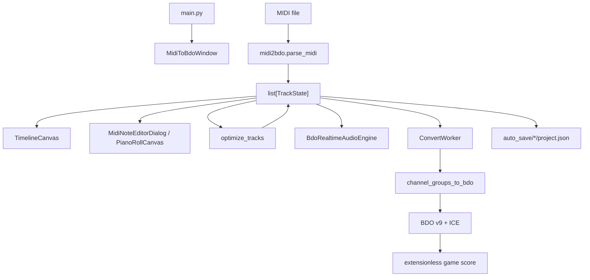

# Architecture

## System overview

BDO Music Composer is a desktop application with one mutable project model and three major consumers: the UI, the preview engine, and the BDO exporter.



## Runtime model

`TrackState` owns track metadata and a list of immutable namedtuple `Note` values:

```text
Note(pitch: int, vel: int, start: float ms, dur: float ms, ntype: int)
```

Widgets mutate a draft list through `_replace()`. The note editor commits a sorted list back to its `TrackState` only on Apply/OK. Project autosave serializes all five note fields.

## Import

1. `main.py` launches `pyside_bdo_gui.main()`.
2. The user selects a MIDI file.
3. `midi2bdo.parse_midi()` extracts BPM, meter numerator, grouped notes, controls, and lyrics.
4. UI mapping assigns a BDO instrument to every group.
5. `TimelineCanvas.set_tracks()` builds visible-range indexes and cached pitch/time bounds.

## Editing and optimization

- Main timeline: mute, solo, duration scaling, instrument assignment, FX, selection, and preview seeking.
- Piano roll: draft note creation/deletion/movement/resizing, batch properties, articulations, undo/redo, and isolated track preview.
- Optimizer: full-song read context plus scoped writes. Reports are generated before the result is applied.

The `optimization/` package separates stable dispatch from implementations. `registry.py` provides process-local discovery and registration, while `builtin.py` contains the default BDO-safe pipeline. The root `bdo_midi_optimizer.py` module is a compatibility facade; new optimization logic belongs in the package.

## Preview

`BdoRealtimeAudioEngine` reads the Wwise MIDI-zone map, resolves every note to a user-provided WAV, decodes/cache-loads off the callback path, and schedules events by exact sample frame. The Qt audio worker only pulls prepared PCM.

The repository contains metadata and mappings, not game audio. `audio_root` points to a user-owned extracted directory.

## Export

`MidiToBdoWindow._build_params()` always passes active `TrackState` objects as `direct_tracks`. `ConvertWorker` applies duration scaling and delegates to `channel_groups_to_bdo()`.

BDO v9 payload invariants:

- 4-byte version prefix followed by ICE-encrypted payload;
- fixed `0x150` plaintext header;
- Owner ID and two UTF-16LE name fields;
- BPM and `/4` meter numerator;
- instrument groups with tracks capped at 730 notes;
- `<HH8sH` track prefix and `<BBBBdd` note records;
- empty trailing track per instrument;
- 8-byte plaintext alignment before encryption.

## Persistence and frozen builds

- Source resources resolve from the repository.
- PyInstaller resources resolve from `sys._MEIPASS`.
- Writable config, autosaves, logs, and exports resolve beside the executable in frozen builds.
- Personal/game files are never bundled.

## Performance strategy

- Timeline and piano-roll canvases use time-sorted visible-range indexes.
- Timeline note rectangles are batched by articulation color.
- Supported-pitch maps, track durations, and pitch bounds are cached.
- Audio decode is concurrent and deduplicated by Wwise source ID.
