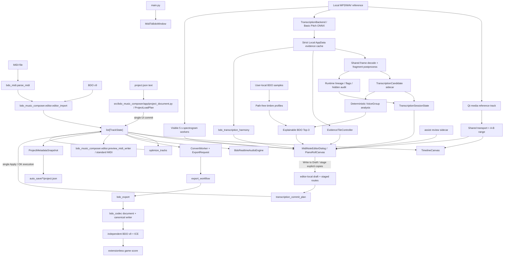

# Architecture

## System overview

BDO Music Composer is a desktop application with one mutable project model and three major consumers: the UI, the preview engine, and the BDO exporter.


```mermaid
flowchart TD
    Entry["main.py"] --> GUI["MidiToBdoWindow"]
    MIDI["MIDI file"] --> Parser["bdo_midi.parse_midi"]
    BDO["BDO v9"] --> ImportAdapter["bdo_music_composer.editor.editor_import"]
    Project["project.json text"] --> ProjectPlan["src/bdo_music_composer/app/project_document.py / ProjectLoadPlan"]
    Parser --> ImportAdapter
    ImportAdapter --> Tracks["list[TrackState]"]
    ProjectPlan -->|"single UI commit"| Tracks
    Tracks --> Timeline["TimelineCanvas"]
    Tracks --> Editor["MidiNoteEditorDialog / PianoRollCanvas"]
    Reference["Local MP3/WAV reference"] --> ReferencePlayer["Qt media reference track"]
    ReferencePlayer --> SharedTransport["Shared transport + A-B range"]
    SharedTransport --> Timeline
    SharedTransport --> Editor
    Reference --> Transcriber["TranscriptionBackend / Basic Pitch ONNX"]
    Reference --> Spectrogram["Visible 5 s spectrogram workers"]
    Transcriber --> Evidence["Strict Local AppData evidence cache"]
    Evidence --> FrameDecode["Shared frame decode + fragment postprocess"]
    FrameDecode --> Candidates["TranscriptionCandidate sidecar"]
    FrameDecode --> Annotations["Runtime lineage / flags / hidden audit"]
    Evidence --> Tiles["EvidenceTileController"]
    Evidence --> Harmony["bdo_transcription_harmony"]
    Tiles --> Editor
    Spectrogram --> Editor
    Candidates --> Session["TranscriptionSessionState"]
    Candidates --> Groups["Deterministic VoiceGroup analysis"]
    LocalSamples["User-local BDO samples"] --> Timbre["Path-free timbre profiles"]
    Groups --> Matches["Explainable BDO Top-3"]
    Timbre --> Matches
    Harmony --> Editor
    Matches --> Editor
    Session --> Editor
    Annotations --> Session
    AssistReview["assist review sidecar"] --> Editor
    Editor -->|"Write to Draft / stage explicit copies"| Draft["editor-local draft + staged routes"]
    Draft --> CommitPlan["transcription_commit_plan"]
    CommitPlan -->|"single Apply / OK execution"| Tracks
    Tracks --> Optimizer["optimize_tracks"]
    Optimizer --> Tracks
    Tracks --> Preview["BdoRealtimeAudioEngine"]
    Tracks --> Worker["ConvertWorker + ExportRequest"]
    Worker --> Workflow["export_workflow"]
    Workflow --> Adapter["bdo_export"]
    Adapter --> Serializer["bdo_codec document + canonical writer"]
    Serializer --> ICE["independent BDO v9 + ICE"]
    ICE --> GameScore["extensionless game score"]
    Tracks --> MidiProjection["bdo_music_composer.editor.preview_midi_writer / standard MIDI"]
    Tracks --> MetadataSnapshot["ProjectMetadataSnapshot"]
    MetadataSnapshot --> Autosave["auto_save/*/project.json"]
```

## Ownership and dependency direction

`src/bdo_music_composer/ui/main_window.py` is the Qt composition root and a compatibility facade for
selected historical imports. It owns signal wiring, mutable window state, and
Qt worker lifetime; it does not become the owner of a rule merely because it
re-exports that rule. New code imports the focused owner directly, while a
compatibility export must remain the exact same object rather than a copied
implementation.

`src/bdo_music_composer/ui/page_transition_qt.py` owns the short, interruptible
snapshot crossfade between the home page and multitrack workspace. Page and
toolbar state still commit synchronously before that visual transition starts.

`src/bdo_music_composer/ui/workspace_refresh_qt.py` executes immutable refresh
plans without redundant full-canvas update requests. The opt-in
`ui/performance_probe_qt.py` records only bounded timing values for
input-to-first-paint and event-loop stalls; normal production runs install no
event filter. Windows qualification enables it at 100%, 150%, and 200% scale.

Shared extension compatibility lives in `src/bdo_common/extension_contract.py`.
Trusted Python APIs, the native C ABI, and isolated NDJSON stdio processes name
their transport explicitly and negotiate versions plus capabilities before use.

The intended production dependency direction is:

```text
Qt composition and widgets
  -> application workflows
  -> editor/game domain
  -> bdo_export adapter
  -> bdo_codec wire layer
```

The `bdo_music_composer` package and its domain-package `__init__.py` files stay
lazy: they document package ownership but do not aggregate or eagerly import
focused owners. Production code imports the concrete submodule so importing one
application service cannot initialize unrelated Qt widgets, audio coordination,
or project infrastructure.

The root migration is complete: `main.py` is the only root Python module. All
application owners use canonical domain paths under `src/bdo_music_composer/`;
shared primitives required by independent packages live in `src/bdo_common/`.
There are no root compatibility shims. The editor package remains Qt-free,
while all package initializers remain inert.

`src/bdo_music_composer/editor/editor_import.py` is the Qt-free typed boundary from MIDI, BDO snapshots, and
migrated project payloads to complete `TrackState` values. It injects names and
colors through `TrackImportPresentation` and reports malformed authoritative
data through a path-aware `EditorImportError`; callers commit only a completely
prepared result. `src/bdo_music_composer/app/project_document.py` composes
schema migration, project-path validation, track import, and every saved
metadata domain into one typed `ProjectLoadPlan` before the main window mutates
state. `src/bdo_music_composer/project/project_persistence.py` recursively freezes
UI-owned JSON metadata into `ProjectMetadataSnapshot` before the writer thread
sees it. `src/bdo_music_composer/editor/game_score_model.py` owns formal/preview scope and final game
instrument mixer identity. `src/bdo_music_composer/export/export_workflow.py` owns immutable export requests
and staged publication; `src/bdo_music_composer/export/export_verification.py` independently projects those
requests into game-representable expectations and checks prepared, primary, and
installed bytes. `src/bdo_export/` adapts domain values and `src/bdo_codec/` remains
independent of the editor and UI.

Small infrastructure also has explicit owners:
`src/bdo_music_composer/app/application_config.py` owns atomic config persistence,
`src/bdo_music_composer/app/game_profile_provider.py` performs lazy cached profile
loading, and `src/bdo_music_composer/app/application_metadata.py` owns the immutable
application version and public GitHub repository identity. `src/bdo_music_composer/app/home_catalog.py`
is separated from the Qt presentation in `src/bdo_music_composer/ui/home_widgets.py`
and `src/bdo_music_composer/ui/startup_widgets.py`. Importing the GUI therefore
performs no profile/config file I/O or update request. Focused-owner function
budgets and dependency rules are executable architecture tests rather than
documentation-only conventions.

`src/bdo_music_composer/transcription/transcription_commit_plan.py` owns pure classification of staged candidate
routes and final note/sidecar intent; it does not execute the transaction.
`src/bdo_music_composer/editor/preview_midi_writer.py` owns the deterministic standard-MIDI projection used
for compatibility round trips. The main-window names for these focused rules
are adapters or identity-preserving re-exports, never alternate implementations.

Project schema/lifecycle/persistence form a parallel application boundary.
They may use Qt-free domain values but do not depend on Codec, the export
adapter, or Qt. These rules are executable in
`tests/test_architecture_dependencies.py`; the owner map and staged extraction
workflow are documented in [AI editing guide](AI_EDITING_GUIDE.md).

## Release history, legacy checker, and production self-update

`data/releases/release_notes.json` is an optional, machine-local, Git-ignored
internal development record. It may be absent and must enter neither public Git
history nor an installation package. `src/bdo_music_composer/app/release_notes.py`
retains strict UTF-8, schema, byte-size, release-count, locale-count,
highlight-count, text-length, date, and SemVer bounds and returns deeply
immutable values for explicit internal tests using a temporary fixture or that
local record.

`src/bdo_music_composer/ui/dialogs/release_notes_dialog.py` remains implemented but
dormant. Production home, startup, menu, and navigation flows do not expose or
construct it, so neither the current version nor the internal history is shown
to users. Only an explicit internal test harness may construct the dialog and
invoke its update-check path.

`src/bdo_music_composer/app/update_check.py` owns strict SemVer comparison,
latest-stable response validation, response/body limits, fixed-repository
release-link construction, and typed failure categories.
`src/bdo_music_composer/ui/update_check_qt.py` owns one asynchronous QtNetwork
request at a time, an eight-second timeout, TLS/redirect fail-closed behavior,
bounded incremental reads, cancellation, and dialog-close cleanup. The request
uses GitHub REST API version `2026-03-10` without authentication. It sends only
public `Accept`, application `User-Agent`, and API-version headers—never a
token, Owner ID, project data, or local path—and it cannot download or execute
a release. Timeout, rate limit, missing release, unsupported API version,
malformed payload, TLS, and other network failures remain explicit unknown/error
states; none may be converted into “current”. The packaged startup self-test
hard-disables this transport, and production application flows have no route
that can start it.

The production updater is a separate boundary. `src/bdo_music_composer/update/`
owns the strict signed channel schema, RSA-3072/SHA-256 verification, normalized
preferences, staging plan, exact executable digest, next-launch handoff,
atomic sibling replacement, health supervision, and rollback. The signing
private key remains outside the repository; only its public modulus is part of
the immutable application identity. GitHub and Gitee host identical manifest,
signature, and EXE bytes and are transport mirrors rather than trust roots.

`src/bdo_music_composer/ui/self_update_qt.py` starts only in a frozen Windows build,
after a 25-second UI delay and at most once per 24 hours. It checks Gitee then
GitHub (or the last successful/preferred mirror), follows only allow-listed
HTTPS redirects, bounds channel responses, streams the EXE to Local AppData,
and verifies size and SHA-256 before recording it as ready. Source runs and
`BDO_STARTUP_SELF_TEST` cannot start this transport. A normal close never
reopens the app. On the user's next launch the old EXE starts the staged new EXE
with `--apply-update-v1` and exits; the new EXE copies itself beside the target,
rechecks the digest, preserves `.exe.old`, atomically replaces the target, and
starts the installed copy with `--post-update-v1`. The supervising staged
process commits only after the real main-window startup reports healthy;
otherwise it restores the backup and relaunches the old version.

## Runtime model

`TrackState` owns track metadata and a list of immutable namedtuple `Note` values:

```text
Note(pitch: int, vel: int, start: float ms, dur: float ms, ntype: int)
```

Widgets mutate a draft list through `_replace()`. The note editor commits a
sorted list back to its `TrackState` only on Apply/OK. Every completed note
transaction (create, delete, move, resize, property edit, optimization,
undo/redo, or candidate promotion) immediately captures an immutable recovery
snapshot. While the modal editor is open, autosave overlays that draft only in
the serialized track view; the live `TrackState`, preview/export model, and
project command history remain formal until Apply. Closing or rejecting the
editor queues a formal-track snapshot so a discarded draft cannot remain the
latest recovery state. Project autosave serializes all five note fields.

`src/bdo_music_composer/editor/game_score_model.py` defines the formal/monitoring split. Every `TrackState`
belongs to the formal score regardless of Mute/Solo; those flags select local
preview only. `Note.vel` is the game `0..127` velocity (the thin bar inside a
game note block), not dB. Legacy velocity recipes and `volume_scale` are
materialized once into that visible field and are rejected at autosave/export
if they reach those boundaries unmaterialized.

The game mixer is keyed by the final serialized instrument ID, including the
Marnian mode offset. Multiple editor lanes for that ID are views of one game
Volume and three Aux sends. Ordinary edits propagate only the changed owned
field; the five Master bytes remain score-wide and untouched. Existing
conflicts fail closed and require the explicit “use this track to unify” action.

## Import

1. `main.py` launches `bdo_music_composer.ui.main_window.main()`.
2. The user selects a MIDI file.
3. `bdo_music_composer.editor.editor_import.prepare_midi_import()` calls `bdo_midi.parse_midi()`, applies
   the visible game-velocity policy, and builds a complete immutable import
   result without touching the open project.
4. BDO snapshots use the same adapter module and fail closed with a stable code
   and payload path instead of returning partial tracks. UI-owned names and
   colors are injected through `TrackImportPresentation`.
5. For `project.json`, the UI reads text and passes injected filesystem/meter
   ports to `prepare_project_load()`. That Qt-free boundary decodes, migrates,
   validates portable references, constructs all tracks, and parses conversion,
   mixer, pitch, reference, research, lyric, and transcription state into one
   `ProjectLoadPlan`. A failure is mapped from its stable code/path before any
   open-project state changes; the raw mapping is never a second UI fact source.
6. The main window commits the prepared tracks or complete load plan as one
   transition; only then
   does `TimelineCanvas.set_tracks()` rebuild its typed `IntervalIndex` values
   and cached pitch/time bounds. Paint queries inspect intersecting blocks and
   long notes without rescanning the complete track.

## Editing and optimization

- Main timeline: mute, solo, instrument assignment, FX, selection, and preview
  seeking. Its compact command bar keeps global transport on the left, collapses
  secondary track actions into one menu, and groups zoom/pan/fit on the right.
  A hidden extension host leaves room for later transcription tools without
  crowding or restructuring the transport. Each visible row paints one compact
  game-volume control directly into the canvas; it edits the shared
  game-instrument `bdo_track_volume` view, without creating per-row widgets or
  rewriting note velocities. The bottom strip contains telemetry only; output-folder
  controls live in Settings. The selected lane also exposes a non-destructive
  free-point velocity envelope. Every row projects onset-average velocity
  directly from the current `Note.vel` model, so piano-roll edits and timeline
  refreshes share one source of truth. It targets A–B when that range contains
  notes, otherwise the visible note-onset span; users can add, drag,
  keyboard-nudge, and delete interior points while the formal notes remain
  unchanged until Apply. Editing remains inside the original 68 px track row;
  there is no sidecar window or lower automation panel. Only the selected point
  exposes its independent left/right influence handles, preserving lane space.
  Their weights scale only the adjacent Hermite tangent, and a monotonic limiter
  prevents overshoot even at extreme weights. The envelope still passes through
  every authored point. Apply publishes one `Note.vel`
  transaction through project undo, immediate autosave, preview refresh,
  validation, and the existing BDO export path.
- Runtime telemetry: `src/bdo_music_composer/app/process_metrics.py` samples only
  the current process once per second. The fixed strip below the timeline shows
  normalized CPU, working set RAM, audio render load/XRUN count, and active logical voices. Native
  process counters and `AudioStatus` are read on the GUI timer; no sampling,
  formatting, process enumeration, or allocation is added to the callback.
- Home examples: the home scanner may pin sanitized manifests from the writable
  `USER_DATA_DIR/examples` directory ahead of recent projects. A local example
  keeps source attribution but strips Owner/name, lyrics, absolute paths,
  reference audio, and transcription review data. Unlicensed MIDI content is
  never promoted from user autosaves into repository or packaged resources.
- Reference audio: a pinned layer at the bottom of the main timeline loads one
  local MP3/WAV file. Before Qt, libsndfile, or mpg123 receives the source,
  `reference_audio_format.py` performs a bounded real-header probe; damaged,
  mislabeled, and unsupported containers are rejected with path-free guidance.
  It stays below the scrolling instrument rows, decodes a
  bounded 50 ms peak envelope off the paint path, and draws that waveform against
  their shared zoomed time scale. The row retains load, gain, and waveform-seek
  controls; play, pause, and stop belong exclusively to the global transport. The
  main transport uses the rendered BDO position as the master clock in combined
  mode. `reference_clock_sync.py` ignores sub-80 ms backend jitter, corrects
  larger drift with a short cooldown, and immediately corrects drift above
  250 ms even while the reference stream is playing. It falls back to the
  reference clock when game samples are unavailable or the reference outlasts
  the MIDI preview. Reference gain defaults
  to 50% and can be changed in 5% steps from
  the row; the project stores its path and gain but does not copy the audio into
  autosaves, exports, or builds. `reference_audio_offset_ms` maps project time
  to audio time (`audio_ms = project_ms - reference_audio_offset_ms`); project
  positions outside the audio extent leave the reference silent while BDO
  preview continues. After analysis, the decoded sample-count duration is the
  authoritative content boundary; the raw multimedia duration remains a seek
  backend detail because MP3 encoder padding can extend it.
- Shared time controls: the arrangement timeline and embedded note editor
  use the same transport, playhead, zoomed time domain, and A–B range. At B the
  preview and reference return to A together; normal playback performs only
  bounded drift correction, not per-frame forced seeks. `beat_origin_ms` changes only measure
  grid/quantization phase. It neither moves formal notes nor enters BDO v9
  output.
- Interface preferences: `app/ui_preferences.py` validates the local,
  non-musical preference schema and `ui/ui_preferences_qt.py` binds it to Qt
  controls with debounced atomic saves. Workspace geometry, timeline view,
  loop and reference-volume defaults plus piano-roll geometry, zoom, note-row
  height, quantization, snap/audition, inspector, velocity-lane and
  transcription-filter controls survive reopening. Project-owned reference
  layers, analysis settings and the current reference volume remain in project
  autosaves; changing reference volume also refreshes the local default used by
  genuinely new projects. Offscreen automation uses clean defaults unless a
  persistence test explicitly opts in, so tests never overwrite user settings.
- Transcription audition: `Project + Original` is available before voice
  grouping and is the default editor source. An empty draft bypasses the
  real-time engine instead of creating a zero-event project clock. Positive
  reference offsets advance to the first audible project position, and seeks
  issued before media-duration metadata arrives are retained until Qt publishes
  the duration. Candidate A/B paths remain exclusive and fail closed when a
  voice or game sample is unavailable.
- Audio-time contract: decoded candidates, `times_ms.npy`, waveform/evidence
  tiles, pitch contours, rhythm diagnostics, and QMediaPlayer source positions
  use source-audio milliseconds. UI notes and playheads use project
  milliseconds, related only by `project_ms = audio_ms +
  reference_audio_offset_ms`. Rhythm alignment may move either note boundary by
  at most `maximum_local_shift_ms`; it snaps on the detected source grid and
  must never convert elapsed source beats through the project BPM. A project
  tempo change is therefore grid metadata unless an explicit destructive note
  retiming operation is introduced separately.
- Project snapshots: blank projects and recovered MIDI/BDO projects use saved
  editor tracks as the source of truth. A missing or corrupt provenance file
  cannot resurrect deleted tracks, discard user-created lanes, or prevent the
  snapshot from opening. The original meter denominator is persisted; when an
  old source-less project has neither that field nor a readable MIDI, export
  fails closed instead of assuming `/4`.
- Piano roll: draft note creation/deletion/movement/resizing, batch properties, articulations, undo/redo, and isolated track preview. It opens at a screen-aware large working size and uses flat pitch lanes, solid note blocks, octave guides, a direct velocity rail, and an empty-score creation prompt without changing hit testing. Selection mode uses an empty click to place the edit cursor, an empty drag to marquee-select, and a double-click to create; `Ctrl`-drag clones the grabbed selection and paste targets the edit cursor. Paste preserves the copied group as one unit and advances it to the nearest quantized position where no pasted note overlaps an existing note of the same pitch, preventing invisible stacked duplicates. Draw mode sets duration and initial velocity in one gesture; Alt temporarily bypasses snap, arrow keys edit selections, and `Ctrl+D` duplicates them. Precision-touchpad two-finger scrolling pans time and pitch simultaneously from pixel deltas; fine-grained Windows angle deltas retain both axes, while ordinary wheel and Ctrl/Alt/Shift modifiers preserve their existing pitch-pan, zoom, row-height, and time-pan behavior. `editor_shortcuts.py` is the single registry for keyboard dispatch, the contextual HUD, and the complete F1 reference. Note-editing commands run only while the piano-roll canvas owns focus, so line edits keep their native editing keys; F1 remains window-wide. `EditorShortcutHud` switches between select/selection/draw context, dims and prompts when the canvas loses focus, and presents one shortcut/action pair per row on a quiet translucent, mouse-transparent surface above the grid. Clicking the piano ruler, creating, selecting, or repitching a note asynchronously auditions it with the current game instrument without doing sample I/O in the audio callback. Changing a selected note's articulation auditions one representative note with its updated `ntype`; the adjacent play control can force the same audition even when click-to-preview is disabled. The full articulation dropdown and compact shortcut chips share one explicit selection state, including techniques outside the visible shortcut set. Its ruler owns seeking, playhead display, and sample-preload progress; there is no separate editor timeline slider. Draw, note, articulation, view, quantize, and velocity controls share the fixed-height top switcher; normal desktop widths keep descriptive labels, while the minimum supported width uses translated short labels rather than mnemonic letters. Apply/discard/finish commands remain in the top command bar. The compact footer retains selection status, controls the shared reference-audio gain, and enables the embedded user-facing Music Reference mode. That mode reuses the same piano roll, adds a time-aligned waveform and transcription review controls, and keeps the shared velocity lane available without replacing the canvas. Its marquee selects both intersecting analysis candidates and intersecting editable draft notes, so candidate adoption and ordinary note adjustments remain available without changing modes. Disabling it releases heavy evidence and spectrogram tiles; the UI-side evidence identity is invalidated at the same time so re-enabling the unchanged analysis descriptor always reopens its background layers and reattaches the waveform. The collapsible velocity lane renders discrete stems instead of presenting note velocity as continuous automation. A faint trend line remains only as context; simultaneous notes use a min/max whisker and individual ticks. Point mode edits the clicked onset (or one already-selected chord note), while the explicit soft-brush mode applies the compact time-distance falloff to either the track or the current selection. Radius changes are available in the header and on the mouse wheel, affected notes show the falloff weight, and only indexed notes inside the brush window are updated during a drag. For one selected note, a background mapping query may add dashed Wwise velocity-zone transitions for the current instrument, pitch, articulation, and Marnian mode. Those lines are structural routing evidence, not measured in-game loudness or timbre proof. Each drag remains one undoable edit.
- Note creation keeps a small editor-local creative-property template. A
  single selected/touched note refreshes its velocity, duration, and
  articulation; double-click and draw creation inherit those values while the
  new gesture still owns pitch, start, and any dragged duration/velocity
  override. Clearing selection keeps the template, but position and pitch are
  never inherited.
- Piano-roll navigation uses two independent wheel axes: `Ctrl`+wheel performs
  cursor-anchored time zoom across 8–1600 px/beat, while `Alt`+wheel changes
  pitch-row/note-block height across 10–72 px and retains the pitch beneath the
  pointer. The canvas uses flat pitch lanes and solid editable blocks with one
  proportional velocity bar. Other unmuted tracks are an optional, read-only
  reference layer rendered as thin onset/duration lines; new projects keep it
  off until requested. Its always-visible top-inspector switch controls the
  layer directly, and the switch arrow opens an exact 0–100% opacity slider;
  the reference layer never participates in note hit testing. Embedded
  transcription is a free workspace with primary actions always available.
  Its adaptive upper command deck places analysis
  setup and reference-display groups side by side on desktop and stacks them
  at the minimum supported width. Diagnostic layers and secondary review tools
  expand independently, so opening analysis settings does not add unrelated
  command rows. Disclosure state is intentionally session-local: each editor
  opens compact even when an older local config recorded expanded panels.
- Timeline artwork: the packaged low-contrast background and twelve
  instrument-family icons are original app resources. `InstrumentLaneArtwork`
  decodes each unique family file once during reload, reuses it across matching
  instruments, and lets private local art override it per instrument. Paint
  events perform memory-only lookup and fall back to vector silhouettes.
- Piano-key audition is monophonic: a new key invalidates an older preload, clears active voices, and flushes already queued device PCM before the replacement starts. Pressed and hovered keys are painted distinctly, and a held left-button drag triggers each newly entered key once for glissando-style browsing.
- Optimizer: full-song read context plus scoped writes. Reports are generated before the result is applied.

The `src/optimization/` package separates the BDO-safe implementation from optimizer
API v1. `.bdoopt` archives are discovered by manifest without executing code,
then lazily loaded from a hash-isolated user cache. Plugins receive immutable
editor snapshots and return structured preview operations; the host owns stale
checks, scope validation, BDO instrument/drum rules, resource limits, and final
application. Analysis runs on a Qt worker thread so a large or external
optimizer cannot block repainting the main UI. `registry.py` and
`src/optimization/` remain compatibility surfaces for older integrations.
The preview validator distinguishes imported compatibility debt from newly
created unsafe output: an unchanged out-of-map pitch, manual articulation, or
legacy drum encoding may be timing/velocity-cleaned but cannot be duplicated or
invented.  Such source issues stay visible as diagnostics and remain owned by
the conversion-check/export gate rather than disabling the optimizer dialog.

`src/bdo_music_composer/ui/dialogs/optimizer_dialog.py` exposes one **MIDI Optimization** workbench instead of
separate global and track dialogs. Scope is a first-level control shown before
algorithm and intensity. Entire-project scope remains a real domain capability:
it may write multiple allowed tracks, emit derived tracks, and adjust global
effects. Single-track scope may read the complete song context but can write only
its target track and cannot emit global-effect changes. A dialog opened from the
main toolbar or a track context action may switch scope; the note editor passes a
draft track collection and therefore locks the control to that track. Every scope
change invalidates the preview and re-filters algorithms by declared scope before
analysis. Scope filtering reuses cached descriptors and does not rescan plugin
packages; only the explicit refresh action performs discovery. The main window
applies the dialog's final scope, never the scope that happened to open it.

`src/bdo_music_composer/core/bdo_profile.py` loads the versioned game constraint profile. `src/bdo_music_composer/export/bdo_validation.py`
produces location-aware `ValidationIssue` values and is the export gate;
known note loss, unsupported pitches, illegal articulations, and unmapped drums
cannot pass silently. `src/bdo_music_composer/export/bdo_score.py` owns full BDO v9 snapshots and score diffs,
with private Owner/name fields excluded from comparison unless explicitly requested.
Track-local issues carry `track_id`; merge, conflicting-volume/effect, and
instrument-capacity issues carry `related_track_ids`. UI consumers must use those
structured IDs rather than parsing translated track names from messages.
`src/bdo_codec/` owns lossless decoding, the reversible document model, canonical
encoding, ICE, opaque-data safety, and the CLI. See `docs/BDO_V9_CODEC.md`.

`src/bdo_music_composer/audio/bdo_instrument_samples.py` is the single Qt-free instrument-to-Wwise-bank and
GM-drum resolution boundary. It also owns the Wwise Event → key/velocity zone
→ Random/Sequence Container selection order, deterministic `AvoidRepeat`
rotation, and shared sample pitch ratio. Real-time preview, offline rendering,
range validation and audit tools must use it instead of maintaining parallel tables.
An editable note is sample-playable only inside the intersection of the
verified game-editor range and the selected Wwise key/velocity zones.

`src/bdo_music_composer/editor/bdo_instrument_adaptation.py` is the read-only editor projection for all 26
logical instruments. It deliberately keeps three facts separate: verified
game-legal pitches, locally previewable Wwise pitches, and recommended editor
focus. Only the first may create a hard validation result. The current verified
drum-set contract uses canonical pitches 48–64 and `ntype=99`; imported GM drum
tracks remain identifiable and are not mapped a second time. Other percussion
families fail open until game-score evidence establishes a safe compressed lane
set. `src/bdo_music_composer/ui/editor/bdo_instrument_lane_art_qt.py` consumes the adaptation visual key for an
app-owned vector watermark, or a bounded image decoded from a user-selected
local directory. Timeline painting performs no directory scan or image decode,
and neither the path nor image data enters project state or export.

Marnian Muse is the first external optimizer package. Its runtime package is
built by the independent project and is not embedded in Music Composer. Corpus
MIDI, audio, reports, profiles under development, and model assets remain owned
outside this repository.

## Audio-assisted transcription boundary

`src/bdo_music_composer/transcription/bdo_transcription.py` is a Qt-free inference service behind the
`TranscriptionBackend` protocol. The Basic Pitch implementation lazily loads
ONNX Runtime, serializes full-song inference behind a process-local lock, and
returns immutable `TranscriptionCandidate` values plus an
`EvidenceDescriptor`. Model work and evidence I/O run outside both the GUI paint
path and real-time audio callback.

The v4 cache key depends on the audio fingerprint, backend/model version,
analysis mode, and HPSS/fusion algorithm version, not the selected decoding
thresholds, cleanup profile, postprocess version, candidate flags, or lineage.
A versioned manifest validates every file,
shape, dtype, finite value, MIDI basis, and bins-per-semitone declaration before
use. It stores official Basic Pitch frame times in `times_ms.npy` instead of
reconstructing time with a hard-coded frame rate. A malformed manifest,
truncated NPY, or incompatible layer fails closed. `frame`, `onset`, and
`contour` evidence remains a disposable Local AppData artifact; it is never
stored in a project, read by the audio callback, or exported to a game score.

`TranscriptionSession` owns candidates and a serializable
`TranscriptionSessionState` sidecar: cache/fingerprint identity, A–B range,
analysis mode, sensitivity, cleanup profile, selection/rejection sets, and
pending/applied routes. Candidate IDs are stable across reloads and local
re-decoding. Runtime `CandidateAnnotation` values carry fragment flags,
disposition, and source lineage without modifying immutable
`TranscriptionCandidate` or entering the project payload. Whole-song and
interval replacement retain reviewed/rejected/pending/applied candidates and
reject incoming derived candidates whose lineage intersects protected review.
Review operations use an independent bounded undo stack. They do not mutate
`TrackState`.

Standard and mixed-enhanced modes share one streamed SoundFile/soxr decode path
to mono 22.05 kHz and one no-copy Basic Pitch window iterator. The anonymous
float32 decode buffer lives only in a guarded Local AppData workspace. Standard
mode runs each window once. Mixed-enhanced mode performs fast HPSS with
30-second blocks, two-second overlap-add crossfades, `n_fft=1024`, `hop=512`,
and `kernel=9`, then runs original and harmonic windows sequentially through
the same ONNX session. Each pair is fused immediately: frame and contour favor
harmonic evidence while onset retains more of the original attack. Only one
float16 evidence timeline is preallocated on disk; there are no two full-song
evidence arrays or whole-song padding/concatenation copies. The manifest is
published last after layer validation and hashing. Workspaces are removed on
success, cancellation, failure, and guarded stale-workspace cleanup at the
next launch. Switching sensitivity or cleanup profile re-decodes that same
quantized cache and never reruns ONNX.

Initial inference, full-cache re-decode, and interval re-decode all call the
same frame-index decoder and `src/bdo_music_composer/transcription/bdo_transcription_postprocess.py` before candidate
times are projected through persisted `times_ms.npy`. Initial inference decodes
the float16 `frame`/`onset` values that will be published, so it cannot disagree
with later cache-only decoding merely because of evidence quantization.
Fragment postprocessing version
`fragment-cleanup-v4-display-continuity` is deterministic and evidence-gated:
duration alone is only an annotation signal. `preserve` is the safe default and
only sorts/removes exact duplicate events. Its non-mutating balanced dry run
may mark evidence-backed false-split lineage for display continuity. The piano
roll paints a visible-range-indexed low-alpha bridge while retaining separate
blocks, onset caps, hit targets, IDs, and draft actions. Selecting the experimental
`balanced` profile directly executes same-pitch NMS and evidence-backed
false-split merges; selecting experimental `clean` directly executes those
actions plus reversible suppression of isolated, weak, severe fragments.
There is no second production-enable flag whose value can contradict the
selected profile. A caller that needs non-mutating diagnostics uses
`preview_frame_event_cleanup()` instead. Suppressed candidates stay in the
postprocess report with lineage and audit flags and can be restored by
re-decoding the same evidence. These actions affect transcription candidates
only; `TrackState` changes still require Apply/OK.

Pitch-line tiles use two-threshold hysteresis: a ridge must cross the normal
profile threshold to start, but an established ridge may continue through a
brief lower-confidence dip. Short profile-specific gaps may be bridged, while
weak isolated peaks cannot start a line. Candidate continuity bridges extend
the contour clip and colour ownership only across the already approved
false-split interval; all image work remains in the bounded tile worker.
The worker renders each continuous colour-owned run as a constrained cubic
Bézier path with a dark halo and thin coloured core. Contour opacity is
independent from Frame/Onset/spectrogram opacity and remains a lightweight
reference-layer setting; no curve construction occurs in `paintEvent`.

`reference_melody_guidance.py` provides opt-in, Qt-free weak supervision for
the display projection. It excludes notes traceable to current-track
candidate routes, matches remaining editable notes against anonymous groups,
and deduplicates evidence by bounded time window and pitch. One unambiguous
window can expose a weak, confidence-capped prediction; per-window and global
influence caps plus a two-window focus gate prevent fragmented recognition from
dominating. The result carries one highest-priority guided
display assignment separately from acoustic grouping and generic-label
confidence. The canvas consumes that same assignment while rebuilding both
analyzed-note styling and pitch-line colour spans outside its paint path; it
never changes the underlying analysis or editor model.

Rhythm cleanup and alignment share one explicit, cache-only worker boundary.
The Qt-free `rhythm_grid.py` still requires explicit project BPM/beat-origin
intent. `rhythm_alignment.py` collapses the cached pitch-specific onset matrix,
uses bounded NumPy autocorrelation to estimate source tempo and first-beat
phase, falls back to the explicit project grid when confidence is weak, and
returns an immutable timing sidecar. Candidate starts are refined only to a
nearby supported onset peak, then projected through the source beat coordinate
onto the project grid. Auto mode chooses the coarsest straight/triplet division
that explains each onset through 1/64; strict mode uses 1/64 for starts and
ends. Chord clusters remain simultaneous and same-pitch overlaps are capped.
The raw candidates, exact `times_ms`, evidence cache, and `TrackState` are never
rewritten. The editor can preview raw or aligned timing; promotion and formal
cross-track commit consume the same selected view in one existing undo/apply
transaction.

`rhythm_cleanup.py` continues to return immutable features and merge/weak-note
review proposals with complete lineage and automatic mutation fixed off.
`TranscriptionRhythmDiagnosticRunner` owns one worker slot: concurrent starts
are refused, cancellation is cooperative, generation invalidation rejects
stale completion, and failures publish no sidecar. The focused Qt adapter owns
signal wiring and active-editor synchronization. Only the explicit `节奏整理`
button invokes the worker; startup, project open, playback, autosave, editor
gestures, and timers do not. Basic Pitch's normal minimum length is not lowered
globally: a bounded decode-side recovery path admits a short event only when it
belongs to a regular three-onset dense run and has strong pitch-specific onset
and frame support.

Cached cleanup-profile switching is transactional. The requested profile is
passed to the cache worker without first mutating persisted session state, then
committed only after the returned postprocess report proves that profile was
applied. Failure, cancellation, stale completion, or a mismatched report
restores the previous session profile and combo while retaining the previous
candidates. Initial inference always forwards every explicit analysis/decode
option and has no compatibility retry that can silently fall back to
`preserve`.

The fixed v2 configuration is the unique result of the 243-config
Track00001-00012 search (`frame harmonic=0.55`, `onset harmonic=0.25`,
`onset threshold=0.55`, `frame threshold=0.25`, `min length=5`). The untouched
Track00013-00020 holdout passed the accuracy, 2.2x runtime, and 512 MiB resident
memory gates, so mixed-enhanced is the default only for newly created session
state. Project-schema migration still writes standard mode explicitly. The
public, path-free aggregate report is stored at
`docs/benchmarks/babyslakh_transcription_v2.json`.

Fragment cleanup has a separate cleanup-only BabySlakh
protocol; the v2 fusion report is not cleanup evidence. The closed 108-member
grid must pass every fixed gate: at least 20% fragment reduction and 0.005 note
precision gain; no more than 0.003 onset-F1, 0.002 onset-plus-offset-F1, 0.005
note-recall, or 0.01 short-note-recall degradation; false merges at most 0.5%
of reference notes; worst-song onset-F1 degradation at most 0.02; and
postprocessing below 5% of complete evidence-to-candidate decode time. The
historical Track00013–00020 run evaluated all 108 configurations: zero passed
the balanced release gate, 104 passed clean safety, and zero passed joint
selection. Under `fragment-cleanup-v2-annotation-only`, the frozen fixed
configuration's balanced branch changed no quality metric
(`fragmentation_reduction=0`, precision delta 0) and consumed 1.933% of decode
time. Its clean branch suppressed 18 of 28,215 candidates; precision improved
by 0.00010135, onset F1 by 0.00011290, recall and short-note recall were
unchanged, and postprocessing consumed 1.9956%. Clean safety passed, but
balanced quality and joint selection failed. The old result therefore has
`selected_config=null` and `annotation_only=true`. It prevents either automatic
profile from becoming the default or being described as verified; it is not a
passing evaluation of `fragment-cleanup-v3-explicit-opt-in`. The current v3
profiles remain explicitly selected experiments until a new holdout passes.
See the
[compact historical result](benchmarks/babyslakh_transcription_v3_cleanup.json)
and [protocol](benchmarks/fragment_cleanup_protocol.md).

The report-schema-v4 run evaluates the current explicit-opt-in implementation
itself. Balanced reduced the fixed output from 28,215 to 28,083 candidates
(0.999% fragment reduction, +0.000637 precision) and clean reduced it to
28,065. Both stayed inside recall, onset, false-merge, worst-song, and
postprocessing limits; clean safety passed for 91/108 configurations. No
configuration met balanced's 20% fragment-reduction and 0.005 precision-gain
requirements, so selection remained 0/108. The runtime consequently keeps
`preserve` as the safe default while treating explicit balanced/clean
selections as functional but unverified experiments. See the
[current compact result](benchmarks/babyslakh_transcription_v4_cleanup.json).

`src/bdo_music_composer/transcription/bdo_transcription_policy.py` is the Qt-free projection boundary shared by
candidate preview, draft staging, cross-track copies, and atomic Apply. It
applies the reference offset once and owns the single 40 ms onset /
`max(40 ms, 18%)` duration matching rule, note creation, and melodic pitch
validation. The editor and project commit path must not define competing
candidate-match tolerances.

Transcription is embedded in `MidiNoteEditorDialog`; there is no second central
workspace or second piano roll. The main “Transcription mode” entry opens the
selected melodic track's editor, or asks for a melodic target when the current
selection is missing or percussion. `PianoRollCanvas` layers grid background,
diagnostic evidence, grid lines, precomputed melody guides, ghost notes,
candidates, formal draft notes,
selection/A–B, and playhead in that order, with a time-aligned reference
waveform immediately below it. Selection is explicit; without a selection,
routing is restricted to the active A–B range, and with neither selection nor
range routing is disabled.

The production editor now exposes one practical workflow only: load/change or
explicitly remove reference audio, run a full-song analysis, choose between
provisional outlined reference blocks with confidence rails and the sparse blue
frame-level pitch guide, select
detected note blocks, then ignore/restore/add them to the current melodic draft. Full
analysis always normalizes older project settings to `standard` analysis,
`balanced` sensitivity, and the safe `preserve` cleanup profile. Range
re-decode, evidence tuning, fragment experiments, phrase navigation, harmony,
voice grouping, timbre matching, and orchestration controls are absent from the
production widget tree. Their Qt-free models and persisted sidecar readers stay
available only for backward-compatible project loading and focused internal
tests; production sessions do not start the semantic-assist worker.

The main window talks back to the open dialog through its public transcription
facade (projection refresh, analysis state, staging query, and resource
release), rather than reaching into the panel or canvas implementation.

The candidate canvas uses discrete note blocks rather than a continuous heat map.
Decoded candidates are grouped by pitch and overlap, assigned a phrase/voice
hue, and painted with confidence opacity. Chord-role strips and review-state
borders remain independent visual channels. Voice groups remain available to
review, routing, harmony, and instrument-suggestion logic but never paint
large time/pitch bounding boxes; those boxes overstated uncertain analysis and
obscured editable notes. Double-clicking a candidate promotes exactly that
candidate through the same validation, duplicate check, undo snapshot, and
staging route as the ordinary write action. The drawing LOD is tied to
pixels-per-beat: distant and middle views retain only visible candidate blocks,
chord segments, and appropriately decimated melody guides; above 160 px it may
add onset, pitch, confidence, and chord-role text.
The Contour tile is exposed as the user-facing **Pitch guide** because it is a
useful frame-level transcription reference. It renders persistent local ridge
tracks instead of the posterior matrix, is clipped to candidate-note time and
near-pitch regions, and has `low` / `standard` / `high` display-only denoise
profiles in its tile cache key. Changing that control schedules only new image
tiles; it never re-runs recognition or changes candidates, draft notes, or
export. Its one-click guide-only mode temporarily hides candidate blocks and
derived voice hints. Frame/onset
tiles and the spectrogram remain internal diagnostics. Candidate visibility is
persisted independently and never deletes or disables candidates. Other-track references retain
track color but render only a thin duration line and onset point. Every
layer uses visible-time indexes; `paintEvent` never runs analysis or opens a
cache file. The review deck keeps display-layer controls and status on its
first row, with review/commit actions grouped on the second row, so dynamic
action visibility does not compress unrelated controls. Pitch-guide tiles use
bucketed `QPainterPath` strokes in the worker, while the candidate-shaped clip
path is cached by projection and viewport geometry across playhead repaints.

After candidates are added to the editable draft, the panel exposes a read-only
game-fit report and a **Continue creating** handoff. The report checks verified
instrument pitch ranges, declared articulations, finite timing, velocity, and
the physical 730-note v9 chunk split. It does not quantize, repitch, delete, or
rewrite notes, and the chunk boundary is never presented as a song quota.

The following semantic modules are dormant compatibility/research boundaries;
they are not part of the production transcription workflow.
`src/bdo_music_composer/transcription/bdo_transcription_melody_lines.py` converts already-decoded candidates and
the existing `VoiceGroup`/harmony sidecars into audio-time lead, bass, and
chord-support guides. Its far LOD uses beat-decimated contours, the middle LOD
uses note plateaus/connectors, and the near LOD adds dashed secondary branches.
Production labels these optional overlays as **Voice hints**. They default off
and to the primary melody role. Full-song overview contours and redundant note
plateaus are not painted; phrase/detail zoom shows only short curved bridges.
Connectors stop after 0.35 beat (bounded to 80–220 ms) or a pitch jump above
seven semitones, and use restrained thin curves without role badges.
Confidence is retained per stroke for line-width encoding; every stroke also
retains bounded source-candidate lineage so clicking a guide can select review
evidence without changing a formal `Note`. The compact “Melody lines” control
is always present (disabled until candidates exist) and its menu filters the
three roles independently; the raw reference spectrogram remains a secondary
diagnostic layer. Canvas setters rebuild and block-index the projection, while
paint and hit testing query only the visible blocks and reuse bounded pen/path
batches. See [voice-guide interaction boundary](TRANSCRIPTION_VOICE_GUIDES.md).

`src/bdo_music_composer/transcription/bdo_transcription_harmony.py` derives a twelve-class chroma from the validated
Basic Pitch frame matrix and aggregates it against
`beat_origin_audio_ms = beat_origin_ms - reference_audio_offset_ms`. It combines
audio and symbolic evidence conservatively, supports the bounded chord-quality
set used by the editor, returns `N` for insufficient/ambiguous evidence, and
uses deterministic smoothing to merge stable adjacent beats. `KeyEstimate`,
`ChordSegment`, and `HarmonyAnalysis` always use original audio time. Manual or
locked key/chord reviews are overlays; normal reanalysis cannot overwrite them.

`src/bdo_music_composer/transcription/bdo_transcription_instruments.py` deterministically connects candidates into
`VoiceGroup` phrases. Simultaneous onsets are kept in separate voices, while
pitch leap, silence, and overlap penalties govern later connections and phrase
breaks. Roles such as primary/secondary melody, harmony, bass, rhythm, pad, and
ornament are suggestions that remain manually correctable. For each group the
module returns no more than three `BdoInstrumentMatch` values. A match is a BDO
arrangement suggestion, not an identification of the instrument present in the
recording, and confirming it never writes or reroutes notes.

`src/bdo_music_composer/transcription/bdo_transcription_timbre.py` is a background-only, Qt-free feature boundary.
It selects at most 32 representative user-local samples per BDO instrument and
extracts bounded MFCC, spectral, and attack/decay summaries. A voice group uses
at most eight low-contamination reference segments. With usable local evidence,
the matcher weights timbre/range/role/articulation at 50/25/15/10; without it,
the same range/role/articulation fallback is explicitly marked and capped at
45%. Marnian program timbres stay below the reliable-timbre threshold until
supported by game A/B evidence. The Local AppData feature cache is content-keyed
and path-free, contains no WAV/clip payloads, and is bounded to 16 MiB in-memory.
Feature extraction and audio decoding are forbidden in paint and real-time
audio callback paths.

`src/bdo_music_composer/transcription/reference_timbre.py` is the production,
display-only consumer of those reference features. It keeps under-evidenced
candidates neutral and applies deterministic complete-link clustering only to
reliable voice prototypes. The focused `ReferenceTimbreAnalysisWorker` binds
the result to the active evidence cache and candidate-ID set; the piano-roll
paint path receives only ready group IDs and colours. While that worker is
running, a confidence-capped structural prediction reuses the ready time/pitch
voice groups so the UI does not block on acoustic profiling. The worker emits
that prediction immediately after grouping and before audio profiling. Final
acoustic groups override matching candidates while acoustic unknowns retain
their provisional structural groups, preserving Melody Guidance voting. Hue identifies the
anonymous group, saturation communicates group confidence, and span opacity
communicates local acoustic evidence; the user opacity setting remains an
independent master multiplier. The optional
`muscriptor_backend.py` adapter is discovered rather than bundled. It parses a
temporary standard-MIDI result and adds only generic family labels that agree
with existing candidate pitch/onset/overlap evidence. It never replaces Basic
Pitch candidates, creates a track, or performs BDO instrument matching. See
[music-reference timbre grouping](REFERENCE_TIMBRE_GROUPING.md).

`src/bdo_music_composer/transcription/bdo_transcription_assist.py` owns the second lightweight sidecar:
`TranscriptionAssistReviewState`. It stores only the audio fingerprint, manual
key decision, locked chord decisions, and manual voice/confirmed BDO instrument
reviews. When reference audio changes, decisions are isolated as orphaned.
Recovery onto a new analysis is one-to-one and requires candidate plus interval
overlap; unmatched reviews remain visible but inactive. Large automatic harmony,
voice, match, and feature results stay disposable cache/runtime data.

**Apply Selected** adds selected candidates to the editor-local
draft and records matching staged routes in the same local undo operation.
**Explicit Copy to…** stages additional melodic targets without changing their
`TrackState`. Percussion targets, unsupported pitches, duplicate formal notes,
and missing tracks fail closed. After the UI validates the draft and prepares
unpublished provisional target tracks, Apply/OK freezes track/candidate/session
views into `CommitPlanInput`; `plan_transcription_commit()` deterministically
classifies created, satisfied, invalid, orphaned, and unresolved routes, applies
the reference offset exactly once, and returns final note/sidecar intent in a
`TranscriptionCommitPlan` without mutating its inputs. Rejected or stale staged
draft candidates fail closed. The Qt host remains the transaction executor: it
takes one project snapshot, publishes the planner's ordinary
`Note(..., ntype=0)` values and session sidecar together, invalidates conversion
checks, refreshes, and autosaves once.
Project undo restores every affected track and the review sidecar atomically;
Cancel discards only changes staged during that editor session. The executor
checkpoints original `TrackState` objects plus project/review histories before
publication: a model or sidecar exception restores them, while Timeline/status
failures are logged as compensable view errors and cannot suppress autosave.
Widgets and mutable `TrackState` never enter the pure planner.

Full-song analysis defaults to the balanced recognition-sensitivity thresholds,
while fragment cleanup defaults independently to `preserve`. Local A–B
re-decoding reads `frame`/`onset` evidence with 500 ms context, never reloads
the model, and replaces only unreviewed candidates in the interval. Rejected,
routed, and applied candidates are protected; source lineage additionally
prevents a merged or otherwise derived candidate from overwriting reviewed
history. New results are deduplicated by pitch, onset tolerance, and duration
overlap.

Phrase previous/next navigation, current-phrase looping, and the ordered review
queue all reuse the existing playhead and A–B interval. Queue order is
fail-closed routing/range problems first, candidate overlap/duplicate conflicts
second, low-confidence harmony third, then uncertain/no-evidence instrument
matches. Queue activation may locate and zoom a problem, but it does not select
candidates, confirm a match, or stage notes. Original/reference and
game-candidate A/B audition also reuse the editor transport; no assist subsystem
owns a second play/pause/stop stack.

`EvidenceTileController` produces fixed-time `QImage` tiles on workers. The GUI
thread only draws completed images. Its 48 MiB LRU is keyed by cache, layer,
zoom level, pitch span, and intensity; distant zoom levels aggregate columns
with maxima/high percentiles so short onsets remain visible. Closing the
editor view or changing audio releases memory maps before cache cleanup on
Windows.

Candidates, harmony, voice groups, and BDO matches are assistive estimates, not
verified scores, raw spectrum, or reliable source-instrument identification.
The product deliberately excludes stem separation, automatic instrument
routing, drum transcription, recording, VST hosting, audio repair, warping,
and time stretching.

## Preview

`BdoRealtimeAudioEngine` reads the Wwise MIDI-zone map, resolves every note to a user-provided WAV, decodes/cache-loads off the callback path, and schedules events by exact sample frame. Native articulation Events suppress legacy synthetic pitch, chord-stack, and envelope effects so one mechanism is never applied twice; synth Events select the native sample layer while their unverified modulators remain approximate. Parent-chain Volume, Note-Off release, WEM loop points, playlist order, and node-level instance limits are prepared before playback. Per-object instance limits use `track_id` as the preview object boundary; one Qt-free timeline planner bakes accepted events and 4 ms releases once, then real-time playback, Seek, and offline rendering consume that result without applying the policy again. Async consumers poll `AudioStatus.preload_progress`, commit with `finish_loading()`, and invalidate abandoned work with `cancel_loading()`. `src/bdo_music_composer/audio/bdo_audio_lifecycle.py` is the Qt-free source of truth for formal note length, game-derived release, bounded audible tail, instance planning, and the final fade; real-time mixing, seek restoration, key audition, project duration, and `src/bdo_music_composer/audio/bdo_sample_renderer.py` all consume the same result. The effective signal endpoint is scanned once during decode/cache preparation, never in the callback.

`bdo_music_composer.editor.preview_midi_writer.build_filtered_midi()` is a separate Qt-free projection of
current editor tracks into standard MIDI for preview/round-trip compatibility.
It owns `/4` tempo metadata, lyric/control events, percussion channel routing,
duration scaling, and note-off-before-note-on ordering at the same tick.
`src/bdo_music_composer/ui/main_window.py` only re-exports that exact function. This path is neither
the BDO v9 serializer nor evidence that BDO mixer/effect bytes can be represented
losslessly in standard MIDI.

When no independently licensed sampled source is configured, ordinary timeline, piano-roll,
and key audition can preload deterministic bounded procedural voices off the
callback thread. This internal renderer has deterministic piano, plucked-string,
harp, bowed-string, woodwind, clarinet, brass, bass, handpan, and synth families;
BDO drum pieces 48–64 are separate one-shots. The toolbar and Settings share one
persistent `preview_mode` policy: `auto` prefers a usable user-selected sampled
source, `bdo` is retained as a legacy configuration identifier and fails
visibly instead of falling back, and `generic` explicitly locks the internal
renderer. The application neither creates a sampled source from the game
client nor provides client-audio extraction/conversion support. The UI labels
the generic route as non-game audio. See
[the content boundary](CONTENT_BOUNDARY.md).
Game-candidate A/B review remains sample-backed and never silently substitutes
the procedural preview, so evidence semantics stay intact. See
[audio source strategy](AUDIO_SOURCE_STRATEGY.md) for the third-party SoundFont
release gate. The pure `bdo_midi.gm_preview` policy now defines complete,
fail-closed BDO-to-GM bank/program, Marnian-mode layer, and semantic drum-lane
routes for that future backend; it is preview-only and cannot affect import or
export.

The timeline reserves a compact 34 px reference row while no MP3/WAV is loaded
and expands it to the standard lane height only for a loaded or loading source.
The piano-roll horizontal range reserves four trailing beats with reference
audio and, without reference audio, at least twelve trailing beats or one and a
half viewports. This keeps blank-score composition available near the centre of
the screen without changing note or export duration.
Its left track header omits redundant pitch-range text; conversion validation is
projected onto each affected lane. Red rails and `!` badges are reserved for hard
export errors; amber rails and merge badges are non-blocking attention marks for
same-instrument export merges. Each lane renders only its highest severity: an
error lane stays fully red, while its lower-priority merge information remains
in the tooltip/check dialog instead of splitting the lane red/amber. Hover exposes
the localized reasons and clicking a badge opens the matching conversion-check
item. There is no dedicated persistent validation row above the canvas; only a
deduplicated global toast appears when the highest validation state changes, then
automatically clears. Validation remains owned by `src/bdo_music_composer/export/bdo_validation.py`.

`src/bdo_common/bdo_track_effects.py` is the Qt-free authoring boundary for the mixer bytes.
Track volume is independent of velocity and has a verified game UI range of
0–100/default 70. Setting bytes 0/2/4 are per-instrument Aux sends; bytes
1/3/5/6/7 repeat the shared master parameters in each physical v9 track.
`src/bdo_music_composer/editor/game_score_model.py` additionally enforces one Volume/Aux state per final
serialized instrument across logical editor lanes. Editors update only their
owned layer and dirty Aux field, while imported 101–255 bytes remain lossless
until that field is explicitly edited. The byte/authoring structure is stored
accurately; its Wwise DSP scaling and volume taper remain unverified, so preview
uses a bounded linear volume interpretation. `src/bdo_music_composer/audio/bdo_preview_effects.py` routes
each voice into the verified per-track Reverb/Delay/Chorus Aux topology, then
applies a preallocated feedback-comb reverb, fixed-delay echo, and modulated
delay chorus. Those local curves are explicitly labelled uncalibrated and never
alter the lossless export bytes.

The Qt audio worker only pulls prepared PCM. Output format negotiation prefers the samples' native 36 kHz stereo Int16 format, then 48 kHz, then a valid device-preferred stereo format. A low/high watermark refills at least 1024 frames per render instead of remixing a 2 ms deficit. Sparse audition retains the former 72 ms queue target; the sink owns 128 ms of physical capacity and playback with at least 64 active voices may use the extra headroom, in blocks of at most 2048 frames, to absorb scheduler and OS spikes. Basic/native voices use fixed eight-voice interpolation tiles backed by preallocated scratch, including voices with nonzero Aux sends. Track-specific wet buses remain logically independent; exactly shared tile routes and exactly equivalent voice groups only aggregate mathematically linear gain/send sums. All logical voices, lifecycle, instance limits, Seek state, track meters, and nonlinear DSP paths remain independent. All event boundaries in a block are scheduled before each surviving voice is mixed once, same-frame pressure pruning is reused, and release-complete spans never run interpolation or articulation DSP. Effect input buses and rings are fixed before playback; the callback only clears, routes and advances them. The bounded voice pool uses short release steals. `AudioStatus.render_p95_load` reports render time relative to the delivered audio budget. The output queue retains partially accepted PCM writes so the mixer timeline cannot skip samples at a block boundary. Pause has explicit transport state, suspends `QAudioSink`, and preserves both its device queue and partially accepted PCM; resume continues in place, while ordinary Stop in both timelines, clear, and seek reset stale PCM without destroying the shared output/decode workers. Repeated note/velocity zone lookups and immutable mapping parses are memoized during preload. Reference waveform decoding yields completely while its media stream is playing, preventing a second full-file decoder from starving the audible stream. `tools/benchmark_realtime_audio.py` defaults to one device-free producer using the same refill policy, supports an explicit all-effects workload, and never lets real-sink mode drive `_read_pcm` from a second thread.

The fixed-tile NumPy mixer has measured device-free headroom for ordinary projects and 64/176/256-request real-sample stress cases. The highest case reaches the bounded soft-voice admission policy and therefore exercises short release steals. Target-device scheduling remains visible in load/underrun telemetry instead of being hidden by an unbounded buffer or a changed voice-admission policy.

Decoded caches up to 192 MiB are repacked during cancellable preload into one
immutable PCM arena, allowing one fixed eight-voice interpolation tile to span
unrelated non-looping Wwise sources. Larger caches fail open to the existing
same-source/scalar mixer without a second steady-state copy. Fallback
articulation envelopes use preallocated frame scratch, and status percentile
work runs after releasing the transport lock. Dense playback keeps its normal
75% queue target, but a previous render load of at least 45% (or a recorded
underrun) may use 87.5% of the existing physical buffer; capacity and render
block limits do not grow. See
[the interleaved real-sample profile](benchmarks/realtime_audio_multitrack_v2.md).

The transcription reference row uses Qt Multimedia for ordinary MP3/WAV playback
and asynchronous waveform decoding. A GUI-thread transport coordinator keeps it
aligned with `BdoRealtimeAudioEngine`; decoded reference audio never enters the
real-time sample callback or BDO export. Peak-envelope extraction uses vectorized
buffer reduction so long files do not monopolize the GUI thread during playback.
The note editor can also use the reference clock by itself when no game sample
preview is available.

Realtime status reports the device presentation head, not the mixer refill
cursor. The audio worker publishes bounded queued and pending frames; the shared
timeline subtracts that latency so dense multitrack note blocks follow the sound
that has actually reached the output device.

The repository contains metadata and mappings, not game audio. `audio_root` points to a user-owned extracted directory.

Game-owned timeline artwork follows a separate local-only boundary.
`tools/import_bdo_game_art.py` reads only the allow-listed composition CSS and
instrument sprite from a user-selected PAZ directory, performs bounded ICE/LZ
decoding outside paint/audio paths, validates every crop against the CSS and
sprite bounds, and atomically creates `instrument_XX.png` files in a local
cache. The cache directory may then be selected by `InstrumentLaneArtwork` and
is preloaded before painting. Neither source paths nor extracted images enter
project state, the executable, or the repository; unknown meta versions fail
closed unless the user explicitly opts into a revalidated scan.

`src/bdo_music_composer/audio/bdo_audio_research.py` reports key/velocity-zone coverage and measures local
render versus game-capture alignment. `src/bdo_music_composer/research/bdo_experiments.py` stores only hashes and
experiment metadata, never local paths or audio assets.

## Export

`MidiToBdoWindow._build_params()` performs only the localized Owner, meter,
name, and destination gates. `build_export_request()` then freezes every formal
`TrackState` into a typed immutable `ExportRequest`, including detached
`ExportTrackSnapshot` objects and the shared `PitchTransformPlan`, before the
worker starts. It derives articulation, Volume and dual-velocity maps from that
same snapshot, preserves per-track Aux bytes, and overlays the single Master
layer. A malformed eight-byte source setting fails closed instead of being
silently replaced. The worker therefore never races later editor mutations. `prepare_export()` owns
the pure transform/encoding phase. Production export then runs the Qt-free
`export_verification` gate in strict order: prepared bytes must match the frozen
editor projection; the atomically written primary must match both those bytes
and the same projection; only then may the primary be installed; an installed
copy is checked again. A primary mismatch therefore never reaches the game
directory. `publish_export()` remains the lower-level atomic publication helper
for compatibility callers. An unchanged imported BDO
document is emitted byte-for-byte;
edited documents preserve bound dual velocities, track volume/settings, and
then use deterministic canonical encoding through `export_workflow`,
`bdo_export`, and `bdo_codec`. Output and game-directory copies are written to
same-directory temporary files, flushed, and atomically replaced; window close
waits for an active export rather than destroying its `QThread`.
After a successful conversion the score is copied into the configured Black
Desert music directory (initially resolved from the redirected Windows
Documents known folder); choosing that directory as the output destination is
handled as a safe no-op instead of attempting to copy a file onto itself.

Lossless source-document matching and score summaries belong to
`bdo_export.source_reuse`, not to the wire Codec. Both byte-reuse and canonical
encoding paths calculate their public summary from the final `BdoDocument`, so
the reported track/note/instrument values cannot drift from the bytes selected
for publication. Reuse compares note multisets rather than editor-container
order and closes when authoritative Volume, velocity-B records, percussion
semantics, settings, instrument identity, or any duration scaling changes.
For canonical export, velocity B is bound to each raw note occurrence before
pitch, duration, articulation, clamping, or drum transforms and travels with
that note through the projection; identity-changing edits therefore cannot
silently replace it with velocity A.

The verifier checks header identity, BPM/meter, ordered instrument groups,
Volume, all eight effect-setting bytes, pitch, both velocity bytes, `ntype`,
timing, canonical 730-note splitting, empty trailing tracks, and byte identity
for lossless source reuse and installed copies. It also rejects noncanonical
note ordering and extra encrypted zero-padding blocks. Reports are bounded and redact
Owner/name values. Passing means only that the current export's representable
editor fields survived BDO v9 serialization and publication; it is not proof
that the whole program has no bugs or that in-game timbre, DSP, or perceived
loudness has been game-A/B verified.

BDO v9 payload invariants:

- 4-byte version prefix followed by ICE-encrypted payload;
- fixed `0x150` plaintext header;
- Owner ID and two UTF-16LE name fields;
- BPM and `/4` meter numerator;
- instrument groups with tracks capped at 730 notes;
- `<HH8sH` track prefix and `<BBBBdd` note records;
- empty trailing track per instrument;
- 8-byte plaintext alignment before encryption.

The 730 value above is a physical v9 track-chunk invariant. The profile's
10,000-note-per-instrument value is separately labelled
`tool_soft_guardrail` and is used only to bound/review costly automatic
arrangement work. It is not an export truncation point or a verified game
account limit; the native composition UI receives `noteCount` dynamically.

## Persistence and frozen builds

- Source resources resolve from the repository.
- PyInstaller resources resolve from `sys._MEIPASS`.
- Frozen builds keep writable config, autosaves, logs, and default exports
  under `%LOCALAPPDATA%\BDO Music Composer` (or `BDO_USER_DATA_DIR`), never
  beside the distributable executable or under `sys._MEIPASS`.
- Transcription evidence is a disposable user cache under Local AppData (or the
  explicit `BDO_TRANSCRIPTION_CACHE` override), never under `sys._MEIPASS`.
- Project schema v11 persists `reference_audio_offset_ms`, `beat_origin_ms`,
  the transcription analysis mode, and lightweight `transcription_review`
  payload v4 (including `cleanup_profile`) plus
  `transcription_assist_review`.  Its `reference_layers` view state keeps
  ghost-note visibility/opacity plus shared background opacity and the
  melody/evidence/spectrogram switches.  Schema v8 migration uses 100% layer
  strength to preserve its old rendering; new projects use quieter defaults.
  Schema v10 also persists a `pitch_transform` plan keyed by stable logical
  track ID. The global value mirrors `ConversionSettings.transpose`;
  per-track UI overrides are octave-only, drums are exempt, and v9 migration
  starts with an empty override list.
  Its velocity migration materializes historical policies exactly once. A
  current v11 payload is validated as already materialized and is never scanned
  and baked again during each open/save cycle.
  New projects default cleanup to `preserve`;
  schemas v1–v7 and review payloads v1–v3 also migrate to `preserve`, because
  their saved profile values predate real automatic actions. A v8/review-v4
  `balanced` or `clean` value therefore represents a current, explicit user
  opt-in. Legacy projects still receive standard analysis mode. Runtime
  candidate lineage, fragment flags, hidden candidates, reference audio,
  candidate/evidence matrices, automatic harmony/match results, rendered tiles,
  game-sample paths, and timbre feature matrices are never embedded.
- Autosaved MIDI/BDO recovery sources live beside `project.json` and are
  serialized only as `project-relative-v1` references. Resolution canonicalizes
  the project directory and rejects traversal (including a symlink that escapes
  it). New writes leave external original/reference paths empty and retain only
  a boolean that lets the UI request reference-audio relinking. Projects written
  before this policy may read their legacy absolute paths once; the immediate
  autosave rewrites them to the path-free policy.
- `ProjectOpenRequest` remains the Qt-free source-routing value after migration:
  it normalizes format/identity, selects an existing recovery copy before the
  original source, and preserves the explicit legacy absolute-path compatibility
  gate. `bdo_music_composer.app.project_document.prepare_project_load()` now
  wraps that routing fact in a complete `ProjectLoadPlan` with validated tracks,
  conversion/mixer/pitch,
  meter/identity, lyrics/research, reference-audio settings, and transcription
  sidecars. Missing source is fatal only for a legacy payload without a complete
  track snapshot; current snapshots restore from their own notes and mixer data.
  The main window reads text, injects filesystem/meter ports, maps typed errors,
  and applies the complete plan once; it does not parse the raw mapping again.
- Autosave captures immutable track/note containers and a
  `ProjectMetadataSnapshot` on the GUI thread. Metadata capture recursively
  detaches JSON-compatible mappings/sequences, rejects non-string keys,
  non-finite numbers and non-portable source references, while `to_payload()`
  gives the writer fresh containers. A frozen outer dataclass never substitutes
  for this deep freeze. A single coalescing writer then serializes JSON, copies a missing recovery source,
  and atomically replaces `project.json` off-thread. `project.index.json`
  contains only the stable project UUID, display name, save time, and distinct
  BDO instrument IDs so the home page never has to parse multi-megabyte note
  payloads. Note transactions bypass the ordinary 700 ms metadata debounce but
  still use the single latest-state coalescing writer; a drag writes once on
  release, not once per mouse-move frame. Transient writer failures retry the
  same immutable request up to three times, while a newer pending request takes
  precedence. Final window close drains the last writer.
- Personal/game files are never bundled.
- `BDOMusicComposer.spec` is the sole Windows packaging boundary. It includes
  the Basic Pitch `nmp.onnx` model, ONNX Runtime CPU native libraries, required
  scientific dependencies, and a build-specific dependency/license inventory.
  The optional local, Git-ignored `data/releases/release_notes.json` catalog,
  TensorFlow, TFLite, Core ML, and their model formats are excluded.
- PyInstaller work reports contain interpreter paths by design, so `build.ps1`
  creates them under a guarded temporary directory and removes that directory
  in `finally`; they are not retained beside the distributable executable.
- `packaging/windows/build.ps1` always creates
  `dist/BDO-Music-Composer.exe`; there is no dependency-light or separately
  named transcription package. It then runs that exact executable with
  `--self-test-transcription` for synthetic Basic Pitch ONNX/CPU inference and
  `--self-test-startup` for a 10-second GUI lifetime check; either failure
  aborts the build. The startup diagnostic also creates and removes its own
  disposable user-data root, so invoking it directly cannot scan or update
  normal projects, recents, settings, caches, or autosaves. It also sets the
  update transport's hard network-disable environment boundary.
- The public one-file EXE also owns the versioned `--apply-update-v1` and
  `--post-update-v1` modes. They run before ordinary CLI/GUI composition, keep
  the distribution single-file, and use only the user-data staging directory
  plus a same-directory target `.new`/`.old` pair.
- `build.ps1 -PublicRelease` validates the generated inventory against
  `packaging/transcription_release_policy.json`. The checked-in v1.0.0 policy
  clears only its recorded schema-2 digest; any dependency or artifact change fails
  closed until a human reviewer approves the new model terms, native libraries,
  inventory digest, and complete notice set.

## Performance strategy

- `TranscriptionSession` maintains stable candidate-order and annotation
  projections plus start/end range indexes. Explicit review/routing actions use
  those indexes instead of rescanning and resorting the full candidate set;
  selected-first/A-B scopes use binary search, chord overlap skips prefixes
  proven to have ended, and A-B replacement deduplicates through exact
  pitch/onset buckets while preserving the original predicate.
- Evidence decoding projects each distinct frame-event fact set to exact
  milliseconds and a stable candidate ID once per decode. Lineage-only changes
  reuse that projection; only a merge that creates new frame boundaries needs
  a new projection.
- Timeline and piano-roll canvases use time-sorted visible-range indexes. The
  timeline's shared Qt-free `IntervalIndex` stores start/end projections once,
  uses block maxima for long-note overlap, and exposes inspection counts to
  regression tests.
- Each formal track replacement rebuilds the multi-track time index once;
  `_refresh_tracks()` is the single refresh boundary rather than being followed
  by duplicate `set_tracks()` calls.
- The multi-track timeline iterates only visible track rows, reuses its
  size-matched background pixmap, and caches conversion-range results by
  instrument, pitch, and transpose.
- The piano roll shares a cached visible-note window with its velocity lane,
  bisects sorted ghost-track notes, batches candidate rectangles by visual
  state, caches its time-independent keyboard/background pixmap, and keeps zoom
  anchored beneath the cursor.
- Semantic transcription blocks, chord segments, and phrase outlines are
  selected through visible-time bisects. Distant zoom paints grouped
  phrase/density geometry rather than scanning or labelling every candidate;
  overlap-folding and candidate/group projections are rebuilt only when their
  source identities change.
- Transcription evidence paint uses fixed-time background tiles and a bounded
  48 MiB LRU. `paintEvent` must never load NPY files, normalize matrices, run an
  FFT/model, or iterate every frame/pitch bin. Source and viewport generations
  discard stale work; cursor-only dirty paints consume ready tiles without
  replacing the real scroll/zoom viewport.
- Harmony, deterministic grouping, reference-segment features, local BDO sample
  features, and Top-3 ranking run on the assist worker. The resident
  `TimbreProfileIndex` enforces a 16 MiB ceiling; decoded samples and reference
  clips are not retained by the canvas.
- Editor playhead repaints are bounded to the old and new cursor regions;
  the reference waveform bisects only the damaged time slice, and status hover
  updates reuse cached invalid-note counts.
- UI button state uses a lightweight module-presence probe. Full Basic Pitch,
  model, provider, and native-runtime validation remains cached and fail-closed
  at the inference boundary instead of blocking the GUI thread.
- Timeline note rectangles are batched by articulation color.
- Supported-pitch maps, track durations, and pitch bounds are cached.
- `tools/benchmark_dense_ui.py` records reproducible offscreen 48k timeline,
  12k + 8k piano-roll paint, and 12k/50k/100k visible-query distributions.
  Correctness gates assert bounded inspections and cache identity; wall-clock
  results remain diagnostic because host scheduling can introduce outliers.
- Audio decode is concurrent and deduplicated by Wwise source ID.
- Abandoned WAV preloads are cooperatively cancelled in bounded chunks, submit
  at most one decode-worker window, and release their executor threads on
  engine shutdown.
- Real-time preview keeps a bounded NumPy peak slot per loaded track. Voice
  mixing reuses frame-sized scratch arrays rather than allocating
  `voices × frames` matrices, and updates those slots in place; the existing
  10 FPS GUI status poll
  copies the values into narrow timeline meters, so meter repainting is limited
  to the track-header strip and adds no file I/O to the audio callback.
- Effect-enabled linear voices remain eligible for the fixed eight-voice
  interpolation tile. Their logical Aux sends stay independent, while an
  exactly shared route is accumulated once per tile and exact duplicate voices
  use gain-weighted Aux sums without merging lifecycle state. The approximate reverb
  uses four preallocated scalar delay rings; delay and chorus process bounded
  vector chunks through fixed scratch arrays. None of these hot paths resize a
  NumPy buffer or perform I/O after project preparation.

## UI theme

`src/bdo_music_composer/ui/theme/fluent_theme.py` selects the newest available native Windows widget style
(`windows11`, with compatibility fallbacks), applies the application's fixed
dark palette, and owns the shared Fluent-inspired component rules and monochrome
line icons. Native popup windows are a separate Windows surface, so
`src/bdo_music_composer/ui/theme/fluent_theme.py` also installs the sole application-level `QMenu` contract for
enabled, selected, disabled, submenu, separator, and checked states. Individual
menus must not install local stylesheets; contrast and actual offscreen popup
rendering are regression tested. `src/bdo_music_composer/ui/theme/main_window_style.py` supplies the BDO-branded base QSS;
`src/bdo_music_composer/ui/editor/timeline_canvas.py` and
`src/bdo_music_composer/ui/editor/piano_roll_canvas.py` keep the timeline, piano
roll, and velocity lane custom-painted. The piano-roll keyboard
uses dark natural-key beds with shorter raised black keys and right-aligned pitch
labels; the roll uses the game's charcoal, beige, brown and green composition
palette. Its visible snap grid uses the existing `1/4` through `1/64` quantize
state, with separate measure, beat and subdivision weights. Formal piano-roll
notes use a restrained neutral game-style slab with the track color retained in
its outline. A pixel-aligned four-DIP beige rail inside notes at least 16 DIP
wide shows MIDI/game velocity `0..127` (not physical dB); the separate three-DIP
top marker retains technique color, and invalid notes retain red warnings.
Compact notes below 12 DIP expose movement rather than overlapping resize hit
zones. Theme work must not
replace those visible-range paint paths or introduce UI-library licensing into
the MIDI, preview, or export layers.

The settings dialog uses a persistent left navigation rail for three bounded
domains: export identity, MIDI/velocity processing, and local audio/appearance.
Score-wide master effects live in a separate workspace-toolbar dialog, while
per-instrument Aux sends remain in each timeline row's Track FX editor. Neither
surface owns or writes the other layer.
Large widgets and workers no longer live inside the main-window module:
`src/bdo_music_composer/ui/dialogs/application_settings_dialog.py` owns the settings UI and its game-art import
worker, `src/bdo_music_composer/ui/dialogs/track_settings_dialogs.py` owns pitch/Aux/master-effect editors, and
`src/bdo_music_composer/ui/dialogs/conversion_check_dialog.py` and
`src/bdo_music_composer/ui/dialogs/optimizer_dialog.py` own their focused
validation/analysis flows. `src/bdo_music_composer/ui/dialogs/acknowledgements_dialog.py` owns the complete
credits/license presentation while `src/bdo_music_composer/core/third_party_credits.py` remains its
Qt-free curated data source.
`src/bdo_music_composer/ui/editor/timeline_canvas.py`,
`src/bdo_music_composer/ui/editor/piano_roll_canvas.py`, and
`src/bdo_music_composer/ui/editor/midi_note_editor.py` own the large editing
surfaces; `src/bdo_music_composer/editor/editor_models.py` is their Qt-free shared
track/note-lane boundary. `src/bdo_music_composer/audio/reference_audio_controller.py` and
`src/bdo_music_composer/ui/transcription/transcription_workers.py` isolate multimedia and background worker lifecycles.
`src/bdo_music_composer/ui/ui_controls.py` and
`src/bdo_music_composer/ui/ui_notifications.py` own shared primitives.
`src/bdo_music_composer/app/audio_source_settings.py` is the Qt-free normalization
boundary shared by settings persistence and preview selection. Extracted
modules must not import
`bdo_music_composer.ui.main_window`; the main module re-exports selected public classes,
connects signals, and applies accepted values to the mutable project model.
`src/bdo_music_composer/editor/model_revision.py` provides the explicit mutation
token used by
`src/bdo_music_composer/app/conversion_validation_controller.py`; one immutable
validation snapshot is reused only while model revision and UI-language scope
remain unchanged.
`src/bdo_music_composer/transcription/transcription_workspace_controller.py`,
`src/bdo_music_composer/project/project_lifecycle_controller.py`, and
`src/bdo_music_composer/audio/preview_transport_controller.py` own Qt-free
lifecycle/generation state.
The transcription controller also owns the bounded mixed session/assist action
order and immutable assist-review undo/redo snapshots; `TranscriptionSession`
continues to own candidate-domain commands and the stable ID/start/end indexes
used by selected-first/A-B and interval-overlap queries. Candidate indexes are
rebuilt only when a candidate set is published; ordinary review mutations do
not reindex. The preview controller classifies a
Play request as wait, resume, or start without invoking the audio engine. These
controllers do not perform file I/O, DSP, or mutate tracks; the main window
remains the side-effect adapter for the command workflows not yet migrated.
The fixed top toolbar is shared by the home and workspace pages. A fixed-width
ensemble identity block anchors its left edge: the original musician portrait,
numeric performer count, and five square capacity lights move as one unit. They
use the same unique physical-instrument calculation as the bottom performance
metric and describe the open score, not connected users. All five lights turn
red when the score exceeds the normal five-person party limit. Navigation,
project commands, and right-side utilities stay in place across pages; only
score commands and score context change visibility. Page and toolbar state are
committed while top-level painting is suspended so a page switch cannot expose
an intermediate toolbar layout.
The lower edge of the home surface keeps the local-processing notice but does
not expose a current-version or release-notes entry. The dormant internal
release-notes dialog and GitHub stable checker are not composed into production
navigation.
The acknowledgements dialog shares the same charcoal surfaces, amber accents,
panel rhythm, and button hierarchy as the editor instead of defining a separate
feature palette. Its Qt layout and escaped HTML live in
`src/bdo_music_composer/ui/dialogs/acknowledgements_dialog.py`; curated entries come from
`src/bdo_music_composer/core/third_party_credits.py`. Every
software/research row carries a license/usage label and a clickable GitHub URL,
while the exact transitive build inventory remains a separate generated
artifact embedded in the executable.

Application startup uses one `QMainWindow` at its final geometry. Before the
brief reveal, `StartupReveal` captures the finished home surface and applies a
dark, subtly warm readability veil and faint score staff to that same snapshot.
Its compact salon-style plaque uses a travelling gold score-line pulse instead
of a generic radial spinner; completion resolves the pulse into one still
diamond and hairline before the veil recedes. The live central widget remains
visible underneath, so the exit animation only removes the veil and never
crossfades unrelated character artwork or hands off between stale and live
geometry. Completion stops the indeterminate spinner immediately, replaces it
with a completion mark, holds that honest state briefly, and finishes with a
short cubic fade. No window or child geometry changes, artificial long loading
delay, splash, or second taskbar window is created.

Transient guidance uses one reusable `GlobalToast` per top-level window. It
fades in, holds briefly, and fades out without accepting input. Homepage privacy
guidance, piano-roll shortcuts, drawing-mode help, and settings FX notes use this
surface instead of permanently occupying layout rows; durable state, errors,
selection details, and export results remain in their existing status surfaces.
The toast is bottom-centred, stays inside the content bounds, and leaves an
eight-DIP gap above `PerformanceStrip`, `EditorFooter`, or `SettingsFooter` when
that footer is visible in the same top-level window.

The main window starts on a lightweight project-chooser home page before
entering the editor workspace. Its packaged, application-owned mountain music
workshop illustration is rendered once through a cached cover pixmap, with a
left-to-right readability gradient and no disk reads in repaint events. A
single translucent left functional layer leaves the character and environment
visible on the right while switching one content surface between recent
projects and files from the configured Black Desert music folder, rather than
rendering two dense lists simultaneously. A compact three-command row covers a
blank project, MIDI import, and opening an existing project. The library uses
lightweight tabs and separator-based rows instead of nested cards, matching the
scope of a small desktop utility. Brown-gold accents and olive selection follow
the game-inspired visual direction without changing those commands or the
library interaction model; refresh, directory maintenance, rename, delete, and
version management remain secondary actions. Tabs, search, rows, and the local-
processing footer share one quiet charcoal library surface instead of floating
as unrelated controls. That surface steps from 584 to 632 and 680 px at the
supported desktop breakpoints, preserving the right-side artwork while avoiding
a narrow-sidebar composition on wide windows. All library controls share a
36 px baseline; the primary new-project action is slightly wider and warmer
than the two secondary entry points, and selected rows use the application gold
rail with a restrained warm wash. The project collection
combines autosaved `project.json` files with the bounded recent-file list stored
in local config.
The brand row includes a compact custom-painted, one-line identity entry with a
neutral profile outline, performer name, and small readiness dot. Owner-ID detail
moves to its tooltip instead of forming a second visual row. Missing identity uses
an amber incomplete state and opens Settings; complete identity uses a muted green
state. It is local export identity, not an account/login surface.
Directory enumeration is incremental and yields after bounded batches. The
project list is path-deduplicated and ordered by recent activity; a stable UUID,
not the editable title, identifies related versions. Same-title unrelated
projects remain separate, while every related version remains an independently
openable row. Search filters both collections without reading score contents. Startup
does not add a separate "autosave found" status banner; recovery stays inside
this unified project list. Homepage scanning performs a bounded,
identity-blind structural read for the instrument summary: it decrypts only
independent ICE blocks containing group counts and track prefixes, skips all
note records, and never decodes Owner IDs, character names, or lyrics.
The compact ensemble label derives physical performer selections from those wire
IDs. Duplicate editor tracks and 730-note physical chunks do not increase the
count; Marnian mode offsets fold back to the same selectable instrument. Because
ensemble playback uses a normal five-member party, scores with more than five
physical instruments show the instrument count and the five-player limit rather
than an impossible required-player number.
Oversized, malformed, or unsupported scores simply show no instrument badges.
Double-clicking a game score explicitly decrypts and parses its
BDO v9 data, collapses physical 730-note chunks into logical `TrackState`
entries, preserves per-note articulation values, and switches to the existing
timeline workspace. The source format is persisted with autosaves so a restored
game-score project is not accidentally passed through the MIDI parser. Opening
MIDI or an autosaved project follows the same workspace transition; the toolbar
Home action returns to the refreshed lists.
