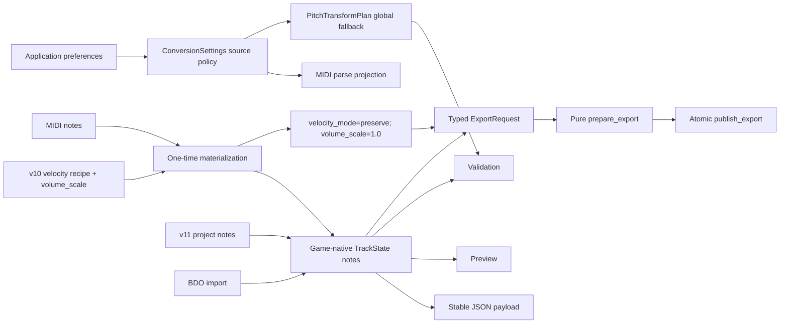

# Conversion settings boundary

## Purpose

Conversion settings used to be seven parallel mutable attributes owned by
`MidiToBdoWindow`. Startup, blank-project creation, raw MIDI import, BDO import,
project recovery, application preferences, autosave, and export each rebuilt a
slightly different subset. The result was temporal coupling: a missing field
could inherit the value of the score opened immediately before it.

`conversion_settings.py` is the Qt-free source of truth for conversion policy.
Its immutable `ConversionSettings` value owns:

- optional BPM override;
- global transpose;
- sustain and tempo-flattening MIDI parse policy;
- the legacy/one-shot velocity recipe and its optional range/floor/step
  parameters.

The formal v11 score is game-first: `TrackState.notes[*].vel` is the velocity
that preview, validation, autosave, and BDO export see. A velocity recipe is an
import or compatibility operation that rewrites those visible note values and
then returns to `velocity_mode="preserve"`. It is not a deferred export effect.
The obsolete per-track `volume_scale` follows the same rule and must be `1.0`
after materialization.

Character identity and master effects deliberately remain outside this model.
They have different ownership and compatibility rules: identity is a local
export preference, while master effects belong to the open score.

## Source policies

| Entry path | BPM | Transpose | Velocity | Reason |
|---|---:|---:|---|---|
| New installation / new authored score | MIDI | `0` | preserve | Game-native neutral default |
| Saved application preference | saved value | saved value | legacy recipe is applied at MIDI import, then preserve | Explicit user choices remain one atomic import operation |
| Legacy MIDI/blank project missing fields | MIDI | `0` | preserve | Missing fields cannot inherit another open score |
| Raw or legacy BDO score | score BPM | `0` | preserve | Imported game data is already authoritative |
| Schema v10 or older project | saved value | saved value | bake once, then preserve | Preserve historical output without future hidden transforms |
| Schema v11 project | saved value | saved value | preserve | Stored notes are the formal game data |

These policies are constructors on the immutable model rather than branches in
widgets. Opening another score cannot change the fallback used by a subsequent
new score or legacy project. An explicitly saved non-zero transpose is retained;
only the default changed to zero.

## Data flow



`to_payload()` is the single JSON projection.
`midi_parse_parameters()` and `export_transform_parameters()` expose only the
fields each consumer owns. `export_workflow` accepts the immutable value first
and retains a legacy flat-dictionary adapter for older callers. Formal v11
exports receive neutral velocity parameters and already-materialized notes.

## Schema v10 to v11 velocity migration

Schema v11 removes two sources of invisible output changes: a project-wide
velocity mode and each track's `volume_scale`. Migration materializes their
historical result exactly once:

1. Parse the saved `ConversionSettings` without borrowing runtime state.
2. For each valid five-field `Note`, temporarily treat `ntype` as zero, matching
   the historical exporter's treatment of normal notes and manual
   articulations.
3. Apply the selected recipe in historical order: rescale, floor, floor then
   step, or layered palette mapping. Layered mode consumes `volume_scale` in
   its palette; all other modes apply the scale after the selected recipe.
4. Bound the game velocity to `0..127`, write only `vel`, restore the original
   `ntype`, and retain pitch, start, duration, row order, and forward-compatible
   extra columns.
5. Set every `volume_scale` to `1.0` and persist
   `velocity_mode="preserve"`.

`off` and `preserve` both mean “do not remap note velocity”; a legacy non-neutral
`volume_scale` is still baked. Re-running migration on a v11 payload is
idempotent, so autosave recovery and repeated opens cannot compound loudness.
After migration, exporting the stored notes with neutral velocity parameters
is binary-equivalent to every historical velocity mode/scale combination that
the old exporter could successfully publish.

## Compatibility rules

- A project missing `transpose` and a new score both mean neutral transpose
  (`0`). Explicit saved values remain authoritative.
- BDO import starts with neutral pitch and velocity policy so unchanged
  documents can remain byte-for-byte lossless.
- Inactive velocity parameters may remain as compatibility metadata, but a v11
  score persists `velocity_mode="preserve"`; they are never projected as a
  second export-time transform.
- Note velocity is distinct from the serialized game instrument mixer volume
  (`bdo_track_volume`) and from reverb/delay/chorus sends. Editing one must not
  silently rewrite another.
- `freeze_export_tracks()` rejects a non-neutral legacy `volume_scale`. The
  caller must materialize it before creating the immutable worker snapshot.
- The PySide window exposes compatibility properties such as `transpose` and
  `velocity_mode`; lifecycle transitions replace the complete immutable state
  rather than assigning those properties one by one.
- Project command snapshots include the immutable conversion state, so an
  automatic conversion-check transpose fix is fully undoable together with
  any track repairs from the same action.
- Master-effect compatibility fields remain in the project conversion payload
  for old projects, but are parsed and authored by `MasterEffects`, not by
  `ConversionSettings`.

## Per-track octave adaptation

`pitch_transform.py` implements the immutable extension seam. A
`PitchTransformPlan` combines the global transpose with optional overrides
keyed by stable editor `track_id`:

```text
effective semitones = global semitones + track octave override
```

- Track overrides authored by the current UI are octave-only (`12k`). An
  arbitrary semitone override has a separate explicit mode so it cannot be
  confused with automatic voice-range adaptation.
- Percussion is always resolved to zero. The shared
  `track_uses_percussion_pitch_semantics()` boundary classifies both a
  percussion MIDI source and any track currently assigned to the BDO drum-set
  target (`0x0D`) as percussion. Consumers must use
  `PitchTransformPlan.effective_track_semitones()` and the same classification
  for serialization so preview, validation, PySide export, and WPF export
  cannot disagree after an instrument remap. Source `Note.pitch` values and
  the source-facing `is_percussion` flag remain unchanged; preview and export
  receive detached projected notes.
- Timeline range hints, structured validation, the piano-roll preview, the
  main preview, PySide export, and the WPF sidecar all use the same plan.
- Right-clicking a melodic track opens **Track Octave**. The operation is
  project-undoable and does not write track state into application preferences.
- Schema v10 introduced the plan and migrates v9 projects to an empty override
  list with `ConversionSettings.transpose` as the global fallback. Schema v11
  leaves that pitch plan intact while materializing only velocity. Stale
  overrides are pruned by stable track identity on load/save/delete.
- `bdo_codec` remains policy-free. `prepare_export()` resolves note pitches
  before delegating to `bdo_export`, and passes zero to the legacy scalar
  transpose argument so a transform can never be applied twice.

`ExportRequest` is the typed immutable worker boundary. `prepare_export()` is
filesystem-free, while `publish_export()` owns atomic output and the
best-effort game-directory copy. `execute_export()` retains a mapping adapter
for existing integrations.

## Validation

```powershell
.\.venv\Scripts\python.exe -m unittest tests.test_conversion_settings -v
.\.venv\Scripts\python.exe -m unittest tests.test_project_schema_velocity_migration -v
.\.venv\Scripts\python.exe -m unittest tests.test_pitch_transform tests.test_export_workflow -v
.\.venv\Scripts\python.exe -m unittest tests.test_conversion_defaults_ui tests.test_pitch_transform_ui tests.test_wpf_sidecar -v
```

The full repository suite remains required because settings affect MIDI parse,
preview validation, autosave recovery, and BDO lossless-export eligibility.
